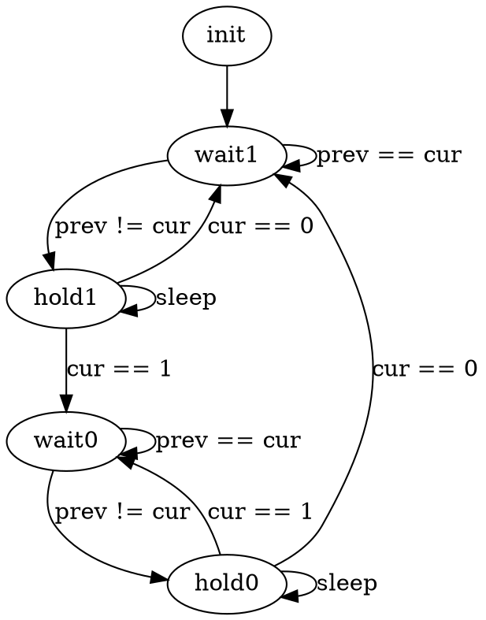

# Архитектура компьютера

## Лекция 10

## Ввод-вывод. PMIO. MMIO. Polling

Пенской А.В., 2026

---

<div class="row"><div class="col">

## Устройство ввода-вывода

Типовое взаимодействие:

1. конфигурация устр./доступа;
1. проверка состояния;
1. отправка данных;
1. проверка статуса ответа;
1. чтение ответа.

Примеры устройств: диоды, ключи, клавиатуры, таймеры, часы, сопроцессоры, диски, и т.п.

</div><div class="col">

 <!-- .element height="420px" -->

</div></div>

----

<div class="row"><div class="col">

## Устройство ввода-вывода. Интерфейс CPU

<div>

1. регистры данных;
1. регистры статуса;
1. протокол взаимодействия.

</div> <!-- .element: class="fragment" -->

</div><div class="col">

 <!-- .element height="220px" -->

</div></div>

---

## Ввод-вывод с точки зрения ISA

Как выглядят операции ввода-вывода с точки зрения CPU?

1. Ввод-вывод через порты. Port-Mapped I/O (PMIO)
1. Ввод-вывод через память. Memory-Mapped I/O (MMIO)

 <!-- .element height="400px" -->

----

### Ввод-вывод через порты. <br/> Port-Mapped I/O (PMIO)

- Ввод-вывод через спец. инструкции: `in 11; out 12;`
- Адресация регистров ввода-вывода не зависит от адресации памяти (Isolated I/O).

<div class="row"><div class="col">

#### Достоинства PMIO

1. Минимизация логики управления (малое адресное пространство). Оптимизация IO.
2. Ввод-вывод и доступ к памяти разделены.
3. Адресное пространство памяти однородно.
4. Простота системы в целом.

</div><div class="col">

#### Недостатки PMIO

1. Усложнение ISA и процессора.
2. Данные ввода-вывода -- данные второго сорта (особенно для CISC процессоров).
3. "Лишние" копирования данных.
4. Очередное адресное пространство.

</div></div>

----

### Ввод-вывод через память. <br/> Memory-Mapped I/O (MMIO)

<div class="row"><div class="col">

1. Регистры внешних устройств отображаются в адресное пространство памяти.
1. Ввод-вывод реализуется через инструкции доступа к памяти.

</div><div class="col">


</div></div>

----

<div class="row"><div class="col">

#### Достоинства MMIO

1. Простота процессора. Без изменения микроархитектуры.
1. Единый набор механизмов доступа: автоинкремент, векторные операции, работа с барьерами.
1. Обработка данных без переноса в память.
1. Адресное пространство памяти.

</div><div class="col">

#### Недостатки MMIO

1. Одна шина для ввода-вывода и памяти. Разница скорости шин.
1. Неоднородность памяти, сложная конфигурация системы.
1. Избыточный адрес для устройств ввода-вывода.
1. Проблемы с параллелизмом уровня инструкций и кешами:
    - flush при вводе-выводе;
    - порядок записи регистров.

</div></div>

---

## Варианты ввода-вывода

<div class="row"><div class="col">

1. **Программно-управляемый ввод-вывод** -- операции реализуются процессором. Все действия реализуются через инструкции процессора.
2. **Ввод-вывод по прерыванию**. Снимает с процессора задачу наблюдения и позволяет это реализовать по внешнему событию.
3. **Channel I/O** и **прямой доступ к памяти** (Direct Memory Access -- DMA). Процессор ставит задачу и оповещается по готовности.

</div><div class="col">


</div></div>

---

## Программно-управляемый <br/> ввод-вывод

Работа с вводом-выводом управляется единым потоком управления.

Типичный подход к программированию: polling.

1. Наблюдаем за состоянием устройства ввода-вывода.
2. Реагируем.

-------------------------

Рассмотрим на примерах:

1. Работа с ключом.
1. SPI.
1. Имитация параллелизма.

----

### Пример: работа с ключом /1

<div class="row"><div class="col">

Задача: посчитать количество нажатий на ключ (кнопку).

```python
counter = 0

while True:
    if switch() == 1:
        counter += 1
```

Будет работать?

</div><div class="col">

 <!-- .element height="260px" -->

</div></div>

<div>

<div class="row"><div class="col">

1. Нет, это не сигнал, это уровень. Нажатие -- поднял и опустил.
2. Нет, есть дребезг контактов.

</div><div class="col">

 <!-- .element height="250px" -->

</div></div>

</div> <!-- .element: class="fragment" -->

----

### Пример: работа с ключом /2

```python
counter = 0
switch_prev = switch()

def sleep(ms):
    begin = now()
    while now() - begin < ms: pass

while True:
    switch_cur = switch()
    if switch_prev != switch_cur:
        if switch_cur == 1:
            sleep(200) # ms
            switch_cur = switch()
            if switch_cur == 1:
                counter += 1
                switch_prev = switch_cur
        if switch_cur == 0:
            sleep(200) # ms
            switch_cur = switch()
            if switch_cur == 0:
                switch_prev = switch_cur
```

- `switch_prev` для обнаружения отпускания кнопки.
- `sleep` и повторная проверка позволяет избежать дребезга.

Проблемы?

----

#### Программно-управляемый ввод-вывод. Проблемы

1. Занимает процессор, включая имитацию таймера.
1. Процессор (алгоритм) должен регистрировать сигнал на частоте в два раза выше частоты сигнала (теорема Котельникова).
1. Высокое энергопотребление.
1. Как работать с клавиатурой?
1. Как совмещать с другими задачами?
1. Как быть со сложным протоколом ввода-вывода (пример на следующем слайде)?

---

#### Пример: Serial Peripheral Interface (SPI)


- **MOSI** (Master Out Slave In) или COPI -- выход ведущего, вход ведомого. Передача данных от ведущего устройства ведомому.
- **MISO** (Master In Slave Out) или CIPO -- вход ведущего, выход ведомого. Передача данных от ведомого устройства ведущему.
- **SCLK** (Serial Clock) или SCK — последовательный тактовый сигнал. Передача тактового сигнала для ведомых устройств.
- **CS** (Chip Select) или SS (Slave Select) — выбор микросхемы, выбор ведомого.

----

<div class="row"><div class="col">

##### Временная диаграмма SPI


(один из возможных вариантов)

</div><div class="col">

##### Устройство SPI передатчиков


</div></div>

Почему сигнал `CS` устанавливает по нулевому значению?

<div>

`CS` часто подключается к сигналу `Reset`, тем самым включая устройство на время взаимодействия.

</div> <!-- .element: class="fragment" -->

---

### Параллелизм ввода-вывода <br/> через конечные автоматы

Задача: посчитать количество нажатий на два ключа одновременно.

Варианты реализации:

1. Усложняем цикл, наблюдая сразу за 2 кнопками. <br/> Решаем проблему одновременного наблюдения.
1. **Разрываем поток управления через конечный автомат.**
1. Используем прерывания (к ним мы вернёмся позже).

----

<div class="row"><div class="col">

#### Пример: работа с <br/> 2 ключами /1

Разрываем код цикла в конечный автомат для счётчика.


```python
class Counter():
  def __init__(self):
    self.state = 'wait1'
    self.counter = 0
    self.begin = None
    self.switch_prev = 0
```

</div><div class="col">

Оригинальный цикл:

```python
counter = 0
switch_prev = switch()

def sleep(ms):
    begin = now()
    while now() - begin < ms: pass

while True:
  switch_cur = switch()
  if switch_prev != switch_cur:
    if switch_cur == 1:
      sleep(200) # ms
      switch_cur = switch()
      if switch_cur == 1:
        counter += 1
        switch_prev = switch_cur
    if switch_cur == 0:
      sleep(200) # ms
      switch_cur = switch()
      if switch_cur == 0:
        switch_prev = switch_cur
```

</div></div>

----

<div class="row"><div class="col">

##### Пример: работа с <br/> 2 ключами /2

Разрываем код цикла в конечный автомат для счётчика.


```python
class Counter():
  def __init__(self):
    self.state = 'wait1'
    self.counter = 0
    self.begin = None
    self.switch_prev = 0
```

</div><div class="col">

Логика управляющего автомата:

```python
def process(self, switch_cur):
  if self.state == 'wait1':
    if self.switch_prev != switch_cur:
      self.state = 'hold1'
      self.begin = now()
  elif self.state == 'hold1':
    if now() - self.begin > delay:
      if switch_cur == 0:
        self.state = 'wait1'
        self.begin = None
      elif switch_cur == 1:
        self.state = 'wait0'
        self.counter += 1
        self.begin = None
        self.switch_prev = 1
  elif self.state == 'wait0':
    if self.switch_prev != switch_cur:
      self.state = 'hold0'
      self.begin = now()
  elif self.state == 'hold0':
    if now() - self.begin > delay:
      if switch_cur == 0:
        self.state = 'wait1'
        self.begin = None
        self.switch_prev = 0
      elif switch_cur == 1:
        self.state = 'wait0'
        self.begin = None
```

</div></div>

Notes:



----

##### Пример: работа с 2 ключами /3

Запускаем счётчики в "параллельную" работу.

```python
counter1 = Counter()
counter2 = Counter()

while True:
    counter1.process(switch1())
    counter2.process(switch2())
```

Особенности реализации:

1. ООП и Python для простоты. Тривиально переписать на C.
2. `now()` -- лучше вынести из автоматов на уровень общего цикла (тестирование, эффективность).
3. Инициализация некорректна: `self.switch_prev = 0` вместо `self.switch_prev = switch()` -- при старте нужно читать реальное состояние кнопки.
4. Многие проблемы сохранились: нагрузка, требования к частоте, энергопотребление.
5. По сути -- это пример кооперативной многозадачности.

Перейдём к многозадачности.

---
