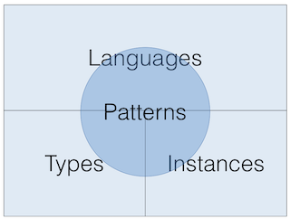
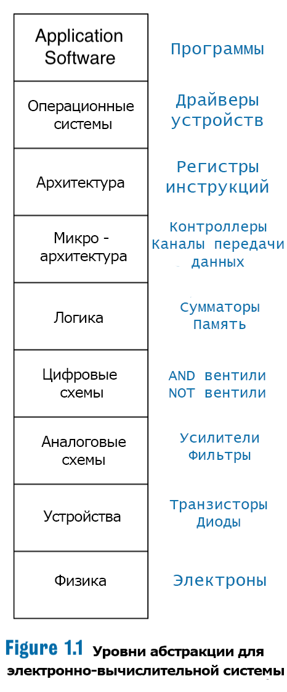
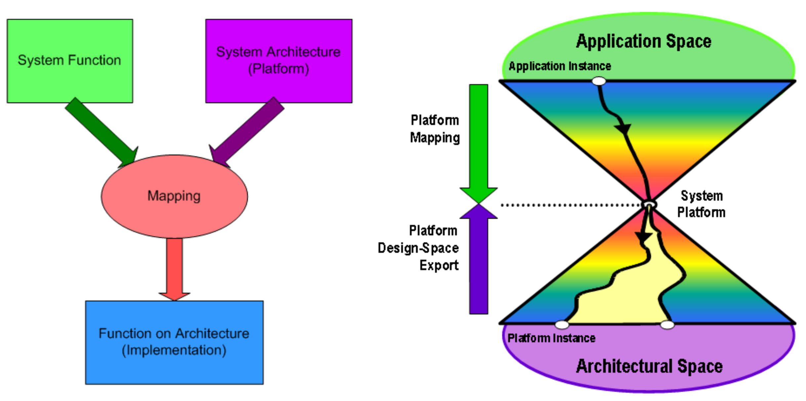

# Lecture 01 — Введение. Вычислительные платформы. Структура курса. Оценивание

## Источники

- `sources/lecture-01/source-pack.md`
- `sources/lecture-01/my-notes.md`
- `sources/lecture-01/slides.md`
- `sources/lecture-01/transcript.cleaned.md`
- `sources/lecture-01/transcript.raw.md`
- `csa-rolling/exam-questions-blitz.md` — только формулировки вопросов

## Список билетов

1. Что такое "вычислительная платформа" с точки зрения пользователя? Каков её состав?
2. Какие уровни абстракций относятся к дисциплине "Архитектура компьютера"? Почему границы определены именно так?
3. В чём заключается отличие Platform-Based Design от проектирования для конкретной платформы?

---

## Билет 1. Что такое "вычислительная платформа" с точки зрения пользователя? Каков её состав?

### Короткий ответ

Вычислительная платформа — это набор инструментов, с помощью которого пользователь или разработчик описывает вычислительный процесс и запускает его.
Примеры: shell, язык программирования, фреймворк, система команд процессора или цифровая схемотехника.
В составе платформы выделяют язык, модель вычислений, типы данных и набор примитивов, из которых собирается вычисление.

### Схема / картинка

На схеме из слайдов показаны четыре части платформы: `Languages`, `Patterns`, `Types`, `Instances`.

### Подробный ответ

#### Что это с точки зрения пользователя

С прикладной точки зрения вычислительная платформа не обязательно равна процессору или компьютеру целиком.
Это любой уровень, который даёт пользователю инструментарий для описания вычислений.
Пользователь платформы в лекции понимается широко: это может быть программист, разработчик низкоуровневой системы или человек, который вводит команду в консоли.

Общее свойство примеров из лекции одно: на платформе можно описать некоторую модель вычислительного процесса, а затем запустить её.
Команда в shell организует вычислительный процесс.
Программа на C или Python описывает вычисление через язык программирования.
Система команд процессора описывает вычисление уже на более низком уровне.
Цифровая схемотехника даёт ещё более низкоуровневый базис для построения вычислителей.

#### Состав вычислительной платформы

- **Язык** — средство, на котором формулируется вычислительный процесс. Для языка программирования это синтаксис; для shell — команды; для ISA — инструкции.
- **Модель вычислений / patterns** — способ представить, как вычисление задаётся и выполняется на этой платформе. На схеме этот элемент подписан как `Patterns`.
- **Типы / данные** — то, с какими значениями работает платформа. В примере языка программирования это машинные слова, символы, массивы, указатели.
- **Instances / примитивы** — базовые элементы, из которых собирается вычислительный процесс: например, операция `+` или вызов функции. Точный смысл этого компонента вынесен в раздел проверки, потому что в raw-транскрипте термин распознан неуверенно как "инстанс".

#### Почему это важно для курса

Курс смотрит на компьютерные системы как на набор вычислительных платформ разных уровней.
Одни и те же идеи повторяются на разных уровнях: в языках программирования, ISA, трансляторах, процессорах, схемах и фреймворках.
Поэтому цель не в том, чтобы выучить одну конкретную архитектуру, а в том, чтобы научиться видеть механизмы и компромиссы платформ.

### Ключевые определения

- **Вычислительная платформа** — набор инструментов, позволяющий описать и запустить вычислительный процесс.
- **Модель вычислительного процесса** — описание того, как вычисление задаётся и выполняется внутри платформы.
- **Язык платформы** — способ записи вычислительного процесса на данном уровне.
- **Типы / данные** — множество значений, с которыми работает платформа.
- **Примитивы / instances** — базовые операции или конструкции, из которых составляется вычисление; точный смысл термина нужно сверить по оригинальному объяснению.

### Пример

Shell можно рассматривать как вычислительную платформу: пользователь вводит команду, а эта команда организует вычислительный процесс.
Язык C или Python тоже является платформой: программа описывает вычисление через синтаксис, типы и операции языка.

### Возможные вопросы преподавателя

- Почему shell тоже можно назвать вычислительной платформой?
- Чем язык программирования как платформа похож на систему команд процессора?
- Какие четыре компонента платформы названы в лекции?
- Почему у понятия "вычислительная платформа" нет одного простого определения?

### Что обязательно запомнить

- Платформа даёт инструменты для описания и запуска вычислений.
- Примеры платформ бывают на разных уровнях: shell, язык, фреймворк, ISA, цифровые схемы.
- Состав платформы: язык, модель вычислений, типы/данные, примитивы.
- Термин `Instances` в составе платформы нужно проверить по оригинальному объяснению.

### Проверить

- `[проверить]` Точный перевод и смысл компонента `Instances`: в raw-транскрипте он распознан как "инстанс", а в cleaned/source-pack интерпретирован как примитивы или базовые операции.

---

## Билет 2. Какие уровни абстракций относятся к дисциплине "Архитектура компьютера"? Почему границы определены именно так?

### Короткий ответ

Вычислительную систему можно смотреть как на лестницу уровней: от приложения и операционной системы вниз к архитектуре, микроархитектуре, логике, цифровым схемам, устройствам и физике.
В этом курсе основная область начинается примерно с цифровых схем и поднимается к ISA, низкоуровневому программированию, моделям вычислений и отдельным темам операционных систем.
Границы такие, потому что курс про цифровые вычислительные механизмы, а не про физику полупроводников, аналоговые схемы или полный курс ОС.

### Схема / картинка

### Подробный ответ

#### Уровни на схеме

Слайды показывают уровни абстракции электронно-вычислительной системы сверху вниз:

- **Application Software** — прикладные программы, то есть то, с чем пользователь обычно взаимодействует напрямую.
- **Операционные системы** — слой выше архитектуры; в курсе он упоминается, например, при виртуальной памяти и многозадачности.
- **Архитектура** — уровень, где видны архитектурные интерфейсы вычислителя, прежде всего система команд и связанные с ней представления.
- **Микроархитектура** — то, как архитектурные решения реализуются внутри процессора; на слайде рядом указаны контроллеры и каналы передачи данных.
- **Логика** — уровень логических блоков, например сумматоров и памяти.
- **Цифровые схемы** — уровень вентилей и цифровых сигналов; на слайде приведены `AND`- и `NOT`-вентили.
- **Аналоговые схемы** — усилители, фильтры и другие аналоговые элементы.
- **Устройства** — физические электронные компоненты, например транзисторы и диоды.
- **Физика** — самый нижний уровень, где речь уже об электронах и физических свойствах материала.

#### Что относится к курсу

По объяснению лекции курс стартует примерно от цифровых схем.
Дальше он поднимается к логике, микроархитектуре, архитектуре процессора, системам команд, ассемблерам разных вычислительных машин, моделям вычислений и практическим вопросам эффективности.
Операционная система будет затрагиваться только там, где она нужна для понимания архитектурных механизмов: например, в темах виртуальной памяти и многозадачности.

#### Почему границы именно такие

Нижняя граница проводится около цифровых схем, потому что курс специализируется на цифровой вычислительной технике.
Физика, устройства и аналоговые схемы важны, но это уже другой большой пласт знаний, и в лекции прямо сказано, что курс не уходит в физику и аналоговый мир.

Верхняя граница тоже ограничена: полный разбор операционных систем, прикладных фреймворков и языков высокого уровня не является целью курса.
Эти уровни нужны как контекст, потому что решения на нижних уровнях влияют на пользовательский опыт и разработку.
Но каждый из уровней сам может быть отдельным большим курсом, поэтому материал даётся обзорно и дозированно.

### Ключевые определения

- **Уровень абстракции** — способ рассматривать вычислительную систему на выбранной детализации, скрывая часть нижележащих механизмов.
- **Архитектура** — уровень интерфейса вычислителя, видимый через систему команд и связанные представления.
- **Микроархитектура** — уровень внутренней реализации архитектуры.
- **Цифровые схемы** — уровень вентилей и цифровых сигналов, с которого в курсе начинается техническое рассмотрение.

### Пример

В лабораторной работе 4, по описанию лекции, уровни связаны практически: нужно придумать язык программирования, систему команд процессора, транслятор, потактовую модель процессора и алгоритмы.
Решение на уровне языка влияет на ISA и транслятор, а решения в ISA и процессоре ограничивают то, как удобно писать программы сверху.

### Возможные вопросы преподавателя

- Какие уровни находятся ниже архитектуры процессора?
- Почему курс не начинается с физики и аналоговых схем?
- Почему операционные системы всё равно появляются в курсе, хотя не являются его основной темой?
- Как лабораторная работа 4 показывает связь уровней?

### Что обязательно запомнить

- Полная лестница уровней: приложение, ОС, архитектура, микроархитектура, логика, цифровые схемы, аналоговые схемы, устройства, физика.
- Основная область курса: от цифровых схем до архитектуры/ISA, низкоуровневого программирования, моделей вычислений и отдельных механизмов ОС.
- Границы выбраны из-за фокуса на цифровых вычислительных механизмах и ограниченности курса.

### Проверить

- Существенных мест для проверки по этому вопросу не осталось.

---

## Билет 3. В чём заключается отличие Platform-Based Design от проектирования для конкретной платформы?

### Короткий ответ

Проектирование для конкретной платформы начинается с уже выбранного языка, фреймворка, процессора или другой готовой платформы, а приложение подстраивается под её возможности и ограничения.
Platform-Based Design идёт двунаправленно: снизу выбираются или создаются механизмы платформы, а сверху приходят требования задачи.
Итогом становится системная платформа, адаптированная под пространство задач, а не просто программа поверх заранее фиксированной универсальной платформы.

### Схема / картинка

### Подробный ответ

#### Проектирование для конкретной платформы

Обычный подход в лекции описан так: разработчик берёт готовый язык программирования, набор библиотек или фреймворк и пишет приложение поверх них.
Это удобно, потому что готовую платформу можно повторно использовать.
Например, можно писать программу на Python, использовать веб-фреймворк или работать через универсальные интерфейсы операционной системы.

Проблема в том, что универсальность имеет цену.
У готовой универсальной платформы есть лишние абстракции, внутренние процессы, которые разработчик не контролирует, дополнительное энергопотребление и не всегда гарантированные задержки.
Для обычного прикладного ПО это может быть нормально, но для низкоуровневых, встроенных, энергоограниченных, real-time или высокопроизводительных систем это становится критичным.

#### Platform-Based Design

Platform-Based Design предлагает не фиксировать платформу заранее как неизменную данность.
Вместо этого разработка идёт с двух сторон:

- снизу берётся, выбирается или строится вычислительный базис и механизмы платформы;
- сверху задаются функции, требования и способ использования этих механизмов.

На схеме это выражено через `System Function`, `System Architecture (Platform)` и `Mapping`.
Функция системы и архитектура сопоставляются друг с другом, а результатом становится реализация функции на архитектуре.
На правой части схемы системная платформа находится между пространством приложений и архитектурным пространством: она сужает пространство решений под нужный класс задач, но оставляет свободу для прикладной разработки.

#### Главное отличие

Проектирование для конкретной платформы отвечает на вопрос: "как реализовать мою задачу на уже выбранной платформе?"
Platform-Based Design отвечает на более широкий вопрос: "какая платформа и какие механизмы нужны, чтобы класс задач реализовывался эффективно и с нужными гарантиями?"

Поэтому Platform-Based Design особенно важен там, где требования нельзя просто "дописать поверх" универсальной платформы: в системах реального времени, высокопроизводительных системах, встроенных системах, спецвычислителях и устройствах с ограничением по энергии или нагреву.

### Ключевые определения

- **Platform-Based Design** — подход, в котором платформа проектируется или выбирается под пространство задач через сопоставление требований сверху и механизмов снизу.
- **Проектирование для конкретной платформы** — разработка приложения поверх заранее выбранной готовой платформы.
- **Системная платформа** — адаптированный вычислительный базис, который закрывает нужное пространство задач и оставляет верхнему уровню свободу разработки.
- **Mapping** — сопоставление функции системы и архитектуры платформы.

### Пример

Если разработчик просто берёт готовый Python-фреймворк и пишет приложение, он проектирует для уже выбранной платформы.
Если же для встроенной системы с требованиями по задержке и энергопотреблению одновременно подбирают аппаратный базис, программные механизмы и способ отображения задач на них, это ближе к Platform-Based Design.
В лекции также приведена программная аналогия: уровень конфигурации, dependency injection или Spring могут играть роль промежуточного слоя, через который собирается большая система.

### Возможные вопросы преподавателя

- Почему готовая универсальная платформа может быть плоха для real-time?
- Что означает двунаправленность Platform-Based Design?
- Что такое системная платформа на схеме?
- Почему Platform-Based Design естественно возникает во встроенных системах?

### Что обязательно запомнить

- Обычный подход фиксирует платформу заранее; Platform-Based Design подбирает или строит платформу под пространство задач.
- В PBD требования идут сверху, механизмы платформы — снизу, а между ними происходит сопоставление.
- Цена универсальности: лишняя энергия, неконтролируемые процессы, лишние абстракции и проблемы с гарантированными задержками.
- PBD важен для embedded, real-time, высокопроизводительных и энергоограниченных систем.

### Проверить

- Существенных мест для проверки по этому вопросу не осталось.

---

## Статус подготовки

- статус: `needs-check`
- дата финализации: `2026-06-02`
- оставшиеся проверки:
  - `[проверить]` Точный смысл компонента `Instances` в составе вычислительной платформы.
  - `[проверить]` Очищенный транскрипт основан на русских авто-субтитрах YouTube, поэтому отдельные термины могли быть распознаны неверно.
