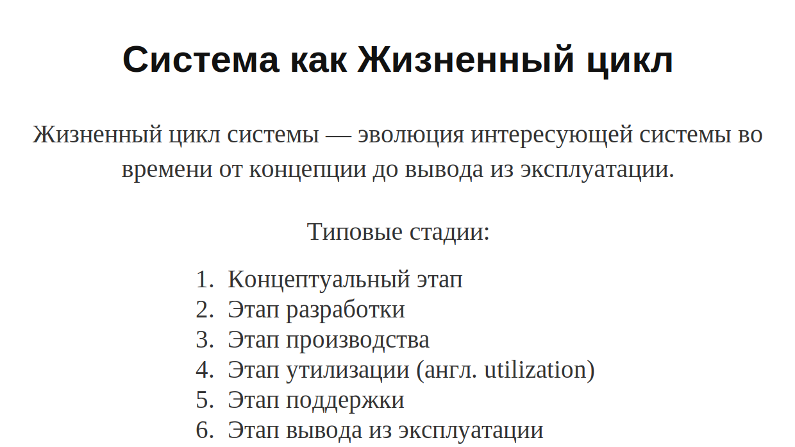

# Lecture 02 — Информационные и управляющие системы. Системная инженерия. Архитектура компьютера

## Источники

- `sources/lecture-02/source-pack.md`
- `sources/lecture-02/my-notes.md`
- `sources/lecture-02/slides.md`
- `sources/lecture-02/transcript.cleaned.md`
- `sources/lecture-02/transcript.raw.md`
- `csa-rolling/exam-questions-blitz.md` — только формулировки вопросов

## Список билетов

1. Почему большинство современных компьютерных систем считаются системами с преобладающей программной составляющей? Приведите примеры.
2. Что такое информационная и управляющая система? Каковы их отличия (функции, ПО, аппаратура)?
3. Что такое "требование реального времени"? Примеры систем.
4. Каковы этапы эволюции информационных систем: от пакетной обработки до облачных систем?
5. Каковы этапы эволюции управляющих систем: от ИУС до КФС?
6. Каковы задачи и предмет дисциплины "Системная инженерия"? Какова роль системных инженеров?
7. Что такое успешная система? Какие точки зрения (заинтересованные стороны) необходимы для построения успешной системы?
8. Как можно рассматривать систему с точки зрения структуры? Каковы причины множественности структуры?
9. Как можно рассматривать систему с точки зрения функционального места? Кто такие заинтересованные стороны (Stakeholders)? Что такое операционное окружение?
10. Как можно рассматривать систему с точки зрения жизненного цикла? Что такое обеспечивающая система?
11. Каковы цели архитектурного проектирования компьютерных систем?
12. Что такое архитектура по Гради Бучу? Что представляют собой логическая и физическая структура?
13. Что такое архитектура согласно ISO 42010? Что такое архитектурное описание?
14. Как архитектурные решения влияют на проектные метрики? Что такое V-диаграмма и какую особенность разработки она демонстрирует?
15. Почему плохой менеджмент может увеличить бюджет проекта быстрее, чем другие факторы? Проблема передачи информации.

---

## Билет 1. Почему большинство современных компьютерных систем считаются системами с преобладающей программной составляющей? Приведите примеры.

### Короткий ответ

Большинство современных компьютерных систем считаются системами с преобладающей программной составляющей, потому что главную сложность в них часто создаёт не само железо, а разработка, интеграция и поддержка ПО.
Железо остаётся важным, но нужное поведение системы всё чаще задаётся программами и их сопровождением.
Например, современный ноутбук покупается как физическое устройство, но его ценность и работа определяются операционной системой и программной средой.
Этот пример подходит, потому что без ПО железо не даёт пользователю нужных функций, а разработка и поддержка ПО занимают большую часть инженерной работы.

### Схема / картинка


### Подробный ответ

#### Почему именно "потому что ПО"

Вопрос не в том, есть ли в системе аппаратная часть.
Она есть и остаётся необходимой.
Но в современной компьютерной системе основная инженерная сложность часто переносится в программную часть: нужно разработать ПО, встроить его в систему, связать с другими компонентами, обновлять и сопровождать.

Именно поэтому такие системы называют `software-intensive`.
На слайде дано определение ISO/IEC/IEEE 42010: это системы, в которых разработка и/или интеграция программного обеспечения являются доминирующими соображениями.
То есть при проектировании важно не просто выбрать процессор, плату или корпус, а понять, как программная часть будет задавать поведение всей системы.

#### Как это связано со стоимостью и поддержкой

Картинка `HW-SW-support cost` показывает общий сдвиг: раньше почти вся стоимость приходилась на разработку оборудования, а затем всё большую роль начали играть разработка ПО и поддержка.
Из этого следует ответ на слово "почему": потому что программа и её сопровождение всё чаще определяют стоимость, риск, сложность и реальное поведение системы.

Важно не перепутать: "преобладающая программная составляющая" не означает, что аппаратура стала неважной.
Это означает, что железо часто становится платформой, а отличительные свойства системы создаются программно.

#### Например: современный ноутбук

В транскрипте преподаватель приводит пример с ноутбуками Apple: пользователь покупает физическую железку, но интересной и полезной она становится из-за операционной системы поверх неё.
Этот пример подходит, потому что показывает преобладание программной составляющей не по факту наличия кода, а по роли ПО в системе.

Аппаратная часть ноутбука нужна: процессор, память, экран и накопитель никуда не исчезают.
Но без ОС и программной среды это не та система, которой пользуется человек.
Функции, удобство, обновления, совместимость и значительная часть инженерной сложности находятся именно в ПО, поэтому пример действительно доказывает software-intensive характер системы.

### Ключевые определения

- **Software-intensive system** — система, в которой разработка и/или интеграция ПО являются доминирующими соображениями.
- **Компьютерная система для курса** — любая система, оснащённая внутренними алгоритмами.
- **Поддержка ПО** — сопровождение программной части после разработки; на графике из слайдов она показана как существенная часть стоимости современной системы.

### Пример

Например, современный ноутбук Apple: в магазине пользователь получает физическое устройство, но сама система становится полезной благодаря операционной системе и программной среде.
Это доказывает преобладание программной составляющей, потому что пользовательские функции, развитие системы, исправления и сопровождение зависят прежде всего от ПО, а не только от корпуса и микросхем.

### Возможные вопросы преподавателя

- Что в определении ISO 42010 делает систему software-intensive?
- Почему дело не только в количестве железа, а в стоимости разработки, интеграции и поддержки ПО?
- Почему аппаратура не исчезает, хотя система называется software-intensive?
- Как на примере ноутбука доказать, что программная составляющая действительно преобладает?

### Что обязательно запомнить

- На вопрос "почему" нужно отвечать через причину: ПО определяет сложность, стоимость, интеграцию, поддержку и поведение системы.
- Software-intensive — это не "железо не нужно", а "ПО стало доминирующим инженерным фактором".
- График из слайдов показывает рост роли стоимости ПО и поддержки относительно разработки оборудования.
- Для примера достаточно одного объекта, но надо доказать, почему в нём программная часть действительно главная.

### Проверить

- Критичных пробелов по источникам для этого билета нет.

---

## Билет 2. Что такое информационная и управляющая система? Каковы их отличия (функции, ПО, аппаратура)?

### Короткий ответ

Информационная система получает данные, преобразует или хранит их и выдаёт результат.
Управляющая система тоже обрабатывает данные, но её входы и выходы связаны с физическим объектом: она измеряет состояние мира и формирует управляющее воздействие.
Для информационных систем обычно важнее производительность обработки данных, а для управляющих — встроенность, ограничения ресурсов, специализация и предсказуемые сроки реакции.

### Пример

**Информационная система**

Например, поисковая система.

Это ИС, потому что она работает с информацией: получает запрос пользователя, ищет данные, преобразует и ранжирует результаты, а потом выдаёт обработанный список ссылок. Она не управляет физическим объектом напрямую. Если ответ пришёл чуть позже, это неприятно, но физический процесс не ломается.

**Управляющая система**

Например, лифт.

Это УС, потому что она связана с реальным физическим объектом: получает данные от кнопок, датчиков дверей, положения кабины, затем принимает решение и управляет двигателем, дверями и остановками. Здесь важно не просто “обработать данные”, а выдать управляющее воздействие в физический мир. Если система ошибётся или среагирует не вовремя, это уже влияет на безопасность и движение реального объекта.

Главное различие: ИС обрабатывает данные, а УС обрабатывает данные, чтобы управлять физическим объектом.

### Схема / картинка

| Аспект | Информационная система | Управляющая система |
| --- | --- | --- |
| Главная функция | обработка, хранение и выдача информации | контроль или управление физическим объектом |
| Связь с миром | данные можно обработать вне жёсткого физического времени | есть датчики, объект управления и исполнительные воздействия |
| Что важно для ПО | производительность, параллелизм, масштабирование | надёжная реакция, ограничения памяти/энергии, real-time |
| Что важно для аппаратуры | серверы, ПК, сети, кластеры, облака | встраивание в объект, специализированные контроллеры, датчики, исполнительные устройства |

real-time - это значит точно и в срок (это не значит - быстро, без отказов или абсолютно точно)
### Подробный ответ

Информационная система работает с данными.
В лекции она описывается через простую цепочку: получить данные, преобразовать или накопить их, а потом отдать пользователю или другой системе.
Примеры: база данных, поисковик, обычный пользовательский компьютер, облачный сервис.

Для информационных систем естественный критерий качества — насколько быстро и удобно они обрабатывают данные.
Если поисковая система отвечает за микросекунды, это отлично; если за секунду-полторы, пользователю уже неприятно, но физический объект из-за этого обычно не ломается.
Поэтому здесь уместны спекулятивные вычисления, параллелизм, кластеры и облака: можно заранее посчитать часть вариантов, распараллелить работу или добавить вычислительные ресурсы.

Управляющая система связана с реальностью.
Событие или состояние физического объекта сначала измеряется и оцифровывается, затем программа принимает решение, после чего результат превращается в управляющий сигнал.
Простой пример из объяснения преподавателя — лифт: система должна понять, где кабина, какие кнопки нажаты, какие двери закрыты, и затем управлять приводом и дверями.

Управляющие системы часто являются встроенными.
Это означает, что вычислитель "вмонтирован" в объект и работает в условиях ограничений: мало энергии, мало памяти, есть требования к тепловыделению, нужны специализированные функции.
Кроме того, такая система часто работает автономно и должна реагировать в реальном времени.

Граница между информационной и управляющей системой не всегда проходит по типу железа.
Один и тот же компьютер может быть информационной системой, если на нём обрабатывают файл, и частью управляющей системы, если он участвует в записи звука или другой задаче с жёстким временем реакции.
Телефон как устройство в целом чаще выглядит как информационная система, но радиомодуль/GSM-часть ближе к управляющей системе, потому что там важны строгие временные интервалы связи с базовой станцией.

### Ключевые определения

- **Информационная система** — система, которая получает, хранит, преобразует и выдаёт данные.
- **Управляющая система** — система, которая получает данные о физическом объекте и формирует воздействие на него.
- **Встроенное исполнение** — вычислитель встроен в управляемый объект и работает с его физическими ограничениями.
- **Автономная работа** — система должна долго работать без постоянного вмешательства человека.

### Пример

`Google Search` как пример информационной системы: входом является запрос, внутри происходит поиск и ранжирование, выходом является список результатов.
Лифт как пример управляющей системы: входом являются датчики и кнопки, а выходом — команды двигателю, дверям и другим исполнительным механизмам.

### Возможные вопросы преподавателя

- Почему телефон нельзя однозначно назвать только информационной или только управляющей системой?
- Почему для управляющей системы важна не просто скорость, а предсказуемость реакции?
- Чем встроенная система отличается от обычного сервера?
- Почему облака хорошо подходят для информационных систем?

### Что обязательно запомнить

- Информационная система работает прежде всего с данными.
- Управляющая система работает с физическим объектом через датчики и исполнительные устройства.
- Информационным системам важны производительность и масштабирование.
- Управляющим системам важны ограничения, автономность и реальное время.

### Проверить

- Критичных пробелов по источникам для этого билета нет.

---

## Билет 3. Что такое "требование реального времени"? Примеры систем.

### Короткий ответ

Требование реального времени означает, что система должна реагировать в заданный срок.
Это не то же самое, что "очень быстро": реакция может быть медленной, если она предсказуемо укладывается в допустимое окно.
Если срок нарушен, результат может стать бесполезным или опасным, даже если логически вычисление правильное.

### Пример
Система водосброса, она запускается определённое время и работает определённое время, при этом это важно, тк если она запуститься позже, чем должна была запуститься, то всех затопит и тд

### Схема / картинка


```
событие в физическом мире
        |
        v
измерение -> обработка -> решение -> управляющее воздействие
        |
        v
   всё должно уложиться в заданный deadline
```

### Подробный ответ

На слайдах специально подчёркнуто, что real-time — это не "быстро".
Это также не абсолютная точность расписания, не гарантия отсутствия отказов и не магическое "всегда сработает".
Реальные распределённые и физические системы могут терять пакеты, ломаться и сталкиваться с внешними сбоями.

Смысл требования реального времени в другом: у системы есть допустимое время реакции.
Она должна выдать результат не когда-нибудь, а в пределах заданного срока, иногда с допустимым отклонением.
Если срок нарушен, система должна хотя бы перейти в понятный отказ, а не вести себя непредсказуемо.

Пример из лекции — управление водосбросом гидроэлектростанции.
Если уровень воды превышен, нельзя открыть шлюз мгновенно и нельзя запаздывать бесконечно.
В объяснении преподавателя фигурировала задержка порядка нескольких минут: сигнал должен быть устойчивым, а открытие водосброса занимает время.
То есть "правильная" реакция определяется не максимальной скоростью, а допустимым временным окном.

Другой пример — обработка видео.
Если `ffmpeg` просто перекодирует файл, это информационная задача: чем быстрее, тем лучше, но опоздание не ломает физический процесс.
Если система показывает потоковое видео или декодирует кадры для отображения, появляется срок: кадр нужен к моменту показа, иначе пользователь увидит задержку или рывок.

### Ключевые определения

- **Deadline** — предельный срок, к которому результат должен быть готов.
- **Real-time requirement** — требование выдать корректный результат в заданном временном окне.
- **Предсказуемость** — способность системы укладываться в ожидаемые задержки.
- **Нарушение срока** — ситуация, когда правильный по смыслу результат приходит слишком поздно.

### Пример

Система управления шлюзом должна учитывать датчики уровня воды и физическое время открытия механизма.
Реакция "открыть немедленно на максимум" может быть неправильной, потому что поток воды способен повредить окружение.
Реакция "когда-нибудь потом" тоже неправильна, потому что резервуар может переполниться.

### Возможные вопросы преподавателя

- Почему real-time не означает "как можно быстрее"?
- Почему нельзя определять real-time через полное отсутствие отказов?
- Чем перекодирование видеофайла отличается от показа видео в реальном времени?
- Почему физический объект задаёт временные ограничения управляющей системе?

### Что обязательно запомнить

- Реальное время — это "вовремя", а не "максимально быстро".
- Deadline является частью корректности результата.
- Управляющие системы часто имеют real-time требования, потому что работают с физическим миром.
- Один и тот же алгоритм может быть real-time или не real-time в зависимости от режима использования.

### Проверить

- `[проверить]` Точное число минут в примере с водосбросом: в транскрипте оно распознано неидеально, смысл примера надёжный.

---

## Билет 4. Каковы этапы эволюции информационных систем: от пакетной обработки до облачных систем?

### Короткий ответ

Информационные системы развивались от больших машин с пакетной обработкой к распределённым системам, персональным компьютерам, сетевым и веб-системам, мобильным и облачным сервисам.
Главный тренд — вычисления становятся ближе к пользователю, сильнее связаны сетью и всё чаще предоставляются как сервис.
Облако в этой линии — способ покупать вычислительную мощность и инфраструктуру как услугу.

“Большие машины с пакетной обработкой” — это ранние мейнфреймы / большие ЭВМ, на которых задачи выполнялись не интерактивно, а пачками.

То есть пользователь не сидит за программой как сейчас: нажал кнопку, сразу получил ответ. Он заранее готовит задание: программу, входные данные, параметры. Потом эти задания загружаются в большую машину очередью, машина выполняет их одно за другим, а результат пользователь получает позже.

### Схема / картинка


```
batch/mainframe
    -> time sharing
    -> мини-ЭВМ и распределённые вычисления
    -> ПК и рабочие станции
    -> сети, Internet, web/client-server
    -> mobile/pervasive/IoT
    -> cloud infrastructure and services
```

### Подробный ответ

Первый этап — пакетная обработка.
Задачи заранее готовились и загружались на большую машину одна за другой.
Такой режим был характерен для ранних мейнфреймов: пользователь не взаимодействовал с программой как с современным приложением, а передавал задание на выполнение.

Следующий шаг — разделение времени.
Одна мощная машина обслуживает нескольких пользователей, создавая ощущение интерактивной работы.
Это уже ближе к современному представлению о вычислительной системе, но центр всё ещё один.

Дальше появляются мини-ЭВМ, рабочие станции и распределённые вычисления.
В лекции это объяснялось как уход от одной огромной машины к множеству меньших машин, связанных между собой.
Система начинает состоять не только из одного компьютера, но и из сети узлов.

Затем массовыми становятся персональные компьютеры.
Вычисления оказываются на рабочем месте пользователя, а сетевые рабочие станции и локальные сети связывают эти машины в более крупные информационные системы.

Следующий крупный этап — Internet, web и client-server.
Приложение уже делится между клиентом, сервером, базой данных и сетью.
Пользователь видит интерфейс, а значительная часть вычислений и хранения уходит на серверную сторону.

Потом добавляются мобильные и повсеместные вычисления: смартфоны, беспроводные сети, сенсоры, элементы "умного города".
В лекции это связывалось с тем, что сеть и вычисления выходят за пределы рабочего стола.

Облачные системы продолжают эту линию.
Вычислительная мощность, хранилища и инфраструктура предоставляются как сервис: вместо владения конкретной машиной пользователь арендует нужные ресурсы.
Это удобно для масштабирования информационных систем, потому что нагрузку можно распределять и наращивать.

### Ключевые определения

- **Пакетная обработка** — выполнение заранее подготовленных заданий без постоянного интерактивного диалога.
- **Разделение времени** — использование одной вычислительной системы несколькими пользователями.
- **Распределённая система** — система из нескольких взаимодействующих вычислительных узлов.
- **Облачная система** — вычислительные ресурсы и инфраструктура, предоставляемые как сервис.

### Пример

Поисковик или крупная база данных не обязаны работать на одном компьютере.
Они могут использовать много серверов, кластеры и облачную инфраструктуру, чтобы быстрее обрабатывать запросы и выдерживать большую нагрузку.

### Возможные вопросы преподавателя

- Чем пакетная обработка отличается от интерактивной работы?
- Почему распределённые системы стали естественным этапом после больших централизованных машин?
- Как Internet и client-server изменили устройство информационных систем?
- Почему облако удобно именно для информационных систем?

### Что обязательно запомнить

- Эволюция идёт от централизованных вычислений к распределённым и сервисным.
- Информационные системы всё сильнее опираются на сеть.
- Облако — не просто "чужой компьютер", а модель предоставления ресурсов как услуги.
- Производительность достигается не только быстрым процессором, но и архитектурой системы.

### Проверить

- Критичных пробелов по источникам для этого билета нет.

---

## Билет 5. Каковы этапы эволюции управляющих систем: от ИУС до КФС?

### Короткий ответ

1. ИУС — информационно-управляющая система

Это когда есть физический объект, а рядом с ним отдельная система управления.

Например: радиолокатор, а рядом большой шкаф с компьютером. От радара к шкафу идёт куча проводов: датчики передают данные, компьютер считает, потом отправляет управляющие сигналы обратно.

Суть: объект отдельно, управляющий компьютер отдельно.

2. Встроенная система

Компьютеры стали маленькими, и управляющий вычислитель начали встраивать прямо внутрь объекта.

Например: контроллер внутри стиральной машины, автомобильный блок управления, спортивные часы.

Суть: это уже не “компьютер рядом”, а компьютер внутри устройства.

3. Распределённая встроенная система

Если объект сложный, одного контроллера мало. Тогда внутри объекта появляется много маленьких контроллеров, датчиков и исполнительных устройств, связанных между собой.

Например: современный автомобиль. Там не один компьютер, а много блоков: двигатель, тормоза, двери, мультимедиа, датчики, шины связи.

Суть: управление распределено по объекту. Это нужно, чтобы контроллеры были ближе к датчикам и механизмам, меньше были задержки, и система могла реагировать вовремя.

4. КФС — киберфизическая система

Это самый сильный уровень связи физики и вычислений. Тут физический объект и программа уже не существуют нормально отдельно друг от друга.

Например: гироскутер. Без системы управления он не просто “хуже работает” — он вообще не имеет смысла, потому что не сможет балансировать. Его физическое поведение создаётся постоянной работой датчиков, алгоритмов и моторов.

Суть: программа, датчики, моторы и физический объект проектируются как одно целое.

### Схема / картинка


```
ИУС
  -> embedded systems
  -> distributed embedded systems
  -> CPS / КФС
```

### Подробный ответ

Начальный вариант — информационно-управляющая система.
Её можно представить как отдельный управляющий блок, связанный с объектом управления множеством проводов и сигналов.
Физический объект и система управления ещё легко мыслятся как две разные части: вот станок или установка, а вот шкаф управления.

Следующий этап — встроенные системы.
Вычислитель уже не стоит отдельно, а встраивается в сам объект.
Например, спортивные часы, автомобильный блок управления или бытовое устройство не выглядят как "компьютер рядом с объектом"; вычислительная часть уже находится внутри продукта.

Дальше появляются распределённые встроенные системы.
Управление выполняется не одним контроллером, а сетью узлов, датчиков и исполнительных устройств.
Это нужно, когда объект сложный и управление физически распределено: автомобиль, промышленная установка, современное здание.

Финальный этап в вопросе — киберфизические системы, или КФС/CPS.
Здесь физическая часть и программно-аппаратная часть уже не проектируются независимо.
Система рассматривается как связка вычислений, связи и физического процесса.
Поэтому нужно моделировать не только программу, но и объект, окружение, датчики, приводы и время реакции.

В лекции этот переход противопоставлялся информационным системам.
Для информационных систем важно обрабатывать данные всё быстрее и масштабнее, а для управляющих систем важно учитывать реальность: энергию, тепло, физические ограничения, автономность и real-time.

### Ключевые определения

- **ИУС** — информационно-управляющая система, где вычислительная часть управляет физическим объектом.
- **Embedded system** — встроенная система, в которой вычислитель является частью управляемого объекта.
- **Distributed embedded system** — встроенная система, состоящая из нескольких взаимодействующих узлов.
- **КФС / CPS** — киберфизическая система, объединяющая вычисления, связь и физический процесс.

### Пример

Автомобиль хорошо показывает эту эволюцию.
Ранний вариант можно представить как механический объект с отдельными управляющими блоками.
Современный автомобиль содержит множество встроенных контроллеров, датчиков, шин связи и алгоритмов, а в пределе беспилотный автомобиль становится киберфизической системой.

### Возможные вопросы преподавателя

- Чем ИУС отличается от встроенной системы?
- Почему распределённая встроенная система нужна для сложных физических объектов?
- Почему КФС нельзя проектировать как "сначала физика, потом программа"?
- Как real-time связано с эволюцией управляющих систем?

### Что обязательно запомнить

- Тренд управляющих систем — от внешнего контроллера к глубокой интеграции с объектом.
- Встроенность приносит ограничения по энергии, памяти, теплу и специализации.
- КФС объединяет вычисления и физический процесс.
- Для КФС важны не только алгоритмы, но и датчики, исполнительные устройства, окружение и время.

### Проверить

- `[проверить]` В источниках лекции хорошо раскрыт общий переход к CPS/КФС, но расшифровки всех промежуточных терминов на схеме могут требовать сверки со слайдами преподавателя.

---

## Билет 6. Каковы задачи и предмет дисциплины "Системная инженерия"? Какова роль системных инженеров?

### Короткий ответ

Системная инженерия занимается тем, как создавать сложные системы целиком, а не только отдельные детали.
Она помогает связать требования, архитектуру, окружение, жизненный цикл, разработку, производство, эксплуатацию и вывод из эксплуатации.
Системный инженер удерживает целостную картину и следит, чтобы разные участники проекта понимали одну и ту же систему.

### Схема / картинка


```
потребности и ограничения
        |
        v
требования -> архитектура -> реализация -> проверка -> эксплуатация
        ^
        |
 stakeholders, окружение, жизненный цикл, обеспечивающие системы
```

### Подробный ответ

По определению SEBoK, системная инженерия — междисциплинарный подход и средство, позволяющее реализовывать успешные системы.
Она рассматривает потребности заказчика и требуемую функциональность рано в цикле разработки, документирует требования, затем переходит к синтезу проектного решения и проверке системы.

Предмет системной инженерии — не одна программа, плата или алгоритм, а система как целое.
В лекции это особенно важно для computer architecture: компьютерная система является software-intensive, но одновременно имеет аппаратную часть, программную часть, окружение, пользователей, производство, обслуживание и ограничения жизненного цикла.

Задачи системной инженерии:

- выявить потребности и ограничения заинтересованных сторон;
- сформулировать требования;
- связать требования с архитектурой и реализацией;
- учитывать структуру системы, функциональное место, окружение и жизненный цикл;
- подготовить проверку и валидацию системы;
- следить, чтобы обеспечивающие системы тоже были учтены.

Роль системного инженера — быть человеком, который держит связи между частями проекта.
Он не обязан лично писать весь код или проектировать каждую микросхему, но должен понимать, какие вопросы нужно задать и кому.
Если разработчик, менеджер, заказчик, производство и эксплуатация понимают систему по-разному, системный инженер должен выявить этот разрыв раньше, чем он станет дорогой ошибкой.

### Ключевые определения

- **Системная инженерия** — междисциплинарный подход к созданию успешных систем.
- **Система** — набор взаимодействующих элементов, организованных для достижения одной или нескольких целей.
- **Валидация** — проверка, что создаётся нужная система для заинтересованных сторон.
- **Верификация** — проверка, что система соответствует заданным требованиям.

### Пример

Если проектируется промышленный контроллер, системный инженер должен учитывать не только программу контроллера.
Нужно понять объект управления, шкаф, питание, кабели, датчики, обслуживание, безопасность, работу монтажников и условия эксплуатации.
Иначе можно сделать технически работающий код, который плохо подходит реальной системе.

### Возможные вопросы преподавателя

- Почему системная инженерия появляется именно при сложных системах?
- Чем системный инженер отличается от программиста или схемотехника?
- Почему требования нужно связывать с архитектурой и проверкой?
- Как системная инженерия уменьшает риск дорогих ошибок?

### Что обязательно запомнить

- Системная инженерия держит систему целиком.
- Главные темы: требования, архитектура, окружение, жизненный цикл, проверка.
- Системный инженер соединяет языки заказчика, разработчика, производства и эксплуатации.
- Без системного взгляда можно оптимизировать деталь и сломать систему.

### Проверить

- Критичных пробелов по источникам для этого билета нет.

---

## Билет 7. Что такое успешная система? Какие точки зрения (заинтересованные стороны) необходимы для построения успешной системы?

### Определение

Система — это комбинация взаимодействующих элементов, организованных для достижения одной или нескольких целей.  
Но важно: просто набор связанных вещей ещё не обязательно система.  
Например, рисинки в пакете не становятся системой только потому, что лежат рядом.  
Система появляется, когда элементы вместе дают полезную функцию или новое качество.  
Например, отдельные детали машины — это набор деталей, а собранная машина уже система, потому что она может перевозить людей.  

Для системной инженерии систему удобно рассматривать сразу с трёх сторон: как совокупность частей, как функциональное место и как жизненный цикл.  
Как совокупность частей — это вопрос “из чего состоит?”.  
Как функциональное место — “где используется и какую пользу приносит?”.  
Как жизненный цикл — “как появилась, как используется, поддерживается и выводится из эксплуатации?”.

### Короткий ответ

Успешная система — это система, которая достигает всех поставленных целей и удовлетворяет всех стейкхолдеров (заинтересованных лиц, которые имеют власть влиять на ваш проект)

Для построения успешной системы необходимо не только внутреннее устройство, но и нужно смотреть на структуру, функцию, окружение, жизненный цикл и обеспечивающие системы.
Разные заинтересованные стороны видят одну систему по-разному, и эти взгляды нужно согласовать.

### Схема / картинка

```
успешная система =
  внутренняя структура
  + функциональное место
  + операционное окружение
  + жизненный цикл
  + обеспечивающие системы
  + согласование stakeholders
```

### Подробный ответ

На слайдах успешная разработка связывается с несколькими обязательными взглядами на систему.
Нельзя ограничиться только кодом, железом или списком функций.
Система существует в окружении, проходит жизненный цикл и создаётся множеством участников.

Первая точка зрения — структура.
Нужно понимать, из каких элементов система состоит и как они связаны.
Но структура не единственная: электрическая, механическая, программная и организационная структуры могут описывать один и тот же объект по-разному.

Вторая точка зрения — функциональное место.
Важно, какую роль система занимает среди других систем.
Например, если насос номер 2 заменили на новый физический насос, функционально это всё ещё "насос номер 2", если он подключён к тем же интерфейсам и выполняет ту же роль.

Третья точка зрения — операционное окружение.
Система приносит пользу не в пустоте, а в конкретной среде: рядом есть пользователи, сети, питание, другие устройства, нормы и физические условия.

Четвёртая точка зрения — жизненный цикл.
Систему нужно не только разработать, но и произвести, эксплуатировать, поддерживать и вывести из эксплуатации.
Если этот взгляд потерять, можно сделать систему, которую невозможно нормально обслуживать или заменить.

Пятая точка зрения — обеспечивающие системы.
Для разработки нужна команда и инструменты, для производства — производственная линия, для эксплуатации — поддержка, документация, сервис.
Они не являются самой целевой системой, но без них система не появится и не будет жить.

Заинтересованные стороны нужны потому, что каждая из них приносит свой набор целей, ограничений и критериев успеха.
Пользователь, заказчик, разработчик, производитель, оператор, сервисная команда и регулятор могут считать важными разные свойства.
Успешная система получается тогда, когда эти взгляды выявлены и согласованы.

### Ключевые определения

- **Успешная система** — система, достигающая целей и удовлетворяющая существенные интересы заинтересованных сторон.
- **Stakeholder** — лицо, группа или организация, чьи интересы затрагиваются системой.
- **Viewpoint** — точка зрения, задающая, какие интересы и вопросы описывает представление системы.
- **View** — конкретное представление системы с выбранной точки зрения.

### Пример

Для банкомата пользователь хочет быстро снять деньги, банк хочет безопасность и учёт операций, сервисная команда хочет ремонтопригодность, а регулятор — соответствие правилам.
Если описать только интерфейс пользователя, система может оказаться небезопасной или неудобной в обслуживании.

### Возможные вопросы преподавателя

- Почему успешность нельзя определить только через работоспособность кода?
- Почему stakeholder не обязательно "хочет", чтобы система существовала?
- Какие пять взглядов нужны для разработки успешной системы?
- Почему разные заинтересованные стороны могут конфликтовать?

### Что обязательно запомнить

- Успешность системы зависит от целей и окружения, а не только от внутренней реализации.
- Нужно учитывать структуру, функциональное место, окружение, жизненный цикл и обеспечивающие системы.
- Stakeholder — это не только пользователь или заказчик.
- Разные взгляды нужны, потому что одна модель системы не отвечает на все вопросы.

### Проверить

- Критичных пробелов по источникам для этого билета нет.

---

## Билет 8. Как можно рассматривать систему с точки зрения структуры? Каковы причины множественности структуры?

### Короткий ответ

С точки зрения структуры систему рассматривают как набор связанных элементов.
Но у сложной системы обычно не одна структура: разные участники выделяют разные элементы и связи.
Множественная структура возникает, потому что зачастую системы очень сложные и разные создатели этой системы ссмотрят на нее по-разному, например, вот сторится дом в нем будет минимум 4 различные схемы этого дома - Водопровод, Электрика, Вентиляция ну и сам дом, и вот условно сантехникам по большомцу счету пофиг на отопление.

### Схема / картинка


```
одна система
  -> механическая структура
  -> электрическая структура
  -> программная структура
  -> функциональная структура
  -> организационная структура
```

### Подробный ответ

Система по определению состоит из взаимодействующих элементов, организованных для достижения целей.
Структурный взгляд отвечает на вопросы: какие элементы есть в системе, как они вложены друг в друга, какие связи между ними существуют.

Для простого объекта иногда кажется, что структура одна.
Но в сложных инженерных системах это быстро перестаёт работать.
Один и тот же физический объект можно разложить на части разными способами.

В лекции приводился пример дома.
Для строителя важны стены, перекрытия, фундамент и несущие элементы.
Для электрика важны щиты, кабели, автоматы и группы потребителей.
Для специалиста по вентиляции важны воздуховоды и потоки воздуха.
Для сантехника важны трубы, насосы и канализация.
Дом один, но структурных описаний несколько.

Причина множественности структуры — в разных интересах и задачах.
Каждая заинтересованная сторона видит те элементы и связи, которые важны для её работы.
Если попытаться загнать всё в одну универсальную схему, она станет слишком сложной и неудобной.

Для компьютерной системы это особенно заметно.
Можно смотреть на аппаратную структуру: процессор, память, устройства ввода-вывода.
Можно смотреть на программную структуру: ОС, драйверы, приложения, сервисы.
Можно смотреть на сетевую структуру, структуру данных, структуру безопасности или структуру команды разработки.

### Ключевые определения

- **Структура системы** — элементы системы и связи между ними.
- **Декомпозиция** — разбиение системы на части.
- **Иерархия** — структура вложенности частей.
- **Множественность структуры** — наличие нескольких корректных структурных представлений одной системы.

### Пример

Ноутбук можно описать как набор аппаратных компонентов: корпус, экран, материнская плата, память, накопитель.
Тот же ноутбук можно описать как программную систему: загрузчик, ОС, драйверы, системные службы и приложения.
Оба описания правильные, но нужны для разных задач.

### Возможные вопросы преподавателя

- Почему одна структура системы не подходит всем участникам проекта?
- Чем структурное представление отличается от функционального?
- Как пример дома объясняет множественность структуры?
- Почему множественность структур особенно важна для software-intensive systems?

### Что обязательно запомнить

- Структура — это элементы и связи.
- У сложной системы несколько структурных представлений.
- Разные структуры появляются из-за разных задач и stakeholders.
- Множественность структуры не ошибка, а нормальное свойство сложной системы.

### Проверить

- Критичных пробелов по источникам для этого билета нет.

---

## Билет 9. Как можно рассматривать систему с точки зрения функционального места? Кто такие заинтересованные стороны (Stakeholders)? Что такое операционное окружение?

### Короткий ответ

Функциональное место показывает, где система используется и какую пользу она там приносит.
В этом взгляде важна не внутренняя конструкция, а роль системы, её внешние интерфейсы и взаимодействие с окружающим миром.
Stakeholder — это человек или организация, у которых есть право, требование, доля или интерес к системе.
Операционное окружение — это среда, где система развёрнута и где существует проблема или возможность, ради которой её сделали.

### Схема / картинка


```
stakeholders
    -> задают интересы и точки зрения
    -> по ним строятся представления системы
    -> система занимает функциональное место в операционном окружении
    -> окружение задаёт интерфейсы, ограничения и ожидаемую пользу
```

### Подробный ответ

#### Система как функциональное место

Структурный взгляд отвечает на вопрос "из чего система состоит".
Функциональный взгляд отвечает на другой вопрос: "куда эту систему можно поставить, с чем она будет взаимодействовать и какую пользу даст".
В транскрипте преподаватель формулирует это как взгляд извне: мы смотрим на систему как на чёрный ящик и интересуемся тем, какими интерфейсами она повернута к окружающему миру.

Функциональное место не равно конкретному физическому экземпляру.
В лекции приводится пример насосной станции: есть насос номер один и насос номер два.
Если второй насос с одним серийным номером заменили на другой насос, его внутренняя конструкция могла измениться, но функциональное место "насос номер два" сохраняется, пока внешний интерфейс и роль в станции остаются прежними.

Похожая идея показана на картинке с председателем банка: один человек может уйти, другой занять должность, но функциональное место "председатель" остаётся.
Для системной инженерии это важно, потому что требования часто относятся не к конкретной железке или человеку, а к роли, которую нужно выполнить.

#### Stakeholders

Stakeholder — это заинтересованная сторона.
По определению на слайдах, это человек или организация, имеющие право, долю, требование или интерес к системе либо к её характеристикам, которые удовлетворяют их потребности и ожидания.

Stakeholders важны потому, что именно они задают разные точки зрения.
Дом с точки зрения жильца, коммунальной службы и продавца недвижимости — это не один и тот же набор вопросов, хотя физический объект один.
Поэтому для системы строят разные представления: каждое представление отвечает на вопросы конкретной точки зрения.

#### Операционное окружение

Операционное окружение — это окружение, в котором система развёртывается и используется.
В слайдах отдельно сказано, что проблема или возможность, ради которой разработали систему, существует именно в этом окружении.
Поэтому окружение помогает определить возможности системы, желаемые результаты, выгоды для заинтересованных сторон и ограничения.

Пример из транскрипта: для процессора окружением будут питание и периферия, с которыми он взаимодействует.
Для контроллера в шкафу окружение включает не только электронную плату, но и способ установки, силовые линии, технику безопасности и работу эксплуатационного персонала.
Если забыть окружение, можно сделать внутренне работающую систему, которая плохо подходит реальному месту использования.

### Ключевые определения

- **Функциональное место** — роль системы во внешнем контексте: где она используется, с чем взаимодействует и какую пользу даёт.
- **Stakeholder** — человек или организация, имеющие право, долю, требование или интерес к системе или к её характеристикам.
- **Viewpoint** — соглашения и правила построения представления для решения проблем заинтересованных сторон.
- **View** — представление системы с заданной точки зрения.
- **Операционное окружение** — окружение, где система развёрнута и где существует проблема или возможность, ради которой система разработана.

### Пример

На насосной станции ремонтируют не "насос с серийным номером XYZ", а "насос номер два".
Если его заменили на другой экземпляр, функциональное место может остаться тем же: станция всё ещё имеет второй насос, подключённый к нужным внешним интерфейсам и выполняющий ту же роль.

### Возможные вопросы преподавателя

- Чем функциональное место отличается от структуры системы?
- Почему замена физического насоса не обязательно меняет функциональное место?
- Как stakeholders связаны с view и viewpoint?
- Чем операционное окружение отличается от обеспечивающей системы?

### Что обязательно запомнить

- Функциональное место — это роль и интерфейсы системы во внешнем мире.
- Stakeholders задают разные точки зрения на одну и ту же систему.
- Операционное окружение задаёт ограничения, пользу и реальные условия применения.
- Без окружения нельзя корректно понять, какую проблему система решает.

### Проверить

- Критичных пробелов по источникам для этого билета нет.

---

## Билет 10. Как можно рассматривать систему с точки зрения жизненного цикла? Что такое обеспечивающая система?

### Короткий ответ

С точки зрения жизненного цикла система существует не только во время работы, а проходит путь от замысла до вывода из эксплуатации.
Типовые стадии: концепция, разработка, производство, использование, поддержка и вывод из эксплуатации.
Обеспечивающая система помогает пройти одну или несколько стадий этого пути, но не обязательно участвует в работе целевой системы во время эксплуатации.

### Схема / картинка



```
System-of-interest:

концепция -> разработка -> производство -> использование -> поддержка -> вывод из эксплуатации
      |             |              |              |             |
      v             v              v              v             v
обеспечивающие системы для соответствующих стадий жизненного цикла
```

### Подробный ответ

#### Зачем нужен взгляд жизненного цикла

Если смотреть только на момент эксплуатации, легко забыть важные инженерные вопросы: как систему получить, как проверить, как обслуживать и что делать с ней после завершения использования.
Преподаватель подчёркивает, что инженеру недостаточно знать, как система приносит пользу сейчас.
Нужно понимать, откуда она появилась и что с ней будет дальше.

На слайдах жизненный цикл определён как эволюция интересующей системы во времени от концепции до вывода из эксплуатации.
Типовые стадии такие:

1. **Концептуальный этап** — формулируется идея: что хотим сделать, зачем и для какой проблемы.
2. **Этап разработки** — создаются требования, архитектура, проектные решения, код, схемы или конструкторская документация.
3. **Этап производства** — получается артефакт, который уже можно использовать.
4. **Этап использования** — система помещается в операционное окружение и приносит ту пользу, ради которой её делали.
5. **Этап поддержки** — систему сопровождают, обслуживают, исправляют и поддерживают в рабочем состоянии.
6. **Этап вывода из эксплуатации** — систему перестают использовать и безопасно убирают из жизненного процесса.

В транскрипте отдельно поясняется граница между разработкой и производством для ПО.
Написать `Dockerfile` — это разработка.
Собрать Docker-образ и опубликовать его в registry — ближе к производству экземпляра, который можно использовать.

#### Обеспечивающая система

Обеспечивающая система — это система, которая дополняет интересующую систему на этапах её жизненного цикла.
Она не обязана напрямую участвовать в функционировании целевой системы во время эксплуатации.
Например, производственная система нужна, когда целевая система вступает в стадию производства.

В лекции в качестве примеров обеспечивающих систем называются команда разработчиков, репозитории и инструменты вроде GitHub, а также промышленное производство.
Для разработки нужна одна обеспечивающая система, для производства другая, для поддержки третья.

Важно, что у каждой обеспечивающей системы тоже есть собственный жизненный цикл.
Команду разработки нужно задумать, собрать, организовать её взаимодействие, дать ей инструменты, а после завершения работ изменить или распустить.
То есть обеспечивающие системы сами могут становиться system-of-interest, если мы начинаем проектировать уже их.

### Ключевые определения

- **Жизненный цикл системы** — эволюция интересующей системы во времени от концепции до вывода из эксплуатации.
- **System-of-interest** — система, которая нас интересует и за реализацию которой отвечает системная инженерия.
- **Обеспечивающая система** — система, которая дополняет интересующую систему на этапах её жизненного цикла, но не обязательно участвует в её эксплуатации.
- **Utilization** — стадия использования системы, а не уничтожения; в источниках отдельно отмечена путаница с русским словом "утилизация".

### Пример

Для программной системы `Dockerfile` относится к разработке, а сборка и публикация Docker-образа в registry — к получению артефакта для использования.
Обеспечивающими системами здесь будут команда разработки, репозиторий, инструменты сборки и инфраструктура публикации образов.

### Возможные вопросы преподавателя

- Почему систему нельзя рассматривать только в момент эксплуатации?
- Чем разработка отличается от производства в программной системе?
- Почему у обеспечивающей системы тоже есть свой жизненный цикл?
- Чем system-of-interest отличается от обеспечивающих систем?

### Что обязательно запомнить

- Жизненный цикл — это путь системы от концепции до вывода из эксплуатации.
- Типовые стадии нужно уметь перечислить и коротко пояснить.
- Обеспечивающие системы нужны, чтобы целевая система могла быть разработана, произведена, использована и поддержана.
- Обеспечивающая система тоже является системой со своим жизненным циклом.

### Проверить

- Критичных пробелов по источникам для этого билета нет.

---

## Билет 11. Каковы цели архитектурного проектирования компьютерных систем?

### Короткий ответ

Архитектурное проектирование нужно, чтобы заранее разобраться с важными решениями о системе.
Главная цель — управлять рисками: не обнаружить слишком поздно, что система устроена неправильно или не подходит своему месту использования. Потому что чем раньше найдена проблема, тем проще ее исправить.
Пример: есть функция которая возвращает кривую доменнуб сущность. Когда в проекте 100 строк, то это легко поправить, а когда 100 000 то уже оч сложно.

### Схема / картинка


```
требования и контекст
    -> архитектурные решения
    -> детальный дизайн и реализация
    -> проверки и валидация
    -> обратная связь по ошибкам

чем позже найдена архитектурная ошибка, тем дороже исправление
```

### Подробный ответ

В источниках лекции нет отдельного нумерованного списка "целей архитектурного проектирования".
Поэтому ответ нужно строить как вывод из трёх блоков лекции: определения архитектуры, системной инженерии и V-диаграммы.

#### Выделить важное

В лекции даётся практическая формула: архитектура — это всё важное.
Речь не о каждой мелочи, а о фундаментальных свойствах, элементах, отношениях, принципах проектирования и развития.
Если решение может радикально повлиять на проект, его нужно рассматривать архитектурно.

#### Связать требования, реализацию и окружение

Архитектура помогает перейти от вопроса "что мы хотим получить" к вопросу "как система будет устроена".
Она связывает требования с компонентами, отношениями, интерфейсами, операционным окружением и жизненным циклом.
Именно поэтому архитектурное проектирование не сводится к красивой диаграмме.

#### Согласовать точки зрения

Компьютерная система почти всегда software-intensive, но в ней всё равно есть аппаратура, ПО, эксплуатация, производство, поддержка и разные stakeholders.
Архитектурное проектирование даёт общий язык, чтобы эти участники не проектировали разные системы в своих головах.
Через views и viewpoints можно показать одну систему с разных сторон.

#### Управлять рисками

На V-модели слева принимаются решения от концепции и требований до архитектуры и детального проекта, а справа идут проверки и валидация.
Чем выше уровень решения и чем позже обнаружена ошибка, тем дороже исправление.
Преподаватель подчёркивает: качественная архитектурная работа не гарантирует экономию сама по себе, она сокращает вероятность дорогих ошибок.

#### Подготовить проверку

Если архитектура показывает основные компоненты, связи, интерфейсы и окружение, легче понять, что проверять.
Без архитектурного проектирования команда может дойти до реализации, а потом обнаружить, что проверить или интегрировать систему как целое трудно.

### Ключевые определения

- **Архитектурное проектирование** — работа с важными проектными решениями о системе, её структуре, окружении, развитии и проверке.
- **Архитектурное решение** — решение, ошибка в котором может привести к серьёзному срыву, отмене или провалу проекта.
- **V-диаграмма** — модель, связывающая ранние стадии проектирования с поздними стадиями проверки.
- **Риск позднего исправления** — рост стоимости переделки, если ошибка найдена после реализации или развёртывания.

### Пример

В лекции приводится пример выбора между документным и реляционным хранилищем данных.
Это не вопрос уровня "табы или пробелы": такое решение может сильно повлиять на свойства системы и её перспективы, поэтому его стоит рассматривать как архитектурное.

### Возможные вопросы преподавателя

- Почему архитектурное проектирование работает прежде всего с рисками?
- Почему не каждое проектное решение является архитектурным?
- Как V-модель объясняет стоимость поздних ошибок?
- Почему архитектура должна учитывать окружение и жизненный цикл?

### Что обязательно запомнить

- Цель архитектурного проектирования — заранее проработать важные решения.
- Архитектура связывает требования, структуру, окружение, жизненный цикл и проверку.
- Польза архитектуры — не магическая экономия, а снижение риска дорогих ошибок.
- Чем позже нашли системную или архитектурную ошибку, тем дороже она становится.

### Проверить

- `[проверить]` В источниках лекции нет отдельного нумерованного списка целей; билет построен как вывод из определений архитектуры, системной инженерии, V-модели и блока про риски.

---

## Билет 12. Что такое архитектура по Гради Бучу? Что представляют собой логическая и физическая структура?

### Короткий ответ

По Гради Бучу архитектура — это логическая и физическая структура компонентов системы и их взаимосвязей.
Эта структура формируется стратегическими и тактическими проектными решениями, принятыми во время разработки.
Логическая структура объясняет ключевые абстракции и механизмы, а физическая структура показывает конкретный программный и аппаратный состав реализации.

### Схема / картинка

```
архитектура по Гради Бучу
    |
    +-- логический взгляд:
    |       ключевые абстракции, механизмы, роли, отношения
    |
    +-- физическая модель:
    |       конкретное ПО, аппаратура, технологии реализации
    |
    +-- стратегические и тактические проектные решения
```

### Подробный ответ

На слайдах архитектура по Гради Бучу определяется так: это логическая и физическая структура компонентов системы и их взаимосвязей, сформированная всеми стратегическими и тактическими проектными решениями, применяемыми во время разработки.
Это определение полезно тем, что сразу связывает архитектуру не только со схемой компонентов, но и с решениями, которые сделали систему именно такой.

#### Логическая структура

Логический взгляд учитывает концепции, созданные в концептуальной модели.
Он устанавливает существование и роль ключевых абстракций и механизмов, которые будут определять архитектуру и общий дизайн системы.
Проще говоря, логическая структура отвечает на вопросы: какие важные сущности есть в системе, какие у них роли, как они связаны по смыслу и за счёт каких механизмов система должна работать.

#### Физическая структура

Физическая модель описывает конкретный программный и аппаратный состав реализации системы.
В слайдах подчёркнуто, что физическая модель зависит от конкретной технологии.
То есть на этом уровне нас интересуют уже реальные программные компоненты, аппаратные компоненты, выбранные технологии и то, как всё это физически реализовано.

#### Роль проектных решений

Хвост определения про стратегические и тактические решения важен.
В транскрипте преподаватель отдельно отмечает, что его часто теряют при цитировании.
Стратегическое решение может задавать, например, общий технологический стек компании, а тактическое решение — локальный способ сделать часть системы быстрее или удобнее сейчас.

Архитектура поэтому не равна одной диаграмме.
Диаграмма может быть представлением архитектуры, но сама архитектура возникает из решений, которые определяют логическую и физическую организацию системы.

### Ключевые определения

- **Архитектура по Гради Бучу** — логическая и физическая структура компонентов системы и их взаимосвязей, сформированная стратегическими и тактическими проектными решениями.
- **Логический взгляд** — взгляд, который учитывает концепции концептуальной модели и задаёт ключевые абстракции и механизмы системы.
- **Физическая модель** — описание конкретного программного и аппаратного состава реализации системы.
- **Стратегические и тактические проектные решения** — решения, которые во время разработки формируют архитектуру системы.

### Пример

В транскрипте как архитектурно значимый пример обсуждается выбор между документным и реляционным хранилищем данных.
На логическом уровне системе нужен механизм хранения данных, а на физическом уровне он будет реализован конкретной технологией.
Если выбрать технологию неправильно, свойства системы могут заметно измениться, поэтому это уже не мелкая деталь.

### Возможные вопросы преподавателя

- Почему в определении Booch важны проектные решения?
- Чем логическая структура отличается от физической?
- Почему физическая модель зависит от технологии?
- Почему архитектура не сводится к диаграмме компонентов?

### Что обязательно запомнить

- У Буча архитектура — это логическая и физическая структура плюс проектные решения.
- Логический взгляд объясняет ключевые абстракции и механизмы.
- Физическая модель показывает конкретное ПО, аппаратуру и технологии.
- Важны не только компоненты, но и решения, которые сформировали их устройство.

### Проверить

- Критичных пробелов по источникам для этого билета нет.

---

## Билет 13. Что такое архитектура согласно ISO 42010? Что такое архитектурное описание?

### Короткий ответ

Согласно ISO 42010, архитектура — это фундаментальные понятия или свойства системы в её окружении.
Они воплощены в элементах, отношениях и принципах проектирования и эволюции системы.
Архитектурное описание — это рабочий продукт, через который архитектуру выражают и делают доступной для обсуждения.

### Схема / картинка

```
ISO 42010:

architecture =
  фундаментальные понятия / свойства системы
  + система в окружении
  + элементы
  + отношения
  + принципы проектирования
  + принципы эволюции

architecture description =
  work product, used to express an architecture
```

### Подробный ответ

Определение ISO 42010 шире, чем простое "архитектура — это структура".
В слайдах оно дано по-английски: architecture — это fundamental concepts or properties of a system in its environment, embodied in elements, relationships, and principles of design and evolution.
Для устного ответа достаточно перевести смысл: архитектура описывает фундаментальные свойства системы в её окружении, выраженные через элементы, связи и принципы проектирования и развития.

#### Почему важно "в окружении"

Система не существует сама по себе.
Ранее в лекции уже вводились функциональное место, операционное окружение, жизненный цикл и обеспечивающие системы.
ISO-определение архитектуры подтягивает эти идеи: архитектурно важными могут быть не только внутренние элементы, но и окружение, интерфейсы, ограничения и принципы развития системы.

#### Что может быть фундаментальным

На слайдах специально сказано, что нет единого списка того, что всегда является essential или fundamental для любой системы.
Это может относиться к составным частям системы, способу их расположения и связей, принципам организации или дизайна, а также принципам эволюции системы в течение жизненного цикла.
Иначе говоря, в каждом проекте нужно думать, что именно является важным.

#### Архитектурное описание

Architecture description — это рабочий продукт, используемый для выражения архитектуры.
Это может быть документ, набор схем, моделей, таблиц и других артефактов.
Важно различать архитектуру и её описание: архитектура как набор фундаментальных свойств может существовать даже тогда, когда она плохо описана, но без описания её трудно согласовывать между stakeholders.

#### Связь с практическими определениями

После ISO 42010 в лекции приводятся более "сущностные" формулировки.
Архитектура — это всё важное.
Архитектура ПО — это набор проектных решений, которые при неправильном выборе могут привести к отмене проекта.
Эти формулировки не заменяют ISO 42010, но помогают понять, какие решения стоит считать архитектурными.

### Ключевые определения

- **Architecture** — фундаментальные понятия или свойства системы в её окружении, воплощённые в элементах, отношениях и принципах проектирования и эволюции.
- **Architecture description** — рабочий продукт, используемый для выражения архитектуры.
- **Fundamental / essential для системы** — то, что существенно для конкретной системы; ISO 42010 не даёт универсального списка таких свойств.
- **Принципы эволюции** — правила и идеи, которые направляют развитие системы в течение жизненного цикла.

### Пример

Для контроллера наружного освещения архитектурно важными могут оказаться не только электронные компоненты и ПО, но и операционное окружение: шкаф, направление силовых линий, техника безопасности и действия эксплуатационного персонала.
Если эти свойства не отражены в архитектурном описании, команда может сделать систему, которая формально работает, но плохо подходит реальной эксплуатации.

### Возможные вопросы преподавателя

- Чем ISO 42010 шире определения архитектуры как структуры?
- Почему окружение входит в определение архитектуры?
- Почему нельзя дать универсальный список фундаментальных свойств для всех систем?
- Чем архитектура отличается от архитектурного описания?

### Что обязательно запомнить

- ISO 42010 говорит про систему в окружении, а не только про внутренние компоненты.
- Архитектура воплощается в элементах, отношениях и принципах проектирования и эволюции.
- Архитектурное описание — это рабочий продукт для выражения архитектуры.
- Что именно фундаментально, зависит от конкретной системы.

### Проверить

- Критичных пробелов по источникам для этого билета нет.

---

## Билет 14. Как архитектурные решения влияют на проектные метрики? Что такое V-диаграмма и какую особенность разработки она демонстрирует?

### Короткий ответ

Архитектурные решения влияют на сроки, стоимость и риски проекта, потому что задают устройство системы на высоком уровне.
V-диаграмма показывает путь от концепции и требований к реализации, а затем к проверке и валидации.
Главная особенность разработки: чем раньше заложена ошибка и чем позже её нашли, тем дороже её исправлять.

### Схема / картинка


### Подробный ответ

#### Влияние на проектные метрики

Архитектурное решение — это важное проектное решение, ошибка в котором может привести к серьёзному срыву проекта.
Поэтому оно влияет не только на код или схему, но и на проектные метрики: плановый и фактический срок, стоимость переделок, риск провала, сложность проверки и возможность развития системы.

В транскрипте преподаватель подчёркивает, что качественная архитектурная работа не гарантирует, что система станет быстрее или дешевле сама по себе.
Она работает с рисками.
Мы тратим усилия на системную инженерию и архитектуру, чтобы снизить вероятность дорогих ошибок.

#### V-диаграмма

V-диаграмма показывает упрощённый жизненный цикл разработки.
По горизонтали идёт время, а по вертикали — уровень детализации решений.
Слева команда движется от концептуального дизайна к требованиям, архитектуре, детальному дизайну и реализации.
Справа идёт подъём обратно: проверка, тестирование, валидация и оценка результата.

Важная особенность V-модели в лекции — длина обратной связи.
Если ошибка найдена сразу в коде тестом, её можно быстро исправить.
Если ошибка была в требованиях или архитектуре, но обнаружилась только на уровне продукта, исправление может потребовать большой переделки.

#### Риск откладывания и объём проектирования

Слайд про риск откладывания управления рисками показывает ту же мысль: позднее обнаружение проблем дороже раннего.
В транскрипте приводится простой пример с числом пользователей: исправить требование на этапе требований легко, а узнать после запуска, что система рассчитана не на то количество пользователей, может означать переделку почти с нуля.

Слайд про эффект архитектурного проектирования связывает усилия системной инженерии с отношением фактического срока к запланированному.
Если системно-инженерной работы слишком мало, риски чаще реализуются и проекты сильнее вылетают из расписания.
Но это не призыв бесконечно проектировать: объём архитектурной работы должен соответствовать масштабу и рискам системы.

### Ключевые определения

- **Проектные метрики** — измеримые характеристики проекта, например сроки, стоимость, отношение факта к плану и объём переделок.
- **V-диаграмма** — модель жизненного цикла, где слева принимаются решения от концепции к реализации, а справа выполняются проверки и валидация.
- **Архитектурный риск** — риск дорогой переделки из-за ошибки в важном проектном решении.
- **Обратная связь** — путь от обнаружения ошибки к её исправлению; на высоких уровнях системы он длиннее и дороже.

### Пример

Если на этапе требований написали "17 пользователей", а нужно было "17 000", ранняя правка стоит почти ничего.
Если это выяснилось после запуска, может оказаться, что архитектура, инфраструктура и реализация не выдерживают нагрузку, и систему придётся существенно переделывать.

### Возможные вопросы преподавателя

- Что по осям показывает V-диаграмма?
- Почему ранние ошибки становятся дорогими при позднем обнаружении?
- Почему архитектурное проектирование работает с рисками, а не гарантирует экономию?
- Почему объём архитектурной работы должен зависеть от масштаба проекта?

### Что обязательно запомнить

- Архитектурные решения напрямую влияют на сроки, стоимость и риски.
- V-модель связывает ранние решения и поздние проверки.
- Чем позднее найдена ошибка требований или архитектуры, тем дороже её исправлять.
- Архитектура нужна для управления рисками, а не для красивой документации.

### Проверить

- Критичных пробелов по источникам для этого билета нет.

---

## Билет 15. Почему плохой менеджмент может увеличить бюджет проекта быстрее, чем другие факторы? Проблема передачи информации.

### Короткий ответ

Плохой менеджмент быстро увеличивает бюджет, потому что ломает передачу информации между участниками проекта.
Часть критических вопросов не попадает к тем, кто принимает решения или пишет код.
Из-за этого команда делает решение для неверного контекста, а потом дорого переделывает уже выполненную работу.

### Схема / картинка


```
заказчик / менеджер / разработчик / производство / эксплуатация
        |
        v
у каждого свой круг знаний, задач и ограничений

если критические вопросы не переданы:
    -> неверные требования
    -> неверные архитектурные решения
    -> переделки
    -> рост сроков и бюджета
```

### Подробный ответ

На слайдах приведена цитата Барри Боэма: poor management can increase software costs more rapidly than any other factor.
В лекции это переносится на компьютерные системы, потому что современные компьютерные системы чаще всего являются software-intensive.
Смысл не в том, что менеджер лично пишет плохой код, а в том, что управление отвечает за коммуникацию между людьми и дисциплинами.

#### Почему информация теряется

У разных участников проекта разные круги знаний.
Senior-разработчик, junior-разработчик, менеджер, заказчик, администратор, нормоконтроль, сертификация и эксплуатация видят разные вопросы.
Проговорить всю область важных деталей почти невозможно, а если часть вопросов не передана, исполнитель начинает додумывать их сам.

На слайдах это формулируется как missed critical questions.
Критические вопросы могут быть за пределами компетенции разработчика, шаблонное проектирование может задавить реальную задачу, требования могут искусственно сузиться, одна задача может подмениться другой, а приоритеты в проектировании могут быть расставлены неэффективно.

#### Как помогает системная инженерия

Преподаватель прямо связывает решение проблемы с практиками системной инженерии.
Нужно задавать вопросы про структуру, функциональное место, операционное окружение, жизненный цикл и обеспечивающие системы.
Эти взгляды вытаскивают наружу вопросы, которые разработчик мог бы не увидеть из своей локальной задачи.

#### Пример с контроллером

В лекции разбирается контроллер наружного освещения в шкафу.
На столе разработчика безопаснее держать силовые линии в одну сторону, а сигнальные линии ближе к себе для отладки.
Но в реальном шкафу силовые линии должны выходить вниз из соображений техники безопасности.
Если это окружение не учесть, можно получить изделие, где фазы подписаны неудобно для эксплуатации, а исправить это уже трудно: люди будут подключать новые ревизии так, как привыкли.

#### Пример с уголками

Другой пример связан с коммуникацией между стадиями жизненного цикла.
Конструктор думал, что детали будут резать на лазерном станке, поэтому сделал отверстия как маркировку похожих уголков.
Производство решило сделать их вручную болгаркой и дрелью, и эти отверстия резко увеличили трудозатраты.
Проблема возникла не из-за сложной техники, а потому что участники по-разному представляли обеспечивающую систему производственного этапа.

### Ключевые определения

- **Плохой менеджмент** — управление, при котором не налажена коммуникация между участниками и теряются критические вопросы.
- **Проблема передачи информации** — ситуация, когда знания, ограничения и контекст одного участника не доходят до другого в пригодном виде.
- **Missed critical questions** — важные вопросы для успеха системы, которые не были заданы или переданы вовремя.
- **Подмена задачи** — ситуация, когда команда решает более удобную или привычную задачу вместо реальной.

### Пример

Контроллер освещения был разработан так, как удобно на столе разработчика, но реальное операционное окружение требовало другого расположения силовых линий в шкафу.
Ошибка коммуникации превратилась в архитектурную проблему: изделие уже выпущено, эксплуатационный персонал привык к конкретному подключению, а исправление становится дорогим и рискованным.

### Возможные вопросы преподавателя

- Почему плохой менеджмент влияет на бюджет быстрее, чем отдельный технический фактор?
- Какие critical questions могут потеряться при передаче задачи?
- Как проблема передачи информации связана с системной инженерией?
- Как примеры с контроллером и уголками показывают операционное окружение и жизненный цикл?

### Что обязательно запомнить

- Бюджет быстро растёт из-за потерянного контекста и переделок.
- У разных участников проекта разные знания и ограничения.
- Системная инженерия помогает вытаскивать критические вопросы до реализации.
- Примеры контроллера и уголков показывают, что ошибка коммуникации может быть архитектурной.

### Проверить

- Критичных пробелов по источникам для этого билета нет.

---

## Статус подготовки

- Статус: `needs-check`.
- Билеты 9-15 переписаны по новым правилам: `Короткий ответ`, затем `Схема / картинка`, затем развёрнутый устный ответ.
- Использованы `sources/lecture-02/slides.md`, `sources/lecture-02/transcript.cleaned.md`, `sources/lecture-02/transcript.raw.md` и `sources/lecture-02/source-pack.md`; `my-notes.md` содержит заглушку.
- `tickets/lecture-02.cram.md` не обновлялся, потому что запрос был только на переписывание билетов в `tickets/lecture-02.md`.
- Оставшаяся проверка:
  - `[проверить]` Билет 11: в источниках нет отдельного нумерованного списка целей архитектурного проектирования; ответ собран как вывод из блоков про архитектуру, системную инженерию, V-модель и риски.
