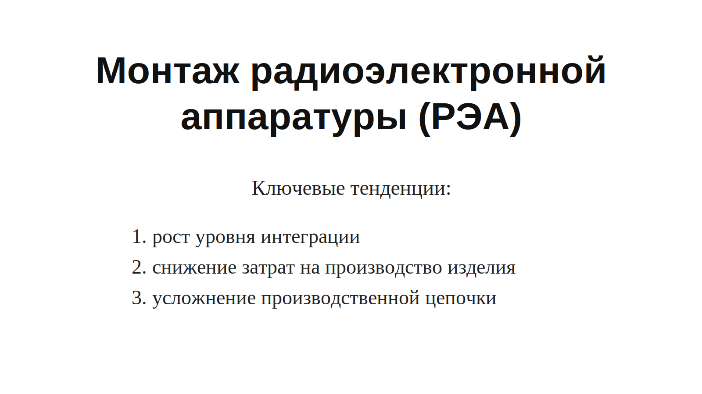

# Lecture 05 — Схемы с состоянием. Монтаж РЭА. Кремниевое производство.

## Источники

- `sources/lecture-05/source-pack.md`
- `sources/lecture-05/my-notes.md`
- `sources/lecture-05/slides.md`
- `sources/lecture-05/transcript.cleaned.md`
- `sources/lecture-05/transcript.raw.md`
- `sources/lecture-04/slides.md` — `[проверить]` только для билетов 1-5: вопросы стоят в блоке lecture-05, но часть содержательных слайдов по ним лежит в lecture-04.
- `sources/lecture-04/transcript.cleaned.md` — `[проверить]` только для билета 1.
- `csa-rolling/exam-questions-blitz.md` — только формулировки вопросов

## Список билетов

1. Каковы особенности реализации "условного оператора" в комбинационных схемах?
2. Что такое триггеры в цифровых схемах? Каковы варианты их использования?
3. Что такое D-триггер и RS-триггер? Какие существуют варианты условия изменения состояния?
4. Что такое пространственные и временные вычисления? Как они могут быть использованы для оптимизации процессоров?
5. Что называют синхронной схемотехникой? Каковы её достоинства и недостатки?
6. Почему цифровая схемотехника оперирует уровнями, а не сигналами? Какие возможности это открывает и какие проблемы создаёт?
7. Каковы ключевые тенденции в производстве радиоэлектронной аппаратуры и связанные с этим проблемы?
8. Что такое навесной монтаж, монтаж на печатную плату, штырьевой и поверхностный монтаж? Как они обеспечивают "гибкость"?
9. Какова производственная цепочка поверхностного монтажа? Каковы её этапы?
10. Какова производственная цепочка кремниевого производства? Каковы особенности формирования цены изделия?

---

## Билет 1. Каковы особенности реализации "условного оператора" в комбинационных схемах?

### Короткий ответ

Условный оператор в комбинационных схемах реализуется как выбор одного из уже сформированных уровней.
Схемотехника не может просто "не работать": на линии всё равно есть некоторый уровень.
Поэтому обе ветви можно посчитать заранее, а мультиплексор по сигналу `sel` выберет нужный результат.
Такой подход похож на спекулятивное вычисление двух вариантов с последующим выбором.
Если нужно отправить данные в один из двух приёмников, нельзя просто "скрутить" провода.
Нужно управлять тем, какой приёмник защёлкнет или примет данные.
Главная особенность в том, что условие превращается не в остановку ненужной ветви, а в управляющий уровень выбора.

### Схема / картинка

Мультиплексор выбирает один из входов по управляющему уровню `sel` и формирует один выход.

---

## Билет 2. Что такое триггеры в цифровых схемах? Каковы варианты их использования?

### Короткий ответ

#### Что такое триггеры в цифровых схемах?

Триггер — это электронное устройство, которое может долго находиться в одном из двух устойчивых состояний.
Он позволяет цифровой схеме хранить состояние, а не только вычислять выходы по текущим входам.
Без триггеров схема остаётся комбинационной и не имеет памяти.

#### Каковы варианты их использования?

Триггеры используют, чтобы зафиксировать состояние линии на длительное время.
Ими разрывают циклы в схемах, чтобы получить корректное последовательное поведение.
Ими ограничивают распространение сигнала и сокращают задержку большой комбинационной схемы.
Например, триггеры позволяют разбить вычисление на несколько тактов.

### Схема / картинка

Схема показывает, что триггер добавляет память: часть результата фиксируется и используется дальше как состояние.

---

## Билет 3. Что такое D-триггер и RS-триггер? Какие существуют варианты условия изменения состояния?

### Короткий ответ

#### Что такое D-триггер и RS-триггер?

D-триггер запоминает состояние входа `D` и выдаёт его на выход.
Его удобно воспринимать как элемент задержки и фиксации значения.
RS-триггер имеет входы `Set` и `Reset`.
При неактивных входах RS-триггер сохраняет прежнее состояние, а при активном входе меняет состояние.

#### Какие существуют варианты условия изменения состояния?

Состояние триггера может изменяться по фронту или по уровню.
Изменение по фронту происходит в момент перехода тактового сигнала.
Изменение по уровню происходит пока управляющий уровень активен.
Для синхронных схем особенно важна фиксация по такту.

### Схема / картинка

На схеме D-триггер используется как элемент памяти, который фиксирует значение между частями логики.

---

## Билет 4. Что такое пространственные и временные вычисления? Как они могут быть использованы для оптимизации процессоров?

### Короткий ответ

#### Что такое пространственные и временные вычисления?

Пространственные вычисления используют больше аппаратных узлов, чтобы выполнить работу сразу.
Временные вычисления переиспользуют один и тот же узел в разные моменты времени.
Например, 16-битный сумматор может сложить 16 бит за один такт, а 8-битный сумматор может сделать это за два шага.

#### Как они могут быть использованы для оптимизации процессоров?

Переход к пространственной организации даёт параллелизм уровня битов, инструкций или задач.
Переход к временной организации экономит площадь, но увеличивает число шагов.
Разбиение работы по стадиям помогает строить конвейер.
Оптимизация процессора поэтому часто выбирает компромисс между площадью, временем и частотой.

### Схема / картинка

Схема показывает компромисс: один широкий сумматор считает сразу, а более узкий сумматор требует нескольких тактов и системы управления.

---

## Билет 5. Что называют синхронной схемотехникой? Каковы её достоинства и недостатки?

### Короткий ответ

#### Что называют синхронной схемотехникой?

Синхронной схемотехникой называют подход, где элементы памяти меняют состояние согласованно по тактовому сигналу.
Между тактами комбинационная логика обрабатывает данные.
На следующем такте триггеры фиксируют новое значение.

#### Каковы её достоинства и недостатки?

Главное достоинство — проще рассуждать о времени и строить многотактовые схемы.
Такой подход уменьшает проблемы гонок и синхронизации.
Недостаток — частота ограничена самой медленной комбинационной схемой.
Ещё один недостаток — входные данные дискретизируются по времени.
Например, АЦП получает непрерывный сигнал, но выдаёт значения только в отдельные моменты.

### Схема / картинка

Схема показывает, что синхронная логика работает не со всеми моментами непрерывного времени, а с выбранными моментами фиксации.

---

## Билет 6. Почему цифровая схемотехника оперирует уровнями, а не сигналами? Какие возможности это открывает и какие проблемы создаёт?

### Короткий ответ

#### Почему цифровая схемотехника оперирует уровнями, а не сигналами?

Цифровая схемотехника оперирует уровнями, потому что на физической линии всегда есть некоторое электрическое состояние.
Это не сообщение, которое можно отправить или не отправить.
Даже если линия "ничего не передаёт", она всё равно имеет уровень или проблемное состояние.

#### Какие возможности это открывает и какие проблемы создаёт?

Это открывает возможность параллельной работы: разные линии одновременно держат свои уровни.
По уровням можно строить комбинационные схемы, память и синхронную фиксацию состояния.
Проблема в том, что уровни распространяются не мгновенно.
Нужно учитывать задержки, переходные процессы и момент защёлкивания.
Если нужно выбрать значение, приходится строить явную управляющую логику, например мультиплексоры и сигналы защёлкивания.

### Схема / картинка

`[подходящей картинки не найдено в sources/lecture-05]`

---

## Билет 7. Каковы ключевые тенденции в производстве радиоэлектронной аппаратуры и связанные с этим проблемы?

### Короткий ответ

Ключевые тенденции в производстве РЭА:

- **рост уровня интеграции** — больше функций и компонентов помещается в меньший объём; это повышает плотность и уменьшает размеры, но усложняет производство, ремонт и поздние изменения;
- **снижение затрат на производство изделия** — в серии изделие дешевеет за счёт автоматизации и массового выпуска; проблема в том, что подготовка производства, оборудование и контроль качества становятся дорогими;
- **усложнение производственной цепочки** — появляется больше этапов, специалистов, логистики, тестирования, упаковки, поставки и ремонта; из-за этого аппаратное производство хуже переносит ошибки и изменения, чем чистое ПО.

### Схема / картинка

Картинка фиксирует три тенденции со слайда: рост уровня интеграции, снижение затрат на производство изделия и усложнение производственной цепочки.

---

## Билет 8. Что такое навесной монтаж, монтаж на печатную плату, штырьевой и поверхностный монтаж? Как они обеспечивают "гибкость"?

### Короткий ответ

#### Что такое навесной монтаж, монтаж на печатную плату, штырьевой и поверхностный монтаж?

- **Навесной монтаж** — радиоэлементы на изолирующем шасси соединяются проводами или прямо выводами. **Плюсы:** простое производство, простая подготовка производства, высокая гибкость, если схему не залить компаундом. **Минусы:** плохо автоматизируется, дорогой в серии, надёжность хуже без защиты, плотность зависит от ручной работы монтажника.
- **Монтаж на печатную плату** — компоненты соединяются через электропроводящие цепи, заранее сформированные на поверхности или внутри диэлектрической платы. **Плюсы:** плата даёт механическое и электрическое соединение, подходит для одно-, двух- и многослойных схем. **Минусы:** соединения уже зафиксированы в плате, поэтому произвольные исправления сложнее, чем при навесном монтаже.
- **Штырьевой монтаж** — выводы компонента вставляются в отверстия печатной платы и закрепляются пайкой. **Плюсы:** такой монтаж наглядный, удобен для ручной сборки и ремонта. **Минусы:** занимает больше места и хуже подходит для высокой плотности и полной автоматизации, чем поверхностный монтаж.
- **Поверхностный монтаж** — SMD-компоненты ставятся прямо на поверхность печатной платы. **Плюсы:** хорошо автоматизируется, повышает плотность размещения, уменьшает размеры и снижает стоимость в серии. **Минусы:** требует подготовки производства, удлиняет производственную цепочку и усложняет внесение исправлений.

### Схема / картинка

**Навесной монтаж**

**Монтаж на печатную плату**

**Штырьевой монтаж**

**Поверхностный монтаж**

Фотографии взяты из слайдов lecture-05 и показывают четыре способа монтажа, перечисленные в коротком ответе.

---

## Билет 9. Какова производственная цепочка поверхностного монтажа? Каковы её этапы?

### Короткий ответ

#### Какова производственная цепочка поверхностного монтажа?

- Производственная цепочка поверхностного монтажа — это линия операций, где готовая печатная плата и SMD-компоненты превращаются в собранную плату.
- Она нужна потому, что SMD-компоненты маленькие и их выгодно ставить автоматом, а не вручную.

#### Каковы её этапы?

- Сначала берут печатную плату с уже разведёнными дорожками и контактными площадками.
- На контактные площадки наносят паяльную пасту.
- Потом автомат расставляет SMD-компоненты по своим местам.
- Затем плату отправляют на пайку: паста плавится и закрепляет компоненты.
- После пайки плату проверяют: ищут неверную установку, плохую пайку и замыкания.
- Если нашли дефекты, их исправляют или отправляют плату на доработку.
- В конце плату тестируют и передают дальше в сборку изделия.

### Схема / картинка

Схема из слайдов показывает общий поток операций поверхностного монтажа.

---

## Билет 10. Какова производственная цепочка кремниевого производства? Каковы особенности формирования цены изделия?

### Короткий ответ

#### Какова производственная цепочка кремниевого производства?

- Кремниевое производство начинается с кремниевого сырья, добывается крениевый песок.
- Затем выращивают монокристалл кремния, то есть плавят песок и отливают кристалл
- этот кристалл пилится горищонтально и получаются такие круги/диски их называют wafer`ами
- формируют рисунки слоёв ну грубо говоря транзисторы крепим
- делают межсоединения между транзисторами
- режут wafer на кристаллы и упаковывают чипы в корпус с контактами.

#### Каковы особенности формирования цены изделия?

Цена изделия связана не только с материалом, но и с дорогой линией, выходом годных кристаллов и тестированием.
Производственный брак неизбежен: не все транзисторы на пластине работают корректно.
Поэтому применяется чип-биннинг.
Один и тот же кристалл может продаваться как разные SKU, если часть блоков отключена или частота ниже.

### Схема / картинка

Схема показывает общий путь от проектирования и технологических операций к готовой интегральной схеме.

---

## Статус подготовки

- статус: `needs-check`
- дата финализации: `2026-06-13`
- оставшиеся проверки:
  - `[проверить]` `sources/lecture-05/my-notes.md` и `sources/lecture-05/source-pack.md` являются заглушками.
  - `[проверить]` В `sources/lecture-05/transcript.cleaned.md` указано, что raw-транскрипт шумный и есть тематический сдвиг границ лекции.
  - `[проверить]` Билеты 1-5 частично опираются на материалы lecture-04, потому что в источниках lecture-05 соответствующие слайды отсутствуют.
  - `[проверить]` Билет 9 текстово восстанавливает этапы SMD по слайду-картинке `smd-flow.jpg`.
  - `[проверить]` Билет 10 не содержит полной экономической модели цены, только факторы из слайдов lecture-05.
