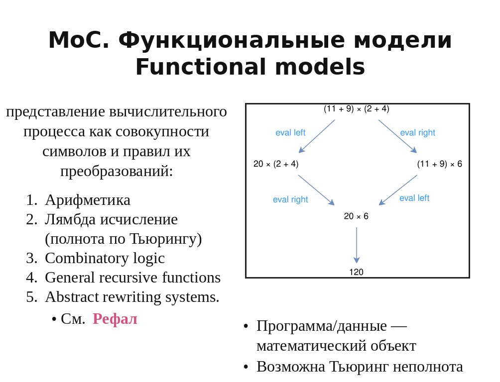
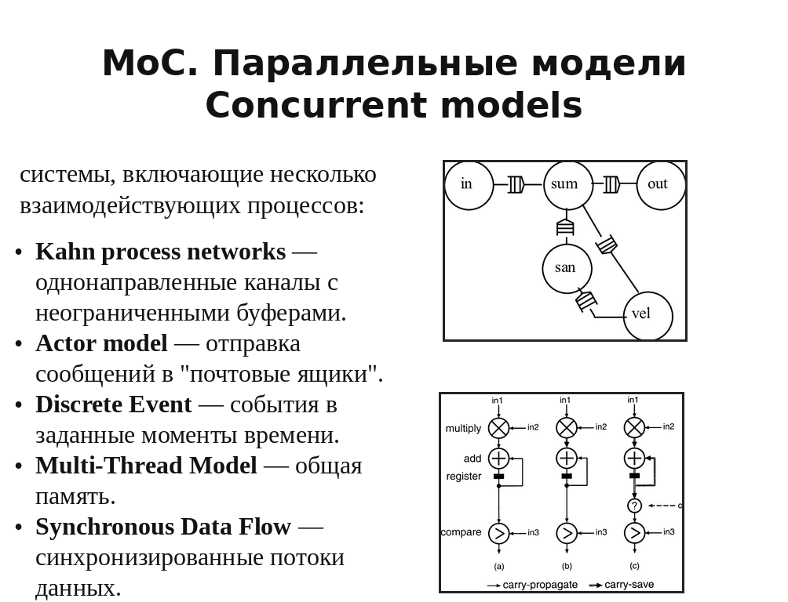

# Lecture 06 — Проблемы аппаратуры. 2 этапа производства. Hardware/Software. Программа. MoC

## Источники

- `sources/lecture-06/source-pack.md`
- `sources/lecture-06/my-notes.md`
- `sources/lecture-06/slides.md`
- `sources/lecture-06/transcript.cleaned.md`
- `sources/lecture-06/transcript.raw.md`
- `sources/lecture-05/slides.md` — `[проверить]` только для билетов 1-4: в слайдах lecture-06 этих тем почти нет, но они заявлены в названии lecture-06 и раскрыты в соседнем источнике.
- `sources/lecture-05/transcript.cleaned.md` — `[проверить]` только для билетов 1-4.
- `csa-rolling/exam-questions-blitz.md` — только формулировки вопросов

## Список билетов

1. Какие трудности связаны с производством аппаратного обеспечения (подготовка производства, элементная база)?
2. Какие трудности связаны с эксплуатацией аппаратного обеспечения (амортизация, физический доступ, среда эксплуатация)?
3. Какие подходы к решению проблемы "устаревающей аппаратуры" существуют с точки зрения аппаратуры и ПО?
4. Что такое концепция 2-этапного производства? Объясните подходы к "конфигурированию": сборка, комплектация, реконфигурация, программирование.
5. Каково определение программной системы согласно OMG Essence? Каковы её части?
6. Что такое программное и аппаратное обеспечение? Что означают понятия Hardware и Software? Сопоставьте их.
7. Какие возможности открывает программное обеспечение (цикл разработки, гибкость, контроль, и т.д.)?
8. Чем отличается типовое проектирование Hardware/Software от совместного (CoDesign) проектирования Hardware/Software? Каковы достоинства и недостатки?
9. Что такое "Модель вычислений"? В чём назначение моделей вычислений? Приведите примеры.
10. Что такое последовательные модели вычислений? Приведите примеры. Как в них представляется вычислительный процесс?
11. Что такое машина Тьюринга и почему она важна для теории вычислений?
12. Что такое Random Access Machine? Каково её устройство и место сегодня? Какова её связь с машиной Тьюринга?
13. Что такое функциональные модели вычислений? Приведите примеры. Как в них представляется вычислительный процесс?
14. Что такое параллельные модели вычислений? Приведите примеры. Как в них представляется вычислительный процесс?

---

## Билет 1. Какие трудности связаны с производством аппаратного обеспечения (подготовка производства, элементная база)?

### Короткий ответ

- **Логистика**
  Нужно физически доставить компоненты, платы, корпуса и готовые изделия между участниками производства.
- **Склады**
  Нужно хранить компоненты, полуфабрикаты, готовые устройства и запасные части.
- **Специалисты**
  Нужны люди, которые понимают технологию производства, монтаж, контроль качества и ремонт.
- **Производственная цепочка**
  Изделие проходит много этапов, и ошибка на одном этапе может остановить весь выпуск.
- **Тестирование**
  Каждое физическое устройство нужно проверить, потому что брак нельзя исправить простым обновлением кода.
- **Упаковка**
  Изделие нужно защитить при перевозке и хранении, иначе оно может повредиться ещё до эксплуатации.
- **Дистрибуция**
  Готовые устройства нужно довезти до пользователя или места установки.
- **Гарантийный ремонт**
  После продажи устройство может вернуться в сервис, и для этого нужны запчасти, диагностика и физический доступ.
- **Подготовка производства**
  Перед серией нужно настроить оборудование, процессы и контроль качества.
- **Элементная база**
  Детали могут устареть, исчезнуть с рынка или подорожать, и тогда изделие приходится переделывать.

### Схема / картинка

Картинка повторяет слайд со списком производственных сложностей: логистика, склады, специалисты, производственная цепочка, тестирование, упаковка, дистрибуция и гарантийный ремонт.

### Пояснение от ИИ простыми словами

- **Главная мысль:** железо трудно не только придумать, но и физически выпустить.
- Для производства нужны детали, склады, специалисты, оборудование, тестирование, доставка и ремонт.
- Ошибка в аппаратуре часто превращается в дорогую физическую проблему: партию нужно проверять, чинить или переделывать.
- **Элементная база** важна: если нужная деталь исчезла с рынка, устройство может потребовать перепроектирования.
- На экзамене можно сказать так: производство Hardware — это длинная цепочка реальных процессов, а не просто "собрать файл и отправить пользователю".

---

## Билет 2. Какие трудности связаны с эксплуатацией аппаратного обеспечения (амортизация, физический доступ, среда эксплуатация)?

### Короткий ответ

#### Суть

- Трудности эксплуатации аппаратного обеспечения возникают потому, что **аппаратура живёт в физическом мире**: стареет, ломается и зависит от условий вокруг.
- В отличие от программы, **железо может деградировать само по себе**, даже если логика работы и данные не менялись.

#### 1. Амортизация. Выход оборудования из строя

- **Амортизация** — постепенное старение компонентов, контактов, соединений и материалов.
- Итог — снижение надёжности, случайные отказы и полный **выход оборудования из строя**.

#### 2. Необходимость физического доступа

- **Физический доступ** нужен для ремонта, замены детали, восстановления контакта, переподключения кабеля или разборки корпуса.
- Если устройство удалённое, встроенное или космическое, обслуживание становится дорогим, долгим или почти невозможным.

#### 3. Особенности среды эксплуатации

- **Среда эксплуатации** — питание, температура, влажность, вода, механические нагрузки, помехи и условия объекта.
- Эти факторы могут вызвать сбой или ускорить износ даже у корректно спроектированной аппаратуры.

#### 4. Долгосрочные эффекты

- **Долгосрочные эффекты** проявляются через годы: деградация материалов, старение соединений, оловянные нитевидные кристаллы.
- Пример: оловянный «ус» может замкнуть проводники или вызвать дугу, поэтому надёжная сегодня плата может отказать спустя большой срок эксплуатации.

### Схема / картинка

На картинке перечислены четыре проблемы эксплуатации аппаратного обеспечения:

1. **Амортизация. Выход оборудования из строя** — аппаратура физически стареет, поэтому её надёжность падает со временем.
2. **Необходимость физического доступа** — многие аппаратные проблемы нельзя исправить только программно; нужно добраться до устройства.
3. **Особенности среды эксплуатации** — реальные условия вокруг устройства могут ломать расчётные предположения проектировщика.
4. **Долгосрочные эффекты** — часть отказов появляется не сразу, а после длительной работы материалов и соединений.

### Пояснение от ИИ простыми словами

- **Главная мысль:** аппаратура работает в физическом мире, поэтому она стареет, ломается и зависит от окружения.
- Программа сама по себе не ржавеет и не плавится, а плата, контакты, корпус и питание могут деградировать.
- Для ремонта часто нужно физически добраться до устройства: открыть корпус, заменить деталь, проверить соединения.
- Среда тоже влияет: температура, влажность, питание, вибрации и помехи могут вызвать сбой.
- Чем устройство дальше или недоступнее, тем дороже даже маленькая аппаратная проблема.

---

## Билет 3. Какие подходы к решению проблемы "устаревающей аппаратуры" существуют с точки зрения аппаратуры и ПО?

### Короткий ответ

#### 1. Что такое проблема устаревающей аппаратуры

- **Устаревающая аппаратура** — оборудование, которое ещё нужно системе, но его уже не производят, так называемый legacy в мире HardWare

#### 2. Подходы к решению

##### 1. Перепроектирование на новой элементной базе 
- Это **аппаратный подход**: старое устройство создают заново на современных компонентах.
- Цель — получить **функциональный эквивалент**: внутри новое железо, снаружи прежняя роль в системе.
- Минус — дорого: нужно заново проектировать, производить, тестировать и проверять совместимость.

##### 2. Модульная организация
- Если система собрана модульно, старый блок можно заменить новым модулем через тот же **стандартный интерфейс**.

##### 3. Виртуализация

- В этом контексте виртуализация — это способ заменить устаревшую аппаратуру не новым физическим устройством, а программной средой, которая воспроизводит поведение старой платформы.

##### 4. Ограничение: пользовательский опыт

- Пользователю впадлу переходить на новое ПО

### Схема / картинка

Картинка используется в слайдах рядом с вопросом замены устаревших частей: система может постепенно меняться, сохраняя прежнюю функцию и интерфейс.

### Пояснение от ИИ простыми словами

- **Проблема:** система ещё нужна, но её старое железо уже трудно купить, чинить или поддерживать.
- **Аппаратный путь:** сделать новый физический модуль, который выполняет старую функцию.
- **Модульный путь:** если интерфейс стандартный, можно заменить один блок, не переделывая всю систему.
- **Программный путь:** виртуализация воспроизводит поведение старой платформы программно.
- Важно помнить: сохранить функцию мало; иногда нужно сохранить ещё и привычное поведение для пользователя.

---

## Билет 4. Что такое концепция 2-этапного производства? Объясните подходы к "конфигурированию": сборка, комплектация, реконфигурация, программирование.

### Короткий ответ

#### Что такое концепция 2-этапного производства?

Концепция 2-этапного производства разделяет выпуск универсальной аппаратной платформы и настройку её прикладного поведения.
Сначала производят достаточно универсальную компьютерную систему.
Потом её конфигурируют под конкретную задачу.
Так длинный и дорогой аппаратный цикл заменяется более гибкой настройкой.

#### Подходы к "конфигурированию"

1. **Сборка** — физически собрать систему из заранее предусмотренных элементов: перемычек, плат расширения, макетных плат, внешних модулей.

2. **Комплектация** — выбрать нужный состав устройства или набора модулей под задачу: какие блоки поставить, какие функции включить, какие порты или вычислители добавить.

3. **Реконфигурация** — после производства изменить связи между уже существующими вычислительными узлами. Пример: FPGA или CGRA, где структура блоков есть, но коммутация задаётся заново.

4. **Программирование** — задать поведение через данные или инструкции в памяти. Один и тот же процессор становится разным инструментом в зависимости от программы.

### Схема / картинка

Слайд показывает два этапа: производство универсальной компьютерной системы и настройку прикладного поведения.
Схема ниже связывает базовую платформу, конфигурацию прикладного поведения и экземпляр сконфигурированной системы.

### Пояснение от ИИ простыми словами

- **Главная идея:** сначала делают универсальную платформу, а потом настраивают её под конкретную задачу.
- Это выгодно, потому что не нужно каждый раз заново производить отдельное железо.
- **Сборка** и **комплектация** меняют физический состав системы.
- **Реконфигурация** меняет связи внутри уже готовой аппаратуры, например в FPGA.
- **Программирование** меняет поведение через инструкции и данные, поэтому одна и та же машина может решать разные задачи.

---

## Билет 5. Каково определение программной системы согласно OMG Essence? Каковы её части?

### Короткий ответ

#### Каково определение программной системы согласно OMG Essence?

Программная система по OMG Essence — это система, состоящая из software, hardware и data, которая даёт основную ценность через исполнение software.
То есть ценность такой системы возникает не просто из железа, а из выполняемого программного поведения.

#### Каковы её части?

В программной системе есть software, hardware и data.
Software отвечает за исполняемое поведение и связанные с ним нематериальные артефакты.
Hardware даёт физическую вычислительную основу.
Data — это данные, необходимые для работы системы.
Например, веб-сервис включает серверы, программы и рабочие данные.

### Схема / картинка

`[подходящей картинки не найдено]`

### Пояснение от ИИ простыми словами

- **Программная система** — это не только код.
- В ней есть **software**, которое задаёт поведение; **hardware**, на котором это поведение исполняется; и **data**, с которыми система работает.
- Главная ценность такой системы появляется, когда software реально исполняется и даёт пользователю нужную функцию.
- Пример: веб-сервис — это серверы, программы и данные пользователей вместе, а не один только исходный код.
- На экзамене удобно сказать: software даёт поведение, hardware даёт физическую основу, data даёт рабочее содержимое.

---

## Билет 6. Что такое программное и аппаратное обеспечение? Что означают понятия Hardware и Software? Сопоставьте их.

### Короткий ответ

#### Что такое программное и аппаратное обеспечение?

Аппаратное обеспечение — это электронные и механические части вычислительного устройства.
Программное обеспечение — это программы, документы и другие нематериальные компоненты, нужные для эксплуатации системы.
Программа является данными: её можно отделить от носителя и передать.

#### Что означают понятия Hardware и Software? Сопоставьте их.

Hardware и Software в курсе не полностью совпадают с русскими "аппаратура" и "ПО".
Их нужно сопоставлять не только по материалу, но и по **жизненному циклу изменения**.

#### Сопоставление по критериям

1. **Физичность**
   Hardware связано с физическим изделием: его нужно произвести, поставить, подключить и обслуживать.
   Software задаётся данными и инструкциями: его можно отделить от носителя, передать и заменить.

2. **Скорость разработки**
   Hardware имеет длинный цикл: проектирование, производство, поставка, проверка.
   Software обычно имеет быстрый цикл: изменить, собрать, протестировать, выкатить новую версию.

3. **Стоимость изменения**
   Ошибка в Hardware может требовать перепроектирования, перепроизводства и перепоставки.
   Ошибка в Software часто исправляется патчем или обновлением.

4. **Доставка пользователю**
   Hardware требует логистики и физического доступа.
   Software можно доставить удалённо, иногда даже без явного участия пользователя.

5. **Гибкость поведения**
   Hardware чаще фиксирует структуру системы.
   Software приспосабливает одну и ту же аппаратуру к разным задачам.

6. **Эксплуатация и старение**
   Hardware изнашивается, зависит от среды и может физически выйти из строя.
   Software само по себе не изнашивается, но зависит от платформы, данных и обновлений.

7. **Контроль над системой**
   Hardware сильнее привязано к владению физическим устройством.
   Software и сервисы дают поставщику больше контроля: обновления, отключение функций, изменение поведения.

8. **Контекст границы**
   Компонент может быть программируемым, но использоваться как Hardware: например, ПЛИС работает как схема.
   Компонент может называться "виртуальным компьютером" или "виртуальной сетью", но быть реализован Software.

### Схема / картинка

`[подходящей картинки не найдено]`

### Пояснение от ИИ простыми словами

- **Hardware** ближе к физическому изделию: его надо произвести, доставить, подключить и ремонтировать.
- **Software** ближе к данным и инструкциям: его можно копировать, передавать и обновлять.
- Главное различие не только в том, "можно потрогать или нет", а в том, как компонент меняется во времени.
- Ошибку в Software часто можно исправить патчем; ошибку в Hardware иногда нужно исправлять новой платой или новой партией.
- Граница бывает неочевидной: программируемая ПЛИС вроде программируется, но после конфигурации ведёт себя как аппаратная схема.

---

## Билет 7. Какие возможности открывает программное обеспечение (цикл разработки, гибкость, контроль, и т.д.)?

### Короткий ответ

#### 1. Быстрый цикл разработки

ПО можно быстро менять, собирать, проверять и выпускать новой версией.
Для этого не нужно перепроизводить физическое изделие.

#### 2. Легко заменяется прямо у пользователя

Программу можно обновить уже после поставки системы.
Одна и та же аппаратура получает новое поведение без замены устройства.

#### 3. Пользователь как Beta-тестер

Из-за быстрых релизов часть ошибок может находиться уже на стороне пользователя.
Пользователь фактически участвует в проверке реальной версии продукта.

#### 4. Возможно удалённое обновление, в том числе без информированного согласия

Патч можно доставить по сети без физического доступа к устройству.
Это удобно для исправлений, но усиливает контроль поставщика над системой.

#### 5. Сервис — вершина владения компьютерной системой

Если система работает как сервис, поставщик управляет обновлениями, доступом и поведением.
Пользователь владеет не всей системой, а в основном доступом к её функциям.

#### 6. Процесс создания и внедрения ПО автоматизируется (CI/CD)

Сборку, тестирование и доставку можно включить в автоматический pipeline.
Это ускоряет выпуск изменений и делает частые релизы технически возможными.

#### 7. Высокая сложность программ

Гибкость ПО имеет цену: программы становятся большими, многослойными и трудными для полного контроля.
Поэтому быстрые патчи не означают простую разработку.

#### Примечание

Здесь речь про **применение патча**, а не про его разработку.
Разработать корректный патч может быть сложно, но доставить и применить его обычно проще, чем изменить аппаратуру.

### Схема / картинка

Слайд перечисляет свойства программного обеспечения: быстрый цикл разработки, заменяемость у пользователя, beta-тестирование на пользователях, удалённые обновления, сервисный контроль, CI/CD и высокую сложность программ.

### Пояснение от ИИ простыми словами

- **Главная мысль:** software делает систему гибкой, потому что поведение можно менять без перепроизводства железа.
- Программу можно обновить у пользователя, иногда просто через сеть.
- Это даёт быстрые релизы, CI/CD и возможность исправлять ошибки после поставки.
- Но есть обратная сторона: пользователь может стать beta-тестером, а поставщик получает больше контроля над системой.
- Software проще доставить, но не обязательно проще разработать: большие программы становятся очень сложными.

---

## Билет 8. Чем отличается типовое проектирование Hardware/Software от совместного (CoDesign) проектирования Hardware/Software? Каковы достоинства и недостатки?

### Короткий ответ

#### Чем отличается типовое проектирование Hardware/Software от совместного (CoDesign) проектирования Hardware/Software?

Типовое HW/SW проектирование сначала проектирует аппаратуру, а потом под неё пишется программа.

**проблемы этого подхода**
- система не всегда идельно подходит под задачи, которые нужно решать
- Высокие интеграционные риски (есть большая вероятность, что когда мы попытаемся соединить SW и HW ничего не будет работать, тк все разрабатывалось отдельно)
- Последовательная разработка

**Решение CoDesign: мы проектируем систему**

1. **Разработка интерфейса HW/SW (системы команд)**  
   Сначала задают границу между аппаратурой и программой: какие команды, механизмы и способы взаимодействия будут доступны.

2. **Разработка моделей HW/SW для получения обратной связи**  
   До финальной реализации строят модели аппаратной и программной частей, чтобы проверить идеи раньше интеграции.

3. **Разработка HW/SW, верификация моделей**  
   Аппаратная и программная части развиваются вместе, а модели проверяются на согласованность с будущей системой.

4. **Замена моделей на HW/SW**  
   Когда решения проверены, модели постепенно заменяют реальной аппаратурой и реальным программным обеспечением.

#### Каковы достоинства и недостатки?

Типовой подход проще организовать, но он даёт шаблонный дизайн, интеграционные риски и последовательную разработку.
CoDesign снижает риск поздней интеграции и может сократить сроки.
Но он требует моделей, верификации и более сложной координации команды.
Главный выигрыш CoDesign — раньше понять, что должно стать железом, а что программой.

### Схема / картинка

Слайд показывает типовое HW/SW проектирование: отдельно проектируют аппаратуру, отдельно пишут программу, а затем сталкиваются с интеграционными рисками и последовательными сроками.

Слайд показывает CoDesign: проектируется вся система, сначала через интерфейс и модели HW/SW, затем через совместную разработку, верификацию и замену моделей реальными HW/SW.

### Пояснение от ИИ простыми словами

- **Типовое проектирование:** сначала делают железо, потом пытаются написать под него программу.
- Проблема такого подхода: в конце может оказаться, что hardware и software плохо подходят друг другу.
- **CoDesign** начинает с проектирования всей системы сразу: где будет железо, где программа, и как они общаются.
- Модели нужны, чтобы раньше проверить решения и не ждать поздней интеграции.
- Выигрыш CoDesign — меньше сюрпризов на стыке HW/SW; цена — больше координации, моделей и проверок.

---

## Билет 9. Что такое "Модель вычислений"? В чём назначение моделей вычислений? Приведите примеры.

### Короткий ответ

#### Что такое "Модель вычислений"?

Модель вычислений — это способ описывать вычислительный процесс: какие состояния возможны, как они меняются и по каким правилам выполняется программа.
Она даёт язык для описания моделей процессов, программ и структур.

#### Почему машина Тьюринга — это модель вычислений?

**Машина Тьюринга** показывает определение MoC на простом примере.
У неё есть **неограниченная двусторонняя лента** из ячеек и **головка чтения-записи**, которая находится в одном из конечного числа состояний.

В этой модели **состояние вычисления** — это содержимое ленты, положение головки и текущее состояние управляющего устройства.
**Переход** — один шаг машины: головка читает символ, записывает новый символ, меняет состояние и сдвигается влево или вправо.
**Правила выполнения программы** — таблица переходов, которая говорит, что делать для каждой пары "текущее состояние + прочитанный символ".

Поэтому машина Тьюринга — именно **модель вычислений**: она не описывает реальный компьютер во всех деталях, а задаёт абстрактные состояния, допустимые шаги и правила, по которым получается результат.

#### В чём назначение моделей вычислений?

Модели вычислений нужны, чтобы **зафиксировать правила вычислительного процесса**.
Они отвечают не на вопрос "из каких деталей собран компьютер", а на вопрос **как вообще исполняется программа**.

- **Описать исполнение**: какие состояния возможны, в каком порядке они появляются, какие переходы разрешены.
- **Определить возможности машины**: какие процессы эта модель умеет выражать и выполнять.
- **Упростить анализ**: MoC обычно минималистична относительно реального вычислителя, поэтому по ней легче рассуждать о корректности, сложности и поведении.
- **Проектировать инструменты**: модели вычислений используют в формальных моделях, дизайне языков программирования и модель-ориентированной инженерии.

#### Примеры

Примеры: конечные автоматы, автоматы с магазинной памятью, машина Тьюринга, RAM-модель, лямбда-исчисление, акторная модель и синхронные потоки данных.

### Схема / картинка

Схема используется в слайдах как иллюстрация Model of Computation.

### Пояснение от ИИ простыми словами

- **Модель вычислений** отвечает на вопрос: "по каким правилам вообще идёт вычисление?"
- Она описывает состояния, допустимые шаги и правила перехода к следующему состоянию.
- На примере машины Тьюринга это видно просто: лента и головка задают состояние, а таблица переходов задаёт следующий шаг.
- Назначение MoC — упростить реальный компьютер до понятной схемы, по которой можно рассуждать о поведении программы.
- Примеры MoC разные: машина Тьюринга, RAM, лямбда-исчисление, акторы, синхронные потоки данных.

---

## Билет 10. Что такое последовательные модели вычислений? Приведите примеры. Как в них представляется вычислительный процесс?

### Короткий ответ

#### Что такое последовательные модели вычислений?

Последовательные модели вычислений описывают процесс как последовательность переходов между состояниями.
В каждый момент есть текущее состояние, а правило перехода определяет следующее.

#### Приведите примеры.

Примеры: конечные автоматы, автоматы с магазинной памятью, машины Тьюринга и Random Access Machines.

#### Как в них представляется вычислительный процесс?

Вычислительный процесс представляется как цепочка состояний.
Автомат меняет состояние, машина Тьюринга читает и пишет символы на ленте, а RAM-модель изменяет значения в памяти и регистрах.
Такие модели относительно просто реализуются аппаратно.

### Схема / картинка

Схема показывает последовательный процесс как переходы между состояниями.

### Пояснение от ИИ простыми словами

- **Последовательная модель** — это когда вычисление идёт шаг за шагом.
- В каждый момент есть текущее состояние, а затем выполняется один переход к следующему состоянию.
- Конечный автомат меняет состояние по таблице переходов.
- Машина Тьюринга меняет состояние ленты, положение головки и состояние управления.
- RAM-модель ближе к процессору: шаг меняет память, регистры или текущую инструкцию.

---

## Билет 11. Что такое машина Тьюринга и почему она важна для теории вычислений?

### Короткий ответ

#### Что такое машина Тьюринга?

Машина Тьюринга — это абстрактная вычислительная машина с неограниченной двусторонней лентой и устройством управления.
Лента разделена на ячейки.
Головка может читать символ, записывать символ и двигаться влево или вправо.
Устройство управления находится в одном из конечного числа состояний.

#### Почему она важна для теории вычислений?

Машина Тьюринга важна, потому что обладает полнотой по Тьюрингу.
Это значит, что на ней можно реализовать любой известный алгоритм.
Она также связана с проблемой остановки.(Можно ли по программе и её входным данным заранее понять, остановится программа или будет выполняться бесконечно?) Главный результат: универсального алгоритма для этого не существует. То есть нельзя написать программу, которая для любой другой программы всегда правильно скажет: “остановится” или “не остановится”.
Поэтому машина Тьюринга задаёт базовый предел рассуждений о вычислимости.

### Схема / картинка

Картинка иллюстрирует абстрактную машину с лентой и управляющим устройством.

### Пояснение от ИИ простыми словами

- **Машина Тьюринга** — это предельно простая абстрактная машина для рассуждений о вычислениях.
- У неё есть лента с ячейками, головка чтения-записи и конечное число внутренних состояний.
- Один шаг: прочитать символ, записать символ, поменять состояние и сдвинуть головку.
- Она важна, потому что на ней можно выразить любой известный алгоритм.
- Проблема остановки показывает предел анализа: нельзя сделать универсальную проверку, которая для любой программы всегда скажет, остановится она или нет.

---

## Билет 12. Что такое Random Access Machine? Каково её устройство и место сегодня? Какова её связь с машиной Тьюринга?

### Короткий ответ

#### Что такое Random Access Machine?

Random Access Machine — это последовательная модель вычислений с памятью произвольного доступа. (это по факту машина тьюринга только пишет и читает она не с ленты а с регистров которых кстати по умолчанию бесконеечность)

#### Каково её устройство и место сегодня?

RAM-модель включает вычислитель и память, к ячейкам которой можно обращаться по адресу.
В слайдах она указана как современный процессор с оговорками.
Сегодня она важна как модель, близкая к машине фон Неймана.

#### Какова её связь с машиной Тьюринга?

RAM и машина Тьюринга обе являются последовательными моделями вычислений.
Машина Тьюринга важна как теоретическая базовая модель.
RAM ближе к практической реализации, потому что использует адресуемую память.

### Схема / картинка

Схема иллюстрирует RAM-модель как вычислитель с памятью произвольного доступа.

### Пояснение от ИИ простыми словами

- **RAM-модель** похожа на идеализированный процессор с адресуемой памятью.
- В отличие от машины Тьюринга, здесь не нужно идти по ленте клетка за клеткой: можно обратиться к ячейке по адресу.
- Поэтому RAM удобнее для понимания обычных программ и машин фон Неймана.
- Это всё ещё модель, а не точное описание реального CPU: в настоящем процессоре есть кеши, конвейер, задержки и другие детали.
- Связь с машиной Тьюринга такая: обе модели описывают вычисления, но RAM ближе к инженерной интуиции современного компьютера.

---

## Билет 13. Что такое функциональные модели вычислений? Приведите примеры. Как в них представляется вычислительный процесс?

### Короткий ответ

#### Что такое функциональные модели вычислений?

**Функциональная модель вычислений** смотрит на программу не как на команды для процессора, а как на **математическое выражение**, которое надо постепенно преобразовать по правилам.
Программа и данные рассматриваются как **математический объект**.

Это не модель вида "загрузи из памяти, сложи, запиши обратно".
Главная идея:

$$
\text{вычисление} = \text{цепочка преобразований выражения}
$$

#### Приведите примеры.

Примеры: арифметика, лямбда-исчисление, комбинаторная логика, общие рекурсивные функции и abstract rewriting systems.
В слайдах также упоминается Рефал как пример, связанный с переписыванием.

#### Как в них представляется вычислительный процесс?

Вычислительный процесс представляется как **преобразование символического выражения**.
Например, есть выражение:

$$
(11 + 9) \times (2 + 4)
$$

Можно сначала вычислять левую часть:

$$
(11 + 9) \times (2 + 4)
\rightarrow 20 \times (2 + 4)
\rightarrow 20 \times 6
\rightarrow 120
$$

А можно сначала вычислять правую часть:

$$
(11 + 9) \times (2 + 4)
\rightarrow (11 + 9) \times 6
\rightarrow 20 \times 6
\rightarrow 120
$$

В такой модели:

- **состояние** — текущее выражение;
- **переход** — одно преобразование выражения;
- **правила** — правила арифметики, лямбда-исчисления, переписывания и т.п.;
- **результат** — выражение, которое дальше уже не надо преобразовывать.

#### Как понимать примеры?

- **Арифметика** — выражения преобразуются по правилам сложения и умножения.
- **Лямбда-исчисление** — вычисление через подстановку аргументов в функции; важная теоретическая модель, полная по Тьюрингу.
- **Abstract rewriting systems** — общая идея: есть символы и правила вида "если видишь такую форму, замени её на такую".

Для устного ответа: **функциональные модели вычислений представляют вычисление как преобразование символических выражений по правилам**.
Вычислительный процесс — это не выполнение инструкций процессором, а последовательность **редукций** или **переписываний выражения** до результата.

### Схема / картинка

Слайд иллюстрирует функциональные модели как работу с символами и правилами их преобразования.

### Пояснение от ИИ простыми словами

- **Функциональная модель** смотрит на вычисление как на переписывание выражения.
- Состояние — это текущее выражение, например \((11 + 9) \times (2 + 4)\).
- Переход — один шаг преобразования: посчитали левую часть, правую часть или применили правило подстановки.
- Результат — выражение, которое дальше уже не нужно упрощать.
- Поэтому здесь важны не команды процессора, а правила преобразования символов: арифметика, лямбда-исчисление, rewriting systems.

---

## Билет 14. Что такое параллельные модели вычислений? Приведите примеры. Как в них представляется вычислительный процесс?

### Короткий ответ

#### Что такое параллельные модели вычислений?

Параллельные модели вычислений описывают системы из нескольких взаимодействующих процессов.
В них важно не только состояние одного вычислителя, но и обмен между процессами.

#### Приведите примеры.

- **Kahn process networks** — сеть процессов, соединённых **однонаправленными каналами** с неограниченными буферами.
- **Actor model** — независимые акторы обмениваются сообщениями через свои **"почтовые ящики"**.
- **Discrete Event** — вычисление задаётся **событиями**, которые происходят в определённые моменты времени.
- **Multi-Thread Model** — несколько потоков работают через **общую память**, поэтому важна синхронизация доступа.
- **Synchronous Data Flow** — блоки обмениваются **синхронизированными потоками данных**.

#### Как в них представляется вычислительный процесс?

Вычислительный процесс представляется как работа нескольких процессов, потоков, акторов или блоков.
Они взаимодействуют через каналы, сообщения, события, общую память или синхронизированные потоки данных.
Например, актор получает сообщения в почтовый ящик, а Kahn network передаёт данные по однонаправленным каналам.

### Схема / картинка

Слайд показывает параллельные модели как системы из нескольких взаимодействующих процессов.
На схеме Kahn process network круги `in`, `sum`, `out`, `san`, `vel` — отдельные процессы, а маленькие прямоугольники на связях — буферы каналов.
`in` можно читать как входной процесс, `sum` — как центральный вычислительный процесс, `out` — как выходной процесс.
`san` и `vel` на слайде не расшифрованы: здесь они важны как дополнительные процессы, связанные с сетью через такие же буферизованные каналы.

### Пояснение от ИИ простыми словами

- **Параллельная модель** нужна, когда вычисление делает не один последовательный исполнитель, а несколько взаимодействующих частей.
- Главное здесь — не только "что делает процесс", но и **как процессы общаются**.
- В Kahn process networks данные идут по однонаправленным каналам.
- В actor model объекты-акторы отправляют друг другу сообщения.
- В discrete event model состояние меняется в заданные моменты времени через события.
- В multi-thread model потоки работают через общую память, поэтому появляется проблема синхронизации.
- В synchronous data flow вычисление похоже на сеть блоков, которые обрабатывают синхронизированные потоки данных.

---

## Статус подготовки

- статус: `needs-check`
- дата финализации: `2026-06-13`
- оставшиеся проверки:
  - `[проверить]` `sources/lecture-06/my-notes.md` и `sources/lecture-06/source-pack.md` являются заглушками.
  - `[проверить]` `sources/lecture-06/transcript.cleaned.md` предупреждает, что raw-транскрипт тематически сдвинут и похож на материал другой лекции.
  - `[проверить]` Билеты 1-4 опираются на материалы lecture-05, потому что в слайдах lecture-06 эти темы почти отсутствуют, хотя заявлены в названии и экзаменационном блоке.
  - `[проверить]` В билетах 8, 12, 13 и 14 некоторые пояснения являются аккуратным раскрытием слайдов, а не прямой цитатой транскрипта.
