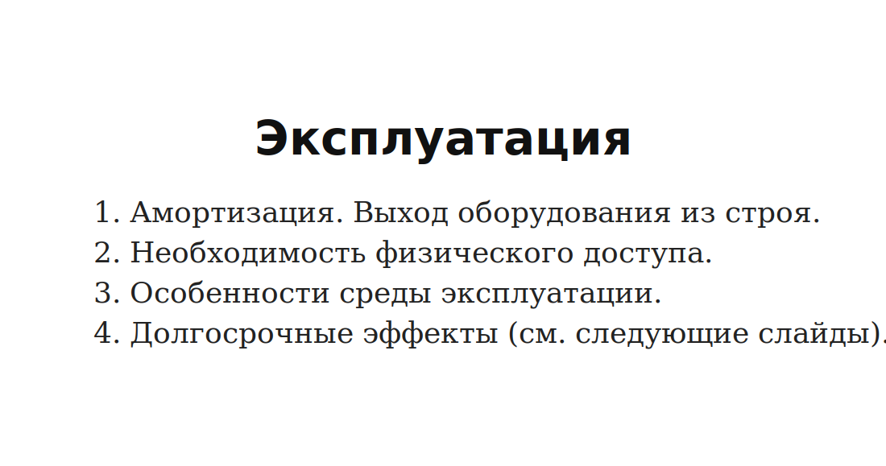
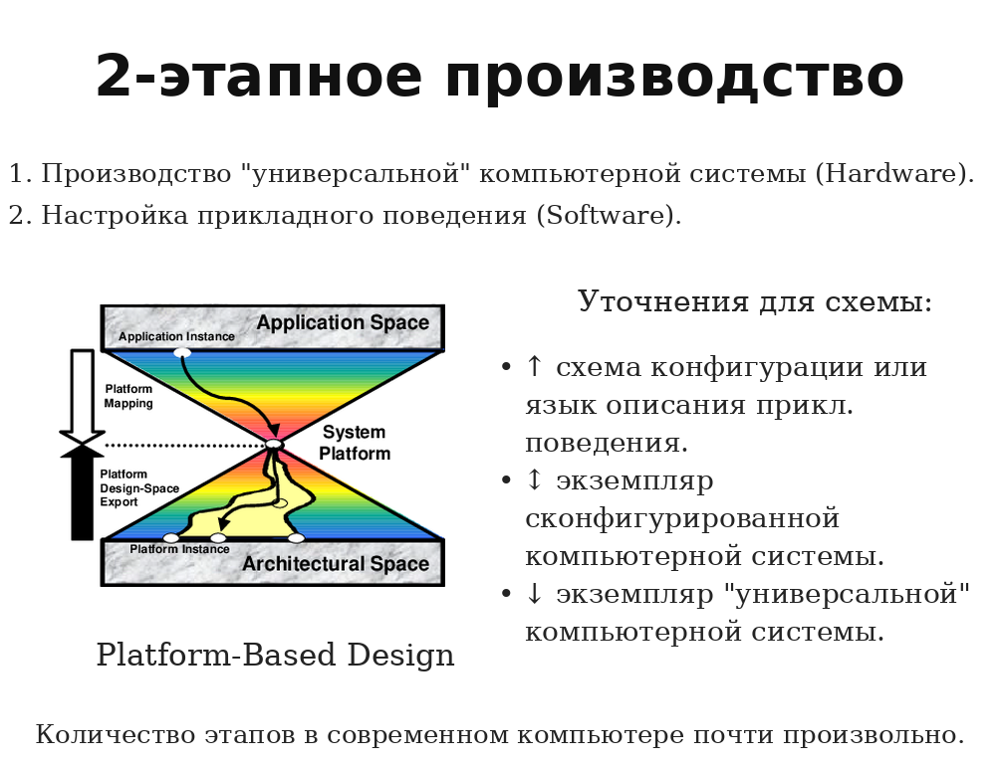
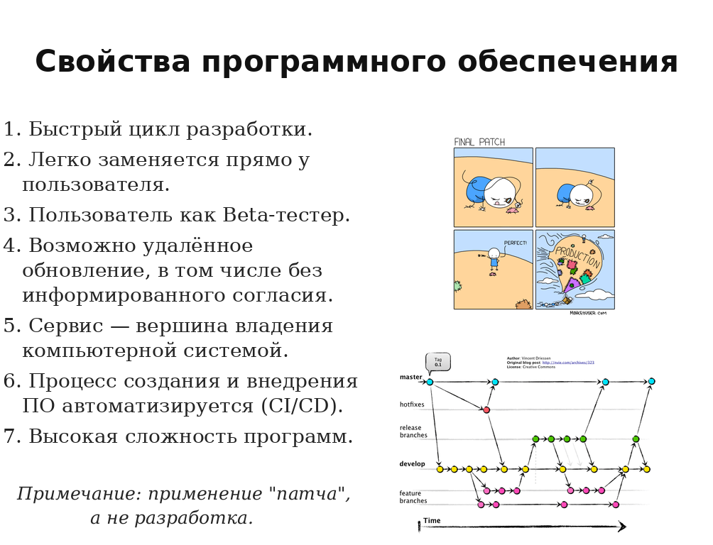
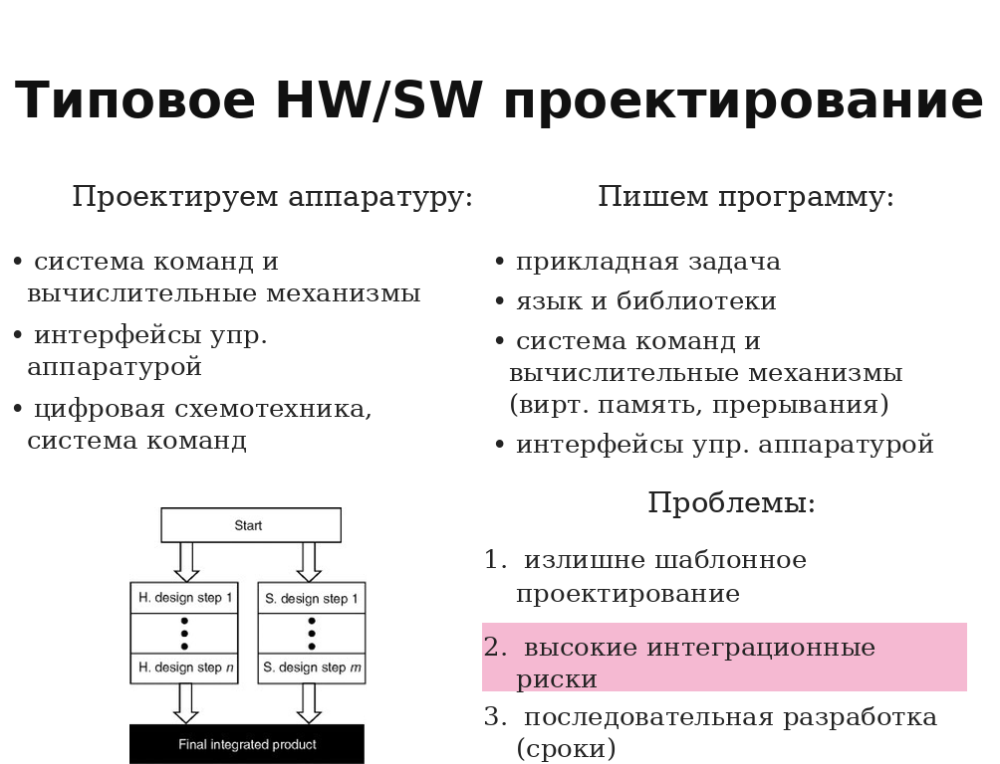
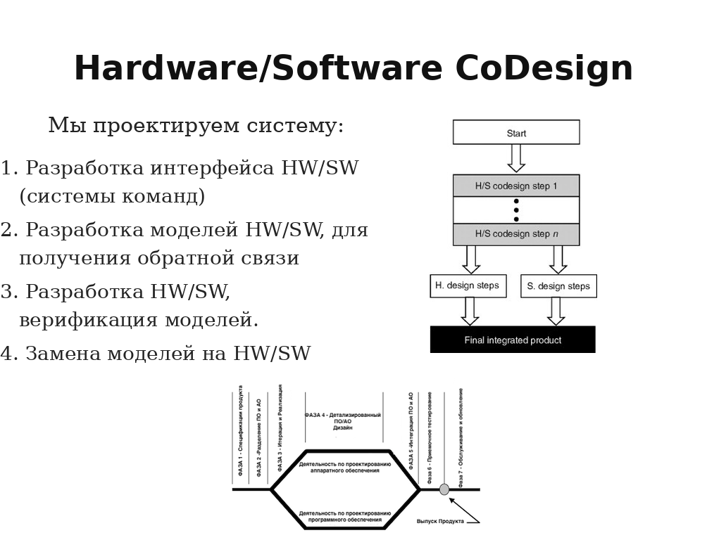
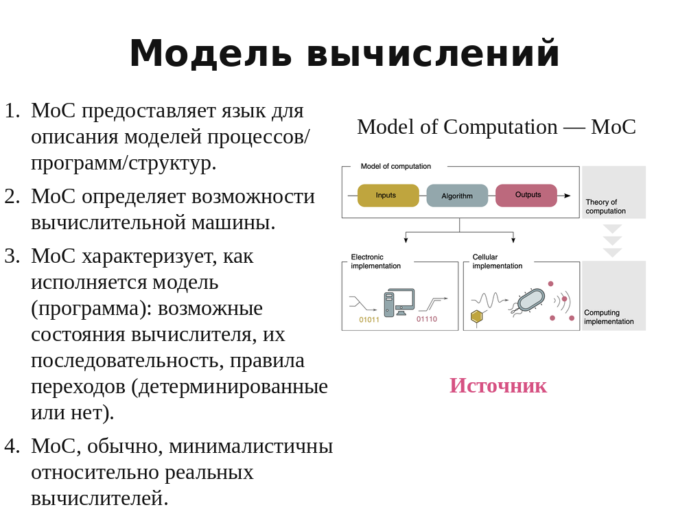

# Lecture 06 — Проблемы аппаратуры. 2 этапа производства. Hardware/Software. Программа. MoC

## Источники

- `sources/lecture-06/source-pack.md`
- `sources/lecture-06/my-notes.md`
- `sources/lecture-06/slides.md`
- `sources/lecture-06/transcript.cleaned.md`
- `sources/lecture-06/transcript.raw.md`
- `sources/lecture-05/slides.md` — `[проверить]` только для билетов 1-4: в слайдах lecture-06 этих тем почти нет, но они заявлены в названии lecture-06 и раскрыты в соседнем источнике.
- `sources/lecture-05/transcript.cleaned.md` — `[проверить]` только для билетов 1-4.
- `csa-rolling/exam-questions-blitz.md` — только формулировки вопросов

## Список билетов

1. Какие трудности связаны с производством аппаратного обеспечения (подготовка производства, элементная база)?
2. Какие трудности связаны с эксплуатацией аппаратного обеспечения (амортизация, физический доступ, среда эксплуатация)?
3. Какие подходы к решению проблемы "устаревающей аппаратуры" существуют с точки зрения аппаратуры и ПО?
4. Что такое концепция 2-этапного производства? Объясните подходы к "конфигурированию": сборка, комплектация, реконфигурация, программирование.
5. Каково определение программной системы согласно OMG Essence? Каковы её части?
6. Что такое программное и аппаратное обеспечение? Что означают понятия Hardware и Software? Сопоставьте их.
7. Какие возможности открывает программное обеспечение (цикл разработки, гибкость, контроль, и т.д.)?
8. Чем отличается типовое проектирование Hardware/Software от совместного (CoDesign) проектирования Hardware/Software? Каковы достоинства и недостатки?
9. Что такое "Модель вычислений"? В чём назначение моделей вычислений? Приведите примеры.
10. Что такое последовательные модели вычислений? Приведите примеры. Как в них представляется вычислительный процесс?
11. Что такое машина Тьюринга и почему она важна для теории вычислений?
12. Что такое Random Access Machine? Каково её устройство и место сегодня? Какова её связь с машиной Тьюринга?
13. Что такое функциональные модели вычислений? Приведите примеры. Как в них представляется вычислительный процесс?
14. Что такое параллельные модели вычислений? Приведите примеры. Как в них представляется вычислительный процесс?

---

## Билет 1. Какие трудности связаны с производством аппаратного обеспечения (подготовка производства, элементная база)?

### Короткий ответ

- **Логистика**
  Нужно физически доставить компоненты, платы, корпуса и готовые изделия между участниками производства.
- **Склады**
  Нужно хранить компоненты, полуфабрикаты, готовые устройства и запасные части.
- **Специалисты**
  Нужны люди, которые понимают технологию производства, монтаж, контроль качества и ремонт.
- **Производственная цепочка**
  Изделие проходит много этапов, и ошибка на одном этапе может остановить весь выпуск.
- **Тестирование**
  Каждое физическое устройство нужно проверить, потому что брак нельзя исправить простым обновлением кода.
- **Упаковка**
  Изделие нужно защитить при перевозке и хранении, иначе оно может повредиться ещё до эксплуатации.
- **Дистрибуция**
  Готовые устройства нужно довезти до пользователя или места установки.
- **Гарантийный ремонт**
  После продажи устройство может вернуться в сервис, и для этого нужны запчасти, диагностика и физический доступ.
- **Подготовка производства**
  Перед серией нужно настроить оборудование, процессы и контроль качества.
- **Элементная база**
  Детали могут устареть, исчезнуть с рынка или подорожать, и тогда изделие приходится переделывать.

### Схема / картинка


Картинка повторяет слайд со списком производственных сложностей: логистика, склады, специалисты, производственная цепочка, тестирование, упаковка, дистрибуция и гарантийный ремонт.

### Подробный ответ

Вопрос про производство аппаратного обеспечения в источниках lecture-06 почти не раскрыт, но он явно относится к названию лекции.
Содержательный материал есть в слайдах lecture-05, поэтому ниже он используется как явно помеченный материал для проверки.

Производство аппаратуры отличается от разработки чистого ПО тем, что результат должен стать физическим изделием.
На слайдах задача производства формулируется просто: превратить документацию в изделие.
Из этого следуют организационные трудности:

- **логистика** — детали, платы, корпуса и готовые изделия нужно физически перемещать;
- **склады** — нужно хранить компоненты, полуфабрикаты, готовые изделия и запасные части;
- **специалисты** — производство требует людей с технологической и аппаратной экспертизой;
- **производственная цепочка** — изделие проходит много этапов, и сбой на одном этапе влияет на весь выпуск;
- **тестирование** — нужно проверить, что физическое изделие действительно работает;
- **упаковка и дистрибуция** — готовое изделие нужно доставить пользователю;
- **гарантийный ремонт** — сломанное устройство часто нужно физически вернуть или обслужить.

Подготовка производства особенно тяжёлая для технологий вроде поверхностного монтажа или кремниевого производства.
В серии изделие может быть дешёвым, но линия, оснастка, контроль и запуск процесса стоят дорого.
Поэтому ошибка в проекте обходится дороже, чем ошибка в программе: исправление может потребовать новой партии, новой платы или даже нового кристалла.

Отдельная трудность — элементная база.
Проект зависит от доступности компонентов.
Если конкретная деталь исчезла, изменилась или стала дорогой, изделие может потребовать перепроектирования.
Для старых систем это особенно больно: устаревшую элементную базу дорого воспроизводить, спрос низкий, а запас на складе конечен.

### Ключевые определения

- **Аппаратное обеспечение** — физические электронные и механические части вычислительного устройства.
- **Подготовка производства** — настройка процессов, оборудования, документации и контроля для выпуска изделия.
- **Элементная база** — компоненты, из которых строится аппаратное изделие.
- **Производственная цепочка** — последовательность этапов от подготовки и изготовления до тестирования, поставки и ремонта.

### Пример

Навесной монтаж можно исправить вручную: перерезать провод и припаять другой.
Непредусмотренное изменение в процессоре, наоборот, ведёт к перепроектированию, перепроизводству и перепоставке.

### Возможные вопросы преподавателя

- Почему аппаратное изделие нельзя исправлять так же быстро, как программу?
- Почему подготовка производства может быть дороже самой единицы изделия?
- Чем опасна зависимость от конкретной элементной базы?
- Почему массовая серия дешевле, но запуск серии дорогой?

### Что обязательно запомнить

- Аппаратуру нужно физически произвести.
- Производство включает логистику, склады, специалистов, тестирование и ремонт.
- Подготовка производства дорогая и длинная.
- Элементная база может устареть или исчезнуть.
- Чем выше интеграция, тем тяжелее поздние изменения.

### Проверить

- `[проверить]` В `sources/lecture-06/slides.md` тема производства почти отсутствует; билет опирается на `sources/lecture-05/slides.md` и `sources/lecture-05/transcript.cleaned.md`.

---

## Билет 2. Какие трудности связаны с эксплуатацией аппаратного обеспечения (амортизация, физический доступ, среда эксплуатация)?

### Короткий ответ

#### Суть

- Трудности эксплуатации аппаратного обеспечения возникают потому, что **аппаратура живёт в физическом мире**: стареет, ломается и зависит от условий вокруг.
- В отличие от программы, **железо может деградировать само по себе**, даже если логика работы и данные не менялись.

#### 1. Амортизация. Выход оборудования из строя

- **Амортизация** — постепенное старение компонентов, контактов, соединений и материалов.
- Итог — снижение надёжности, случайные отказы и полный **выход оборудования из строя**.

#### 2. Необходимость физического доступа

- **Физический доступ** нужен для ремонта, замены детали, восстановления контакта, переподключения кабеля или разборки корпуса.
- Если устройство удалённое, встроенное или космическое, обслуживание становится дорогим, долгим или почти невозможным.

#### 3. Особенности среды эксплуатации

- **Среда эксплуатации** — питание, температура, влажность, вода, механические нагрузки, помехи и условия объекта.
- Эти факторы могут вызвать сбой или ускорить износ даже у корректно спроектированной аппаратуры.

#### 4. Долгосрочные эффекты

- **Долгосрочные эффекты** проявляются через годы: деградация материалов, старение соединений, оловянные нитевидные кристаллы.
- Пример: оловянный «ус» может замкнуть проводники или вызвать дугу, поэтому надёжная сегодня плата может отказать спустя большой срок эксплуатации.

### Схема / картинка



На картинке перечислены четыре проблемы эксплуатации аппаратного обеспечения:

1. **Амортизация. Выход оборудования из строя** — аппаратура физически стареет, поэтому её надёжность падает со временем.
2. **Необходимость физического доступа** — многие аппаратные проблемы нельзя исправить только программно; нужно добраться до устройства.
3. **Особенности среды эксплуатации** — реальные условия вокруг устройства могут ломать расчётные предположения проектировщика.
4. **Долгосрочные эффекты** — часть отказов появляется не сразу, а после длительной работы материалов и соединений.

### Подробный ответ

В источниках lecture-06 эта тема почти не раскрыта, поэтому билет опирается на явно помеченные материалы lecture-05.

Первая трудность — **амортизация**.
Аппаратное обеспечение стареет.
Компоненты деградируют, контакты портятся, механические части изнашиваются, а надёжность со временем падает.
В слайдах отдельно упоминаются долгосрочные эффекты, например оловянные нитевидные кристаллы.
Они могут вызывать нежелательные соединения и отказы.

Вторая трудность — **физический доступ**.
Если программу можно обновить через сеть, то аппаратную проблему часто нужно исправлять руками.
Нужно добраться до устройства, разобрать его, заменить компонент, перепаять соединение или поставить новый модуль.
Это дорого даже для обычного оборудования и может быть почти невозможно для удалённых систем.
Слайды приводят пример Voyager как иллюстрацию сложности применения патча или изменения к недоступной аппаратуре.

Третья трудность — **среда эксплуатации**.
Аппаратура работает не в идеальной абстрактной среде.
На неё влияют температура, влажность, питание, механические нагрузки, помехи, физический износ и условия объекта.
В управляющих и встроенных системах это особенно важно, потому что устройство часто стоит рядом с промышленным оборудованием или в труднодоступном месте.

Четвёртая трудность — **ремонт и запасные компоненты**.
Для старой аппаратуры нужны совместимые детали.
Их хранение дорого, запас конечен, а производство устаревших компонентов может быть нерентабельным.

### Ключевые определения

- **Амортизация** — физическое старение и деградация оборудования в эксплуатации.
- **Физический доступ** — возможность реально добраться до устройства для ремонта, замены или изменения.
- **Среда эксплуатации** — внешние условия, в которых работает устройство.
- **Долгосрочные эффекты** — физические процессы, проявляющиеся со временем и влияющие на надёжность.

### Пример

Если старое устройство стоит в удалённом месте, его нельзя обслужить как веб-сервис.
Даже простой аппаратный ремонт требует поездки, доступа к корпусу, запасных деталей и проверки после вмешательства.

### Возможные вопросы преподавателя

- Почему ПО само по себе не изнашивается, а аппаратура изнашивается?
- Почему физический доступ является отдельной проблемой?
- Как среда эксплуатации влияет на аппаратное обеспечение?
- Почему старую аппаратуру трудно ремонтировать?

### Что обязательно запомнить

- Аппаратура стареет и ломается.
- Ремонт требует физического доступа.
- Среда эксплуатации может ломать предположения проектировщика.
- Запасные детали конечны и устаревают.
- Чем устройство недоступнее, тем дороже любое изменение.

### Проверить

- `[проверить]` В `sources/lecture-06` тема эксплуатации почти отсутствует; билет опирается на материалы lecture-05.

---

## Билет 3. Какие подходы к решению проблемы "устаревающей аппаратуры" существуют с точки зрения аппаратуры и ПО?

### Короткий ответ

#### 1. Что такое проблема устаревающей аппаратуры

- **Устаревающая аппаратура** — оборудование, которое ещё нужно системе, но его уже не производят, так называемый legacy в мире HardWare

#### 2. Подходы к решению

##### 1. Перепроектирование на новой элементной базе 
- Это **аппаратный подход**: старое устройство создают заново на современных компонентах.
- Цель — получить **функциональный эквивалент**: внутри новое железо, снаружи прежняя роль в системе.
- Минус — дорого: нужно заново проектировать, производить, тестировать и проверять совместимость.

##### 2. Модульная организация
- Если система собрана модульно, старый блок можно заменить новым модулем через тот же **стандартный интерфейс**.


##### 3. Виртуализация

- В этом контексте виртуализация — это способ заменить устаревшую аппаратуру не новым физическим устройством, а программной средой, которая воспроизводит поведение старой платформы.

##### 4. Ограничение: пользовательский опыт

- Пользователю впадлу переходить на новое ПО

### Схема / картинка


Картинка используется в слайдах рядом с вопросом замены устаревших частей: система может постепенно меняться, сохраняя прежнюю функцию и интерфейс.

### Подробный ответ

Устаревание аппаратуры связано с тем, что физические компоненты выходят из строя, исчезают из производства и перестают поддерживаться сопутствующим оборудованием.
Слайды lecture-05 перечисляют причины:

- срок службы и деградация надёжности;
- стоимость обслуживания;
- необходимость запасных компонентов;
- дорогой и конечный склад запасов;
- вытеснение устаревшей элементной базы;
- низкий спрос и штучное производство;
- исчезновение сопутствующих устройств, например CD-ROM или дискет.

С точки зрения аппаратуры есть несколько подходов.

Первый — **перепроектирование на новой элементной базе**.
Старую функцию реализуют современными компонентами.
Это может решить проблему поставок, но требует разработки, проверки совместимости и нового производства.

Второй — **модульная организация и стандартные интерфейсы**.
Если старый компонент имеет понятный интерфейс, его можно заменить новым модулем.
Главное — чтобы остальная система видела тот же протокол и поведение.

Третий — **имитация старых систем**.
Новое устройство может притворяться старым: отвечать на те же команды и давать совместимые результаты.
Это аппаратно-программный компромисс: внутри всё новое, но снаружи поведение привычное.

С точки зрения ПО важны **совместимость и виртуализация**.
Если старое ПО нельзя или дорого переписать, можно создать виртуальную среду, которая воспроизводит старую платформу.
Проблема в том, что функциональная совместимость не всегда равна прежнему пользовательскому опыту.
Слайды прямо отмечают: компьютер 1980-х может позволить внести запись в базу данных, пока современный только загружается.

### Ключевые определения

- **Устаревающая аппаратура** — оборудование, которое трудно обслуживать из-за износа, исчезновения деталей или технологического устаревания.
- **Перепроектирование** — повторная реализация функции на новой элементной базе.
- **Имитация** — поведение нового устройства как старого через совместимый интерфейс.
- **Виртуализация** — перенос поведения старой платформы в программную или программно-аппаратную среду.

### Пример

Старое ПО может ожидать ленточный накопитель или другой устаревший интерфейс.
Современный модуль может имитировать этот интерфейс, а внутри использовать современное хранилище.

### Возможные вопросы преподавателя

- Почему нельзя просто хранить бесконечный запас старых компонентов?
- Чем перепроектирование отличается от имитации?
- Почему стандартный интерфейс помогает пережить устаревание?
- Почему виртуализация может не сохранить пользовательский опыт?

### Что обязательно запомнить

- Устаревание связано с износом и исчезновением элементной базы.
- Можно перепроектировать железо.
- Можно сохранить интерфейс и заменить модуль.
- Можно имитировать старую систему.
- Можно виртуализировать старую платформу для старого ПО.

### Проверить

- `[проверить]` В `sources/lecture-06` тема устаревающей аппаратуры почти отсутствует; билет опирается на `sources/lecture-05`.

---

## Билет 4. Что такое концепция 2-этапного производства? Объясните подходы к "конфигурированию": сборка, комплектация, реконфигурация, программирование.

### Короткий ответ

#### Что такое концепция 2-этапного производства?

Концепция 2-этапного производства разделяет выпуск универсальной аппаратной платформы и настройку её прикладного поведения.
Сначала производят достаточно универсальную компьютерную систему.
Потом её конфигурируют под конкретную задачу.
Так длинный и дорогой аппаратный цикл заменяется более гибкой настройкой.

#### Подходы к "конфигурированию"

1. **Сборка** — физически собрать систему из заранее предусмотренных элементов: перемычек, плат расширения, макетных плат, внешних модулей.

2. **Комплектация** — выбрать нужный состав устройства или набора модулей под задачу: какие блоки поставить, какие функции включить, какие порты или вычислители добавить.

3. **Реконфигурация** — после производства изменить связи между уже существующими вычислительными узлами. Пример: FPGA или CGRA, где структура блоков есть, но коммутация задаётся заново.

4. **Программирование** — задать поведение через данные или инструкции в памяти. Один и тот же процессор становится разным инструментом в зависимости от программы.

### Схема / картинка



Слайд показывает два этапа: производство универсальной компьютерной системы и настройку прикладного поведения.
Схема ниже связывает базовую платформу, конфигурацию прикладного поведения и экземпляр сконфигурированной системы.

### Подробный ответ

#### Что такое концепция 2-этапного производства?

2-этапное производство нужно, чтобы уменьшить жёсткость, стоимость и длинный цикл аппаратного производства.
Идея простая:

1. Сначала производят универсальную или достаточно гибкую аппаратную систему.
2. Затем настраивают её прикладное поведение через software, конфигурацию или реконфигурацию.

В такой схеме аппаратура не делается заново под каждую задачу.
Она становится платформой.
Конкретная задача отображается на платформу позже.
Это похоже на Platform-Based Design: есть базовая вычислительная платформа и есть способ описать прикладное поведение.

Важное ограничение: каждый новый уровень абстракции имеет цену.
Поэтому промежуточные уровни добавляют только тогда, когда гибкость действительно окупается.

#### Подходы к "конфигурированию"

**Сборка** работает на уровне физического соединения элементов.
Можно использовать джамперы, платы расширения, внешние модули, макетные платы.
Смысл: собрать систему из заранее предусмотренных частей так, чтобы получить нужное поведение.

**Комплектация** работает на уровне выбора состава изделия.
Под задачу выбирают, какие модули, порты ввода-вывода, специализированные вычислители или функции будут доступны.
Пример: плата расширения добавляет специализированный вычислитель или новые порты ввода-вывода.

**Реконфигурация и коммутация** меняют связи между уже произведёнными блоками.
Это характерно для реконфигурируемых архитектур: FPGA, CGRA и похожих систем.
Аппаратные узлы уже есть, но их можно соединить иначе и получить другое вычисление.

**Программирование** задаёт поведение через данные в памяти.
Программа определяет, какой прикладной процесс будет разворачиваться на вычислителе.
Количество уровней исполнения и интерпретации данных ограничено целесообразностью.

Слайды также отмечают, что возможности конфигурирования бывают заложенными при проектировании или незадокументированными.
Незапланированное использование может быть похоже не на нормальную конфигурацию, а на дыру в безопасности.

### Ключевые определения

- **2-этапное производство** — производство универсальной аппаратной системы и последующая настройка прикладного поведения.
- **Конфигурирование** — настройка готовой системы под задачу без полного перепроизводства.
- **Реконфигурация** — изменение связей между вычислительными узлами после производства.
- **Программирование** — задание поведения вычислителя данными или инструкциями.

### Пример

Процессор x86 можно произвести массово как универсальную платформу.
Конкретную задачу он решает позже, когда пользователь загружает программу.

### Возможные вопросы преподавателя

- Почему 2-этапное производство снижает жёсткость аппаратуры?
- Чем сборка отличается от реконфигурации?
- Почему программирование — самый гибкий уровень конфигурирования?
- Почему каждая новая абстракция имеет цену?

### Что обязательно запомнить

- Сначала универсальная платформа, потом настройка поведения.
- Сборка выбирает модули и перемычки.
- Реконфигурация меняет связи внутри готовой аппаратуры.
- Программирование задаёт поведение через данные.
- Гибкость появляется только если она заранее предусмотрена или удачно использует существующую структуру.

### Проверить

- `[проверить]` В `sources/lecture-06/slides.md` есть только отсылка к Platform-Based Design; полный материал по 2-этапному производству взят из lecture-05.

---

## Билет 5. Каково определение программной системы согласно OMG Essence? Каковы её части?

### Короткий ответ

#### Каково определение программной системы согласно OMG Essence?

Программная система по OMG Essence — это система, состоящая из software, hardware и data, которая даёт основную ценность через исполнение software.
То есть ценность такой системы возникает не просто из железа, а из выполняемого программного поведения.

#### Каковы её части?

В программной системе есть software, hardware и data.
Software отвечает за исполняемое поведение и связанные с ним нематериальные артефакты.
Hardware даёт физическую вычислительную основу.
Data — это данные, необходимые для работы системы.
Например, веб-сервис включает серверы, программы и рабочие данные.

### Схема / картинка

`[подходящей картинки не найдено]`

### Подробный ответ

#### Каково определение программной системы согласно OMG Essence?

Слайд lecture-06 даёт определение:

```text
software system: A system made up of software, hardware, and data
that provides its primary value by the execution of the software.
```

Главная мысль: программная система не состоит только из кода.
Она включает физическую часть, программную часть и данные.
Но её основная ценность появляется именно через выполнение software.

Это объясняет термин `software intensive system`.
В такой системе аппаратура может быть необходимой, но пользовательская ценность определяется тем, какое программное поведение она исполняет.

#### Каковы её части?

Слайды выделяют три части:

- **software** — программное обеспечение или гибкая часть поведения системы;
- **hardware** — аппаратное обеспечение, физическая основа выполнения;
- **data** — данные, которые нужны системе для работы и тоже являются её частью.

Данные важно не забывать.
Например, программа без конфигурации, базы данных, моделей или входных наборов может не давать нужной ценности.
Поэтому программная система шире, чем просто исполняемый файл.

### Ключевые определения

- **Программная система** — система из software, hardware и data, дающая основную ценность через исполнение software.
- **Software** — программная или гибкая часть, задающая поведение системы.
- **Hardware** — физическая аппаратная часть системы.
- **Data** — данные, необходимые для работы системы.

### Пример

Информационная система включает серверное оборудование, программный код и базу данных.
Если убрать любую из этих частей, система перестанет давать основную ценность пользователю.

### Возможные вопросы преподавателя

- Почему программная система не равна просто программе?
- Почему данные считаются частью системы?
- Что значит "primary value by the execution of the software"?
- Чем software intensive system отличается от чисто аппаратного изделия?

### Что обязательно запомнить

- OMG Essence выделяет software, hardware и data.
- Основная ценность возникает через выполнение software.
- Hardware и data не исчезают из программной системы.
- Программа — только один компонент software.
- Система шире, чем код.

### Проверить

- `[проверить]` `my-notes.md` и `source-pack.md` для lecture-06 являются заглушками; определение взято из слайдов.

---

## Билет 6. Что такое программное и аппаратное обеспечение? Что означают понятия Hardware и Software? Сопоставьте их.

### Короткий ответ

#### Что такое программное и аппаратное обеспечение?

Аппаратное обеспечение — это электронные и механические части вычислительного устройства.
Программное обеспечение — это программы, документы и другие нематериальные компоненты, нужные для эксплуатации системы.
Программа является данными: её можно отделить от носителя и передать.

#### Что означают понятия Hardware и Software? Сопоставьте их.

Hardware и Software в курсе не полностью совпадают с русскими "аппаратура" и "ПО".
Их нужно сопоставлять не только по материалу, но и по **жизненному циклу изменения**.

#### Сопоставление по критериям

1. **Физичность**
   Hardware связано с физическим изделием: его нужно произвести, поставить, подключить и обслуживать.
   Software задаётся данными и инструкциями: его можно отделить от носителя, передать и заменить.

2. **Скорость разработки**
   Hardware имеет длинный цикл: проектирование, производство, поставка, проверка.
   Software обычно имеет быстрый цикл: изменить, собрать, протестировать, выкатить новую версию.

3. **Стоимость изменения**
   Ошибка в Hardware может требовать перепроектирования, перепроизводства и перепоставки.
   Ошибка в Software часто исправляется патчем или обновлением.

4. **Доставка пользователю**
   Hardware требует логистики и физического доступа.
   Software можно доставить удалённо, иногда даже без явного участия пользователя.

5. **Гибкость поведения**
   Hardware чаще фиксирует структуру системы.
   Software приспосабливает одну и ту же аппаратуру к разным задачам.

6. **Эксплуатация и старение**
   Hardware изнашивается, зависит от среды и может физически выйти из строя.
   Software само по себе не изнашивается, но зависит от платформы, данных и обновлений.

7. **Контроль над системой**
   Hardware сильнее привязано к владению физическим устройством.
   Software и сервисы дают поставщику больше контроля: обновления, отключение функций, изменение поведения.

8. **Контекст границы**
   Компонент может быть программируемым, но использоваться как Hardware: например, ПЛИС работает как схема.
   Компонент может называться "виртуальным компьютером" или "виртуальной сетью", но быть реализован Software.

### Схема / картинка

`[подходящей картинки не найдено]`

### Подробный ответ

#### Что такое программное и аппаратное обеспечение?

Слайды определяют аппаратное обеспечение как электронные и механические части вычислительного устройства, входящие в состав системы или сети.
К нему относятся компьютеры, логические устройства, внешние устройства, диагностическая аппаратура, энергетическое оборудование, батареи и аккумуляторы.
Из аппаратного обеспечения исключаются программное обеспечение и данные.

Программное обеспечение определяется как совокупность программ, систем обработки информации и программных документов, необходимых для эксплуатации.
Оно позволяет аппаратному обеспечению выполнять вычисления или функции управления.
Отдельно подчёркнуто: программа — это данные, она отчуждаема и передаваема.

#### Что означают понятия Hardware и Software? Сопоставьте их.

Слайды прямо говорят: аппаратура и ПО не равны автоматически Hardware и Software.
Причина в том, что английская пара в курсе используется как различение по гибкости изменения.

Базовый критерий такой:

- **Hardware** — то, что в данном контексте тяжело, долго или дорого поменять.
- **Software** — то, что в данном контексте легко, быстро или дёшево поменять.

Более развёрнуто их удобно сравнивать по нескольким критериям.

**1. Материальность.**
Аппаратное обеспечение — физические устройства и элементы, которые нужно произвести и можно физически потрогать.
Программное обеспечение — программы, данные, документы и другие нематериальные артефакты.

**2. Скорость разработки.**
Для Hardware изменение связано с длинной цепочкой: проектирование, производство, поставка, тестирование, внедрение.
Для Software цикл обычно короче: изменение можно собрать, проверить и доставить пользователю быстрее.

**3. Цена ошибки.**
Непредусмотренное изменение или ошибка в аппаратуре может привести к перепроектированию, перепроизводству и перепоставке.
В Software ошибку часто можно исправить обновлением, хотя разработка самого патча тоже может быть сложной.

**4. Доставка и обновление.**
Hardware требует логистики и часто физического доступа.
Software может заменяться прямо у пользователя и обновляться удалённо.

**5. Гибкость применения.**
Hardware задаёт основу вычислительной системы.
Software приспосабливает одну и ту же технику к разным задачам: игра, расчёт, текстовый редактор, сервис.

**6. Эксплуатация.**
Hardware физически стареет, ломается и зависит от среды эксплуатации.
Software не изнашивается как материал, но может устаревать из-за изменения платформы, данных, требований и окружения.

**7. Контроль.**
Software даёт больше возможностей централизованного контроля: обновления, сервисная модель, включение или отключение функций.
Для Hardware контроль сильнее связан с физическим устройством и доступом к нему.

Из-за этого граница зависит от способа использования элементной базы.
Например, Minix в Intel ME/CSME является программной системой по природе, но находится глубоко внутри процессорной платформы.
ПЛИС программируется, но работает как схема, поэтому часто считается аппаратурой.
Виртуальные компьютеры, сети и тома называются как будто аппаратными сущностями, хотя реализуются программно.

Есть случаи, где Hardware совпадает с аппаратной составляющей почти без альтернатив: питание, антенны, аналоговые сигналы.
Их трудно сделать чисто программными, потому что они связаны с физическим миром.

### Ключевые определения

- **Аппаратное обеспечение** — физические электронные и механические части вычислительной системы.
- **Программное обеспечение** — программы, документы и нематериальные компоненты, нужные для эксплуатации.
- **Hardware** — часть системы, которую в данном контексте тяжело, долго или дорого изменить.
- **Software** — часть системы, которую в данном контексте легко, быстро или дёшево изменить.
- **Граница Hardware/Software** — не абсолютная линия, а решение по жизненному циклу, стоимости изменения и способу использования компонента.

### Пример

Одна и та же ПЛИС конфигурируется данными, но после конфигурации работает как аппаратная схема.
Поэтому по способу использования она ближе к аппаратуре, хотя её поведение задаётся программируемо.

### Возможные вопросы преподавателя

- Почему программа считается данными?
- Почему Hardware и аппаратное обеспечение не всегда одно и то же?
- Почему Software не значит "easy"?
- В каком случае Hardware почти точно совпадает с физической аппаратурой?

### Что обязательно запомнить

- Аппаратура — физическая часть системы.
- ПО — программы и связанные нематериальные артефакты.
- Hardware/Software — граница по стоимости и скорости изменения.
- Сопоставлять их нужно по критериям: физичность, скорость разработки, стоимость изменения, доставка, гибкость, эксплуатация, контроль.
- Software не обязательно простое.
- Название компонента зависит от контекста использования.

### Проверить

- `[проверить]` Пример Minix взят из слайда lecture-06; детали Intel ME/CSME не раскрываются в источниках.

---

## Билет 7. Какие возможности открывает программное обеспечение (цикл разработки, гибкость, контроль, и т.д.)?

### Короткий ответ

#### 1. Быстрый цикл разработки

ПО можно быстро менять, собирать, проверять и выпускать новой версией.
Для этого не нужно перепроизводить физическое изделие.

#### 2. Легко заменяется прямо у пользователя

Программу можно обновить уже после поставки системы.
Одна и та же аппаратура получает новое поведение без замены устройства.

#### 3. Пользователь как Beta-тестер

Из-за быстрых релизов часть ошибок может находиться уже на стороне пользователя.
Пользователь фактически участвует в проверке реальной версии продукта.

#### 4. Возможно удалённое обновление, в том числе без информированного согласия

Патч можно доставить по сети без физического доступа к устройству.
Это удобно для исправлений, но усиливает контроль поставщика над системой.

#### 5. Сервис — вершина владения компьютерной системой

Если система работает как сервис, поставщик управляет обновлениями, доступом и поведением.
Пользователь владеет не всей системой, а в основном доступом к её функциям.

#### 6. Процесс создания и внедрения ПО автоматизируется (CI/CD)

Сборку, тестирование и доставку можно включить в автоматический pipeline.
Это ускоряет выпуск изменений и делает частые релизы технически возможными.

#### 7. Высокая сложность программ

Гибкость ПО имеет цену: программы становятся большими, многослойными и трудными для полного контроля.
Поэтому быстрые патчи не означают простую разработку.

#### Примечание

Здесь речь про **применение патча**, а не про его разработку.
Разработать корректный патч может быть сложно, но доставить и применить его обычно проще, чем изменить аппаратуру.

### Схема / картинка



Слайд перечисляет свойства программного обеспечения: быстрый цикл разработки, заменяемость у пользователя, beta-тестирование на пользователях, удалённые обновления, сервисный контроль, CI/CD и высокую сложность программ.

### Подробный ответ

На слайде "Свойства программного обеспечения" перечислены ключевые возможности.

Первая возможность — **быстрый цикл разработки**.
Программное изменение не требует перепроизводства физического изделия.
Код можно менять, собирать, тестировать и выпускать итеративно.

Вторая возможность — **лёгкая замена у пользователя**.
ПО можно обновить на уже установленной аппаратуре.
Это делает систему гибкой: одна и та же аппаратная платформа получает новое поведение.

Третья возможность — **удалённое обновление**.
Патч можно применить без физического доступа к устройству.
Но слайды подчёркивают: речь именно о применении патча, а не о его разработке.

Четвёртая возможность — **автоматизация процесса создания и внедрения**.
CI/CD позволяет автоматизировать сборку, тестирование и деплой.
Это ускоряет цикл и делает возможными очень сложные программные системы.

Пятая возможность — **сервисная модель владения**.
Слайды формулируют это резко: сервис — вершина владения компьютерной системой.
Если поставщик управляет обновлениями и доступом к функциям, он получает сильный контроль над системой.

У этих возможностей есть обратная сторона:

- пользователь может стать beta-тестером;
- обновление может прийти без полного понимания пользователем;
- высокая гибкость ведёт к высокой сложности;
- ошибки и уязвимости могут распространяться массово.

### Ключевые определения

- **Цикл разработки** — последовательность изменения, сборки, проверки и внедрения системы.
- **CI/CD** — автоматизация сборки, тестирования и доставки программного обеспечения.
- **Патч** — изменение, применяемое к уже существующей системе.
- **Гибкость ПО** — возможность быстро менять поведение системы без перепроизводства аппаратуры.

### Пример

Одна и та же аппаратная платформа может после обновления ПО получить новую функцию или исправление ошибки.
Для аппаратного изделия без программной гибкости это потребовало бы физического изменения.

### Возможные вопросы преподавателя

- Почему ПО быстрее менять, чем аппаратуру?
- Почему пользователь может стать beta-тестером?
- Чем полезно удалённое обновление?
- Почему гибкость ПО увеличивает сложность системы?

### Что обязательно запомнить

- ПО даёт быстрый цикл изменений.
- ПО можно обновлять у пользователя.
- Удалённые патчи уменьшают потребность в физическом доступе.
- CI/CD автоматизирует создание и внедрение.
- Гибкость ПО создаёт сложность и риски контроля.

### Проверить

- `[проверить]` Источники дают список свойств, но не раскрывают отдельные примеры уязвимостей в lecture-06.

---

## Билет 8. Чем отличается типовое проектирование Hardware/Software от совместного (CoDesign) проектирования Hardware/Software? Каковы достоинства и недостатки?

### Короткий ответ

#### Чем отличается типовое проектирование Hardware/Software от совместного (CoDesign) проектирования Hardware/Software?

Типовое HW/SW проектирование сначала проектирует аппаратуру, а потом под неё пишется программа.

**проблемы этого подхода**
- система не всегда идельно подходит под задачи, которые нужно решать
- Высокие интеграционные риски (есть большая вероятность, что когда мы попытаемся соединить SW и HW ничего не будет работать, тк все разрабатывалось отдельно)
- Последовательная разработка

**Решение CoDesign: мы проектируем систему**

1. **Разработка интерфейса HW/SW (системы команд)**  
   Сначала задают границу между аппаратурой и программой: какие команды, механизмы и способы взаимодействия будут доступны.

2. **Разработка моделей HW/SW для получения обратной связи**  
   До финальной реализации строят модели аппаратной и программной частей, чтобы проверить идеи раньше интеграции.

3. **Разработка HW/SW, верификация моделей**  
   Аппаратная и программная части развиваются вместе, а модели проверяются на согласованность с будущей системой.

4. **Замена моделей на HW/SW**  
   Когда решения проверены, модели постепенно заменяют реальной аппаратурой и реальным программным обеспечением.

#### Каковы достоинства и недостатки?

Типовой подход проще организовать, но он даёт шаблонный дизайн, интеграционные риски и последовательную разработку.
CoDesign снижает риск поздней интеграции и может сократить сроки.
Но он требует моделей, верификации и более сложной координации команды.
Главный выигрыш CoDesign — раньше понять, что должно стать железом, а что программой.

### Схема / картинка



Слайд показывает типовое HW/SW проектирование: отдельно проектируют аппаратуру, отдельно пишут программу, а затем сталкиваются с интеграционными рисками и последовательными сроками.



Слайд показывает CoDesign: проектируется вся система, сначала через интерфейс и модели HW/SW, затем через совместную разработку, верификацию и замену моделей реальными HW/SW.

### Подробный ответ

#### Чем отличается типовое проектирование Hardware/Software от совместного (CoDesign) проектирования Hardware/Software?

В типовом подходе есть две последовательные линии.
Сначала проектируют аппаратуру: систему команд, вычислительные механизмы, интерфейсы управления, цифровую схемотехнику.
Затем пишут программу: решают прикладную задачу, выбирают язык и библиотеки, используют систему команд, виртуальную память, прерывания и аппаратные интерфейсы.

Проблема в том, что программная часть поздно получает влияние на аппаратную.
Если интерфейс неудобен или вычислительный механизм не подходит, это обнаруживается на интеграции.

CoDesign формулируется иначе: "мы проектируем систему".
Слайды выделяют шаги:

1. Разработка интерфейса HW/SW, например системы команд.
2. Разработка моделей HW/SW для обратной связи.
3. Разработка HW/SW и верификация моделей.
4. Замена моделей на реальные HW/SW.

То есть аппаратная и программная стороны развиваются вместе.
Сначала можно работать с моделями, а не сразу фиксировать дорогое железо.

#### Каковы достоинства и недостатки?

Недостатки типового подхода прямо перечислены на слайде:

- **излишне шаблонное проектирование** — аппаратура проектируется по привычным шаблонам;
- **высокие интеграционные риски** — несовместимость проявляется поздно;
- **последовательная разработка** — сроки растут, потому что этапы идут один за другим.

Достоинства типового подхода: он проще организационно и понятнее при стандартной платформе.
Если аппаратная платформа уже известна и менять её не нужно, последовательный подход может быть достаточным.

Достоинства CoDesign:

- ранняя обратная связь между HW и SW;
- более осознанный выбор границы между железом и программой;
- снижение интеграционных рисков;
- возможность сократить сроки, что показано на слайде про скорость разработки.

Недостатки CoDesign в источниках явно не перечислены отдельным списком, но из схемы следуют расходы на модели, верификацию и координацию.
Это более сложный процесс, чем "сначала железо, потом программа".

### Ключевые определения

- **Типовое HW/SW проектирование** — последовательная разработка аппаратуры и затем программной части под неё.
- **Hardware/Software CoDesign** — совместное проектирование аппаратной и программной частей системы.
- **Интерфейс HW/SW** — граница взаимодействия аппаратуры и программы, например система команд.
- **Модель HW/SW** — упрощённое представление аппаратной или программной части для ранней проверки решений.

### Пример

Если система команд разрабатывается без обратной связи от программной части, компилятору может быть трудно генерировать эффективный код.
В CoDesign такую проблему можно увидеть на модели до окончательного производства аппаратуры.

### Возможные вопросы преподавателя

- Почему последовательная разработка увеличивает сроки?
- Какие интеграционные риски есть в типовом подходе?
- Зачем в CoDesign нужны модели?
- Что значит "разработка интерфейса HW/SW"?

### Что обязательно запомнить

- Типовой подход: сначала HW, потом SW.
- CoDesign: проектируется система целиком.
- Проблемы типового подхода: шаблонность, интеграционные риски, сроки.
- CoDesign использует модели и обратную связь.
- Граница HW/SW должна выбираться как инженерное решение.

### Проверить

- `[проверить]` Недостатки CoDesign в слайдах не даны отдельным списком; они сформулированы как следствие процесса с моделями и верификацией.

---

## Билет 9. Что такое "Модель вычислений"? В чём назначение моделей вычислений? Приведите примеры.

### Короткий ответ

#### Что такое "Модель вычислений"?

Модель вычислений — это способ описывать вычислительный процесс: какие состояния возможны, как они меняются и по каким правилам выполняется программа.
Она даёт язык для описания моделей процессов, программ и структур.

#### Почему машина Тьюринга — это модель вычислений?

**Машина Тьюринга** показывает определение MoC на простом примере.
У неё есть **неограниченная двусторонняя лента** из ячеек и **головка чтения-записи**, которая находится в одном из конечного числа состояний.

В этой модели **состояние вычисления** — это содержимое ленты, положение головки и текущее состояние управляющего устройства.
**Переход** — один шаг машины: головка читает символ, записывает новый символ, меняет состояние и сдвигается влево или вправо.
**Правила выполнения программы** — таблица переходов, которая говорит, что делать для каждой пары "текущее состояние + прочитанный символ".

Поэтому машина Тьюринга — именно **модель вычислений**: она не описывает реальный компьютер во всех деталях, а задаёт абстрактные состояния, допустимые шаги и правила, по которым получается результат.

#### В чём назначение моделей вычислений?

Модели вычислений помогают понять возможности вычислительной машины.
Они показывают, как исполняется программа и какие переходы допустимы.
Они обычно проще реальных вычислителей, поэтому удобны для анализа, проектирования языков и контроля сложности.

#### Примеры

Примеры: конечные автоматы, автоматы с магазинной памятью, машина Тьюринга, RAM-модель, лямбда-исчисление, акторная модель и синхронные потоки данных.

### Схема / картинка



Схема используется в слайдах как иллюстрация Model of Computation.

### Подробный ответ

#### Что такое "Модель вычислений"?

MoC, или Model of Computation, в слайдах описывается через четыре пункта.
Модель вычислений:

- предоставляет язык для описания моделей процессов, программ и структур;
- определяет возможности вычислительной машины;
- характеризует исполнение модели или программы;
- обычно минималистична относительно реального вычислителя.

Ключевая часть определения — правила исполнения.
MoC говорит, какие состояния может иметь вычислитель, в какой последовательности они появляются и по каким правилам происходят переходы.
Переходы могут быть детерминированными или недетерминированными.

#### В чём назначение моделей вычислений?

Модели вычислений нужны не только для теории.
Слайды перечисляют практические применения:

- Computer Science и формальные модели;
- дизайн языков программирования;
- ограничение творческого порыва и контроль сложности;
- модель-ориентированная инженерия;
- ответственные применения;
- переносимость;
- экспертиза.

Модель вычислений отделяет главный принцип исполнения от деталей реальной машины.
Это позволяет анализировать свойства системы и выбирать подходящие инструменты.

#### Примеры

Последовательные модели: конечные автоматы, автоматы с магазинной памятью, машина Тьюринга, Random Access Machine.
Функциональные модели: арифметика, лямбда-исчисление, комбинаторная логика, общие рекурсивные функции, abstract rewriting systems.
Параллельные модели: Kahn process networks, actor model, discrete event, multi-thread model, synchronous data flow.

### Ключевые определения

- **MoC** — Model of Computation, модель вычислений.
- **Состояние вычислителя** — описание текущего положения вычислительного процесса.
- **Правило перехода** — правило, по которому одно состояние заменяется другим.
- **Минималистичная модель** — упрощённое описание, сохраняющее главные свойства вычисления.

### Пример

Конечный автомат описывает вычисление как набор состояний и переходов между ними.
Это удобно для интерфейсов, управляющей логики и проверки допустимых переходов.

### Возможные вопросы преподавателя

- Чем модель вычислений отличается от языка программирования?
- Почему MoC обычно проще реального процессора?
- Какие свойства исполнения описывает MoC?
- Где модели вычислений применяются на практике?

### Что обязательно запомнить

- MoC описывает вычислительный процесс.
- Важны состояния, последовательность и правила переходов.
- MoC определяет возможности вычислительной машины.
- Модели помогают анализировать и проектировать системы.
- Примеры бывают последовательные, функциональные и параллельные.

### Проверить

- `[проверить]` Raw-транскрипт lecture-06 тематически сдвинут; билет опирается на слайды.

---

## Билет 10. Что такое последовательные модели вычислений? Приведите примеры. Как в них представляется вычислительный процесс?

### Короткий ответ

#### Что такое последовательные модели вычислений?

Последовательные модели вычислений описывают процесс как последовательность переходов между состояниями.
В каждый момент есть текущее состояние, а правило перехода определяет следующее.

#### Приведите примеры.

Примеры: конечные автоматы, автоматы с магазинной памятью, машины Тьюринга и Random Access Machines.

#### Как в них представляется вычислительный процесс?

Вычислительный процесс представляется как цепочка состояний.
Автомат меняет состояние, машина Тьюринга читает и пишет символы на ленте, а RAM-модель изменяет значения в памяти и регистрах.
Такие модели относительно просто реализуются аппаратно.

### Схема / картинка


Схема показывает последовательный процесс как переходы между состояниями.

### Подробный ответ

#### Что такое последовательные модели вычислений?

Sequential models позволяют описывать последовательный процесс, который можно представить как sequence of state transitions.
Главная идея: вычисление идёт шаг за шагом.
На каждом шаге система находится в некотором состоянии.
Затем выполняется переход, и состояние меняется.

Такую модель удобно реализовывать в аппаратных схемах, потому что состояние можно хранить, а переходы задавать логикой.

#### Приведите примеры.

Слайды перечисляют четыре примера:

- **Finite state machines** — конечные автоматы;
- **Pushdown automata** — автоматы с магазинной памятью;
- **Turing machines** — машины Тьюринга;
- **Random Access Machines / von Neumann Machine** — RAM-машины и машина фон Неймана.

Конечный автомат имеет конечный набор состояний и переходов.
Автомат с магазинной памятью добавляет стековую память.
Машина Тьюринга добавляет ленту, головку чтения-записи и конечное управление.
RAM-модель ближе к современному процессору, потому что использует память с произвольным доступом.

#### Как в них представляется вычислительный процесс?

Вычисление представляется как упорядоченная цепочка:

```text
состояние 0 -> состояние 1 -> состояние 2 -> ...
```

В конечном автомате состояние меняется по таблице переходов.
В автомате с магазинной памятью переход зависит также от верхушки стека.
В машине Тьюринга переход включает чтение символа, запись символа и движение головки.
В RAM-модели шаг похож на выполнение инструкции, меняющей регистры или память.

### Ключевые определения

- **Последовательная модель** — модель, где вычисление описывается цепочкой переходов состояний.
- **Конечный автомат** — модель с конечным набором состояний и правил переходов.
- **Автомат с магазинной памятью** — автомат со стековой памятью.
- **RAM-модель** — модель с памятью произвольного доступа.

### Пример

Конечный автомат можно использовать для описания поведения устройства: состояние "ожидание", состояние "приём", состояние "ошибка" и переходы между ними.

### Возможные вопросы преподавателя

- Что такое state transition?
- Почему конечные автоматы хорошо верифицируются?
- Чем автомат с магазинной памятью сильнее конечного автомата?
- Почему RAM-модель ближе к современному процессору?

### Что обязательно запомнить

- Последовательная модель — это цепочка состояний.
- Примеры: FSM, pushdown automata, Turing machine, RAM.
- Таблица состояний удобна для проверки.
- Такие модели относительно просто реализуются аппаратно.
- RAM-модель ближе к процессору фон Неймана.

### Проверить

- `[проверить]` Объяснение примеров взято из слайдов; транскрипт lecture-06 по этой теме ненадёжен из-за сдвига.

---

## Билет 11. Что такое машина Тьюринга и почему она важна для теории вычислений?

### Короткий ответ

#### Что такое машина Тьюринга?

Машина Тьюринга — это абстрактная вычислительная машина с неограниченной двусторонней лентой и устройством управления.
Лента разделена на ячейки.
Головка может читать символ, записывать символ и двигаться влево или вправо.
Устройство управления находится в одном из конечного числа состояний.

#### Почему она важна для теории вычислений?

Машина Тьюринга важна, потому что обладает полнотой по Тьюрингу.
Это значит, что на ней можно реализовать любой известный алгоритм.
Она также связана с проблемой остановки.
Поэтому машина Тьюринга задаёт базовый предел рассуждений о вычислимости.

### Схема / картинка


Картинка иллюстрирует абстрактную машину с лентой и управляющим устройством.

### Подробный ответ

#### Что такое машина Тьюринга?

Слайды описывают машину Тьюринга через два основных элемента.

Первый элемент — **неограниченная двусторонняя лента**, разделённая на ячейки.
В ячейках находятся символы конечного алфавита.
Лента не ограничена в обе стороны в рамках модели.

Второй элемент — **устройство управления**, или головка записи-чтения.
Оно может находиться в конечном числе состояний.
Головка умеет:

- перемещаться по ленте влево и вправо;
- читать символ в текущей ячейке;
- записывать символ в текущую ячейку.

Машина Тьюринга не предназначена как практическая инженерная машина.
Слайды прямо говорят: она не может быть реализована на практике.
Но как модель она очень важна.

#### Почему она важна для теории вычислений?

На слайдах названы несколько причин.

Первая — **полнота по Тьюрингу**.
Модель позволяет реализовать любой известный алгоритм.
Это делает её базовой точкой сравнения для других моделей вычислений.

Вторая — **проблема остановки**.
Машина Тьюринга используется для формулировки фундаментального вопроса: можно ли в общем случае определить, остановится программа или нет.
Слайды называют эту проблему как важное свойство модели.

Третья — **разделение данных и управления**.
В слайдах отмечено, что данные и управление отделены.
Это помогает рассуждать о вычислении как о формальном процессе.

Четвёртая — **ориентация на реализацию**.
В слайдах это названо парадоксальным: модель теоретическая, но описывает вычисление достаточно механически.

### Ключевые определения

- **Машина Тьюринга** — абстрактная машина с лентой, головкой чтения-записи и конечным управлением.
- **Лента** — неограниченная двусторонняя память, разделённая на ячейки.
- **Полнота по Тьюрингу** — способность реализовать любой известный алгоритм.
- **Проблема остановки** — вопрос о том, можно ли определить, завершится ли произвольная программа.

### Пример

Если язык или модель полны по Тьюрингу, их можно сравнивать с машиной Тьюринга по вычислительной выразительности.
Это не значит, что они удобны или эффективны, но значит, что они достаточно выразительны для известных алгоритмов.

### Возможные вопросы преподавателя

- Какие части входят в машину Тьюринга?
- Почему лента считается неограниченной?
- Что означает полнота по Тьюрингу?
- Почему проблема остановки важна?

### Что обязательно запомнить

- Машина Тьюринга — теоретическая модель.
- У неё есть лента, головка и конечное управление.
- Она читает, пишет и двигается по ленте.
- Она полна по Тьюрингу.
- Она важна для рассуждений о вычислимости и проблеме остановки.

### Проверить

- `[проверить]` В источниках нет подробного доказательства проблемы остановки; билет даёт только уровень слайдов.

---

## Билет 12. Что такое Random Access Machine? Каково её устройство и место сегодня? Какова её связь с машиной Тьюринга?

### Короткий ответ

#### Что такое Random Access Machine?

Random Access Machine — это последовательная модель вычислений с памятью произвольного доступа.
Она похожа на упрощённую модель процессора.

#### Каково её устройство и место сегодня?

RAM-модель включает вычислитель и память, к ячейкам которой можно обращаться по адресу.
В слайдах она указана как современный процессор с оговорками.
Сегодня она важна как модель, близкая к машине фон Неймана.

#### Какова её связь с машиной Тьюринга?

RAM и машина Тьюринга обе являются последовательными моделями вычислений.
Машина Тьюринга важна как теоретическая базовая модель.
RAM ближе к практической реализации, потому что использует адресуемую память.

### Схема / картинка


Схема иллюстрирует RAM-модель как вычислитель с памятью произвольного доступа.

### Подробный ответ

#### Что такое Random Access Machine?

Random Access Machine входит в список последовательных моделей вычислений.
Её название подчёркивает главное свойство: доступ к памяти происходит по адресу, а не только через последовательное движение головки по ленте.
Поэтому RAM-модель ближе к привычному процессору, чем машина Тьюринга.

#### Каково её устройство и место сегодня?

Слайды не дают детального списка регистров RAM-машины, но показывают её как модель с памятью и вычислителем.
Главная идея устройства:

- есть вычислительная часть;
- есть память с адресуемыми ячейками;
- вычисление идёт последовательными шагами;
- команда может обращаться к нужной ячейке по адресу.

В слайдах рядом с Random Access Machine написано: "современный процессор, с оговорками".
Оговорки важны: реальный процессор сложнее.
В нём есть кеши, конвейеры, предсказание, параллелизм и много микроархитектурных деталей.
Но как модель программного исполнения RAM хорошо приближает идею машины фон Неймана.

#### Какова её связь с машиной Тьюринга?

Обе модели используются для рассуждения о вычислениях.
Машина Тьюринга более фундаментальна и теоретична: лента, головка, конечное управление.
RAM более инженерно похожа на реальные компьютеры: адресуемая память и операции над ячейками.

Связь можно сформулировать так: машина Тьюринга задаёт теоретический предел вычислимости, а RAM-модель удобнее для анализа алгоритмов и процессороподобных систем.
Обе относятся к последовательным моделям, где вычисление представляется как цепочка состояний.

### Ключевые определения

- **Random Access Machine** — модель вычислений с памятью произвольного доступа.
- **Память произвольного доступа** — память, к ячейкам которой можно обращаться по адресу.
- **Машина фон Неймана** — практическая архитектурная идея, близкая к RAM-модели.
- **Последовательная модель** — модель с пошаговым переходом между состояниями.

### Пример

Современный процессор можно грубо представить как RAM-машину: он выполняет инструкции и обращается к памяти по адресам.
Но для точной производительности этого мало, потому что реальные кеши и конвейеры меняют время выполнения.

### Возможные вопросы преподавателя

- Почему RAM ближе к современному процессору, чем машина Тьюринга?
- Что значит random access?
- Какие оговорки нужны при сравнении RAM с реальным процессором?
- Как RAM относится к последовательным моделям?

### Что обязательно запомнить

- RAM — модель с адресуемой памятью.
- Она ближе к процессору фон Неймана.
- Это всё ещё упрощённая модель.
- Машина Тьюринга более теоретична.
- Обе модели последовательные.

### Проверить

- `[проверить]` Слайды дают только краткий блок про RAM; устройство раскрыто на уровне схемы и общей модели.

---

## Билет 13. Что такое функциональные модели вычислений? Приведите примеры. Как в них представляется вычислительный процесс?

### Короткий ответ

#### Что такое функциональные модели вычислений?

Функциональные модели вычислений представляют процесс как работу с символами и правилами их преобразования.
Программа и данные в них рассматриваются как математический объект.

#### Приведите примеры.

Примеры: арифметика, лямбда-исчисление, комбинаторная логика, общие рекурсивные функции и abstract rewriting systems.
В слайдах также упоминается Рефал как пример, связанный с переписыванием.

#### Как в них представляется вычислительный процесс?

Вычисление представляется как преобразование выражений.
В лямбда-исчислении есть переменные, константы, вызовы и абстракции.
Процесс идёт через редукции: переименование, подстановку аргумента и сокращение.

### Схема / картинка


Картинка иллюстрирует вычисление как последовательность преобразований выражения.

### Подробный ответ

#### Что такое функциональные модели вычислений?

Слайды определяют функциональные модели через представление вычислительного процесса как совокупности символов и правил их преобразований.
В отличие от процессорной интуиции "выполнить команду над ячейкой памяти", здесь главное — выражение и его переписывание.

Программа и данные рассматриваются как математический объект.
В слайдах также отмечено, что возможна Тьюринг-неполнота.
Это значит, что не каждая такая модель обязана выражать все известные алгоритмы; иногда ограничение выразительности полезно для анализа и контроля.

#### Приведите примеры.

Слайды называют:

- **арифметику**;
- **лямбда-исчисление**;
- **combinatory logic**;
- **general recursive functions**;
- **abstract rewriting systems**;
- **Рефал** как связанный пример.

Особенно подробно показано лямбда-исчисление.
В нём есть четыре вида выражений:

- переменная: \(x\), \(y\), \(z\);
- константа: \(a\), \(b\), \(c\);
- комбинация, или вызов: \(s\;t\);
- абстракция: \(\lambda x.s\).

#### Как в них представляется вычислительный процесс?

Вычислительный процесс — это преобразование выражений по правилам.
Для лямбда-исчисления слайды дают три вида редукций:

$$
\lambda u.u\;v \xrightarrow{\alpha} \lambda w.w\;v
$$

$$
(\lambda x.s)\;t \xrightarrow{\beta} s[t/x]
$$

$$
\lambda u.v\;u \xrightarrow{\eta} v
$$

Первая редукция переименовывает переменные.
Вторая применяет функцию, то есть подставляет аргумент.
Третья сокращает лишний аргумент.
Так вычисление выглядит как последовательность корректных переписываний.

### Ключевые определения

- **Функциональная модель вычислений** — модель, где вычисление описывается преобразованием символических выражений.
- **Лямбда-исчисление** — функциональная модель с переменными, абстракциями и применением функций.
- **Редукция** — шаг преобразования выражения.
- **Abstract rewriting system** — модель переписывания объектов по правилам.

### Пример

В лямбда-исчислении применение функции к аргументу записывается как бета-редукция:

$$
(\lambda x.s)\;t \xrightarrow{\beta} s[t/x]
$$

Это означает, что аргумент \(t\) подставляется вместо \(x\) в выражение \(s\).

### Возможные вопросы преподавателя

- Чем функциональная модель отличается от последовательной процессорной?
- Почему программа и данные становятся математическим объектом?
- Какие виды выражений есть в лямбда-исчислении?
- Что такое бета-редукция?

### Что обязательно запомнить

- Функциональная модель — это символы и правила преобразования.
- Программа и данные рассматриваются как математический объект.
- Главный пример — лямбда-исчисление.
- Вычисление идёт через редукции.
- Некоторые модели могут быть Тьюринг-неполными.

### Проверить

- `[проверить]` Слайды дают только обзор; строгую теорию лямбда-исчисления билет не доказывает.

---

## Билет 14. Что такое параллельные модели вычислений? Приведите примеры. Как в них представляется вычислительный процесс?

### Короткий ответ

#### Что такое параллельные модели вычислений?

Параллельные модели вычислений описывают системы из нескольких взаимодействующих процессов.
В них важно не только состояние одного вычислителя, но и обмен между процессами.

#### Приведите примеры.

Примеры: Kahn process networks, actor model, discrete event, multi-thread model и synchronous data flow.
В распределённых примерах слайды показывают OpenMP, IEC 61499, LabVIEW и Lingua Franca.

#### Как в них представляется вычислительный процесс?

Вычислительный процесс представляется как работа нескольких процессов, потоков, акторов или блоков.
Они взаимодействуют через каналы, сообщения, события, общую память или синхронизированные потоки данных.
Например, актор получает сообщения в почтовый ящик, а Kahn network передаёт данные по однонаправленным каналам.

### Схема / картинка


Схема показывает вычисление как сеть процессов, связанных каналами передачи данных.

### Подробный ответ

#### Что такое параллельные модели вычислений?

Параллельные, или concurrent, модели нужны для систем, где есть несколько взаимодействующих процессов.
Здесь вычисление уже не похоже на один линейный поток состояний.
Нужно описывать, какие части работают одновременно, как они обмениваются информацией и как синхронизируются.

Важная особенность: разные модели по-разному отвечают на вопрос "как взаимодействуют процессы".
Где-то это каналы, где-то сообщения, где-то события, где-то общая память.

#### Приведите примеры.

Слайды называют пять основных моделей:

- **Kahn process networks** — однонаправленные каналы с неограниченными буферами;
- **Actor model** — отправка сообщений в "почтовые ящики";
- **Discrete Event** — события в заданные моменты времени;
- **Multi-Thread Model** — общая память;
- **Synchronous Data Flow** — синхронизированные потоки данных.

Также показаны распределённые примеры:

- Open Multi-Processing, или OpenMP;
- IEC 61499;
- LabVIEW;
- Lingua Franca.

#### Как в них представляется вычислительный процесс?

В Kahn process networks вычисление — это сеть процессов и каналов.
Процессы читают данные из входных каналов и пишут в выходные.

В actor model вычисление — это набор акторов.
Актор получает сообщения в почтовый ящик и реагирует на них.

В discrete event вычисление — это последовательность событий, привязанных к моментам времени.
Модель удобна там, где важны моменты изменения состояния.

В multi-thread model вычисление — это несколько потоков, работающих с общей памятью.
Здесь главная проблема — синхронизация доступа к общим данным.

В synchronous data flow вычисление — это сеть блоков и потоков данных, где запуск блоков синхронизирован поступлением данных.

### Ключевые определения

- **Параллельная модель вычислений** — модель для нескольких взаимодействующих процессов.
- **Kahn process network** — сеть процессов с однонаправленными каналами и неограниченными буферами.
- **Actor model** — модель, где акторы взаимодействуют сообщениями.
- **Discrete event** — модель, где поведение задаётся событиями во времени.
- **Synchronous Data Flow** — модель синхронизированных потоков данных.

### Пример

В акторной модели каждый актор имеет "почтовый ящик".
Другие акторы отправляют ему сообщения, а он обрабатывает их и может менять своё состояние или отправлять новые сообщения.

### Возможные вопросы преподавателя

- Чем параллельная модель отличается от последовательной?
- Как процессы взаимодействуют в Kahn process networks?
- Что является единицей взаимодействия в actor model?
- Почему multi-thread model требует синхронизации?
- Где используются synchronous data flow и LabVIEW?

### Что обязательно запомнить

- Параллельные модели описывают несколько процессов.
- Главное — способ взаимодействия процессов.
- Каналы, сообщения, события, общая память и потоки данных — разные варианты связи.
- Примеры: Kahn networks, actors, discrete event, threads, SDF.
- Распределённые практические примеры: OpenMP, IEC 61499, LabVIEW, Lingua Franca.

### Проверить

- `[проверить]` Слайды дают обзор моделей; детали семантики каждой модели не раскрываются.

---

## Статус подготовки

- статус: `needs-check`
- дата финализации: `2026-06-13`
- оставшиеся проверки:
  - `[проверить]` `sources/lecture-06/my-notes.md` и `sources/lecture-06/source-pack.md` являются заглушками.
  - `[проверить]` `sources/lecture-06/transcript.cleaned.md` предупреждает, что raw-транскрипт тематически сдвинут и похож на материал другой лекции.
  - `[проверить]` Билеты 1-4 опираются на материалы lecture-05, потому что в слайдах lecture-06 эти темы почти отсутствуют, хотя заявлены в названии и экзаменационном блоке.
  - `[проверить]` В билетах 8, 12, 13 и 14 некоторые пояснения являются аккуратным раскрытием слайдов, а не прямой цитатой транскрипта.
