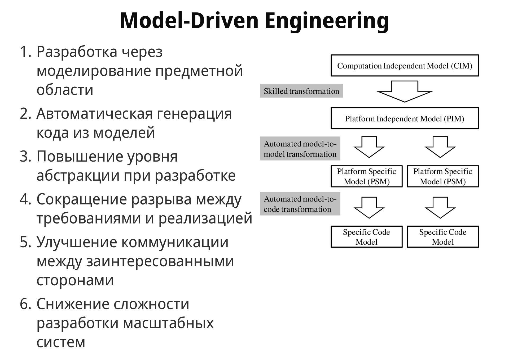
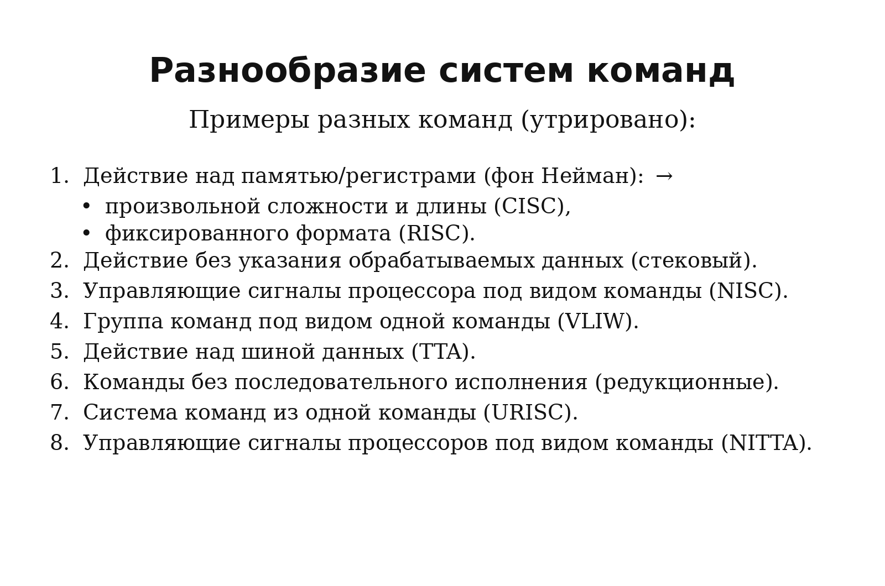

# Lecture 07 — Model Driven Engineering. Универсальный процессор. Машина фон Неймана. CU и DataPath

## Источники

- `sources/lecture-07/source-pack.md`
- `sources/lecture-07/my-notes.md`
- `sources/lecture-07/slides.md`
- `sources/lecture-07/transcript.cleaned.md`
- `sources/lecture-07/transcript.raw.md`
- `csa-rolling/exam-questions-blitz.md` — только формулировки вопросов

## Список билетов

1. Что такое Model-Driven Engineering (MDE)? Чем цепочка трансформации в MDE отличается от языков высокого уровня? Приведите примеры.
2. Что такое универсальный процессор? Каковы его особенности и свойства?
3. В чём заключается противоречие между универсальностью и эффективностью в разных видах процессоров (СБИС, FPGA, CGRA, GPU, DSP, CPU)?
4. Как соотносятся вычислительные платформы и языки описания вычислительного процесса? Как это связано с эффективностью и областью применения?
5. Что такое архитектура и микроархитектура процессора? В чём различие между ними?
6. Что такое система команд и какова её роль в архитектуре процессоров? Что определяет система команд?
7. Что такое машина фон Неймана? Какова её связь с машиной Тьюринга? Каковы её ключевые принципы?
8. Что такое микропроцессор и микроконтроллер? В чём их отличия?
9. Что такое Control Unit и Data Path? Каковы их назначение и принципы взаимодействия?
10. Какие виды инструкций существуют в машине фон Неймана? Приведите примеры. Каковы принципы кодирования?

---

## Билет 1. Что такое Model-Driven Engineering (MDE)? Чем цепочка трансформации в MDE отличается от языков высокого уровня? Приведите примеры.

### Короткий ответ

#### Что такое Model-Driven Engineering (MDE)?

- **Model-Driven Engineering (MDE)** — это подход, где разработка строится
  вокруг **модели системы**, а не сразу вокруг обычного программного кода.
- **Модель** здесь не просто картинка для документации. Это более строгое
  описание системы: например, состояния, переходы, сообщения между частями
  системы или предметные правила.
- Такая модель может участвовать в работе инструментов: её можно
  **проверять**, **запускать** или **транслировать** в целевое исполняемое
  представление.
- Поэтому MDE помогает держать сложность под контролем: модель можно сделать
  более **формальной** и искать в ней ошибки вроде недостижимых состояний,
  незакрытых случаев или deadlock-ов.
- Ещё одна важная идея — **переносимость**. Если логика описана не сразу под
  один конкретный язык или платформу, её проще переводить в разные реализации.

#### Что такое цепочка трансформации в MDE?

- **Цепочка трансформации** — это путь от исходной модели к тому, что уже можно
  проверить, запустить или сгенерировать как реализацию.
- В простом виде цепочка выглядит так:
  **модель предметной области** → более формальная модель →
  **платформенно-специфичное представление** → код, тест или другая исполняемая
  форма.
- На каждом шаге смысл системы должен сохраняться, но меняется форма описания:
  сначала описание удобно для понимания и анализа, а ближе к концу — для
  исполнения на конкретной платформе.

#### Чем цепочка трансформации в MDE отличается от языков высокого уровня?

- **Язык высокого уровня** тоже прячет от программиста детали машины, но
  программист всё равно пишет программу: например, на C, Python или Java.
- В MDE исходным артефактом часто является не свободный код, а **предметная
  модель**. Она описывает систему ближе к задаче, а не сразу к конкретной
  машине, языку или фреймворку.
- Потом эта модель проходит цепочку преобразований: уточняется, проверяется и
  переводится в целевой код или другое исполняемое представление.
- Главное отличие такое: в языках высокого уровня **код остаётся центром
  разработки**, а в MDE центром становится **модель**, из которой уже получают
  реализацию.
- Поэтому MDE — это не просто "ещё более высокий язык". Это способ разработки,
  где модель задаёт правила, ограничивает лишнюю свободу и помогает не потерять
  связь между описанием системы и её исполнением.

#### Приведите примеры.

- **Executable UML**: поведение системы описывается через конечные автоматы и
  сообщения между подсистемами. Такая модель может быть исполняемой и потом
  транслироваться в целевую реализацию.
- **BDD**: поведение системы записывается полуформально, так чтобы описание было
  понятно прикладным специалистам и при этом могло запускаться как тест.
- **DSL, например SQL или Lingua Franca**: предметно-ориентированный язык
  описывает вычисление в терминах своей области. Пользователь формулирует, что
  нужно получить, а инструмент переводит это в конкретное исполнение.

### Схема / картинка

Слайд с канонического deck-а `06-hw-sw-program-moc.md#/10` показывает основные
идеи MDE и типовую цепочку: от модели предметной области к
платформенно-независимой модели, затем к платформенно-специфичным моделям и
конкретной модели кода.

### Пояснение от ИИ простыми словами

MDE можно представить так: сначала мы описываем систему в виде строгой модели,
которую удобно проверять инструментами. Потом эта модель проходит цепочку
преобразований: становится всё ближе к конкретной платформе и в конце
превращается в код, тесты или другое исполняемое представление. Обычный язык
высокого уровня тоже упрощает программирование, но он всё равно остаётся кодом.
В MDE важнее сама модель: она задаёт правила, ограничивает лишнюю свободу и
помогает не потерять связь между описанием системы и тем, что реально
запускается.

---

## Билет 2. Что такое универсальный процессор? Каковы его особенности и свойства?

### Короткий ответ

#### Что такое универсальный процессор?

Универсальный процессор — это процессор для широкого круга задач.
Его прикладная функция задаётся после производства, обычно программой.
Он нужен как основа двухэтапного производства: сначала железо, потом программа.

#### Каковы его особенности и свойства?

Универсальность не равна полноте по Тьюрингу.
Теоретическая универсальность не всегда полезна практически.
Универсальность обычно конфликтует с эффективностью.
Типичные свойства: двухэтапное производство, полнота по Тьюрингу, большой объём программы и изменяемость ПО.

### Схема / картинка

Схема показывает общую рамку: ввод, процессор, хранилище и вывод.

---

## Билет 3. В чём заключается противоречие между универсальностью и эффективностью в разных видах процессоров (СБИС, FPGA, CGRA, GPU, DSP, CPU)?

### Короткий ответ

Противоречие между универсальностью и эффективностью состоит в том, что универсальная платформа подходит для многих задач, но хуже использует аппаратуру под одну конкретную.
CPU самый гибкий, потому что его поведение задаётся программой.
ASIC/СБИС самый специализированный, потому что делается под узкую функцию.
FPGA и CGRA дают реконфигурируемость между этими крайностями.
GPU и DSP специализируются на характерных типах вычислений.
Чем ближе аппаратура к задаче, тем выше производительность и энергоэффективность.
Но тем меньше свободы менять задачу после производства.
Например, аппаратный видеодекодер быстрее программы на CPU, но почти бесполезен вне своей области.

#### Что означают аббревиатуры в этом сравнении?

- **СБИС / ASIC** — **сверхбольшая интегральная схема** /
  **Application-Specific Integrated Circuit**. Это специализированная
  аппаратная реализация под одну задачу или узкую группу задач: минимум
  гибкости, зато высокая производительность и энергоэффективность для своей
  области.
- **FPGA** — **Field-Programmable Gate Array**. Это программируемая после
  производства логическая матрица: её можно настроить под нужную схему, поэтому
  она гибче ASIC/СБИС, но обычно менее эффективна, чем полностью
  специализированная аппаратура.
- **CGRA** — **Coarse-Grained Reconfigurable Arrays**. Это реконфигурируемые
  массивы более крупных функциональных блоков: пользователь работает не с
  отдельными регистрами и логическими схемами, а с аппаратными блоками вроде
  умножителей, делителей и других специализированных узлов.
- **GPU** — **Graphics Processing Unit**. Это графический процессор: он менее
  универсален, чем CPU, и относится к промежуточным специализированным
  вариантам между ASIC/СБИС и CPU.
- **DSP** — **Digital Signal Processor**. Это цифровой сигнальный процессор:
  он специализирован под обработку сигналов и похожие вычислительные шаблоны.
- **CPU** — **Central Processing Unit**. Это центральный процессор: самый
  гибкий вариант в этом сравнении, потому что его поведение в основном задаётся
  программой, но за гибкость он платит меньшей энергоэффективностью на узких
  задачах.

### Схема / картинка

Схема сравнивает семейства вычислителей по гибкости, производительности и энергоэффективности.

---

## Билет 4. Как соотносятся вычислительные платформы и языки описания вычислительного процесса? Как это связано с эффективностью и областью применения?

### Короткий ответ

#### Как соотносятся вычислительные платформы и языки описания вычислительного процесса?

Вот чуть подробнее, но всё ещё компактно:

#### Как соотносятся вычислительные платформы и языки описания вычислительного процесса?

**Вычислительная платформа** задаёт, как процесс реально исполняется  
(то есть какие есть исполнители: процессор, память, устройства; какие операции они умеют выполнять; как хранятся данные; какие есть ограничения по скорости, объёму памяти и параллелизму).

**Язык описания** задаёт, как человек или инструмент формулирует этот процесс  
(то есть в каких терминах мы описываем вычисления: команды, выражения, функции, переходы между состояниями, потоки данных или управляющие сигналы).

Между языком и платформой почти всегда есть **разрыв**  
(язык обычно удобнее и абстрактнее для человека, а платформа требует конкретных действий: машинных команд, обращений к памяти, сигналов управления, работы отдельных блоков).

Этот разрыв нужно закрывать **трансляцией или проектированием**  
(например, программа переводится компилятором в машинный код, алгоритм превращается в схему автомата, а описание поведения устройства — в аппаратную реализацию).

#### Как это связано с эффективностью и областью применения?

Чем ближе язык к физической платформе, тем легче получить эффективную реализацию.
Чем выше уровень языка, тем шире область применения и проще программирование.
Поэтому под задачу выбирают не только процессор, но и подходящий язык/инструмент.

### Схема / картинка

Схема показывает связь между типом вычислительной платформы и инструментом описания вычислений.

---

## Билет 5. Что такое архитектура и микроархитектура процессора? В чём различие между ними?

### Короткий ответ

#### Что такое архитектура и микроархитектура процессора?

Архитектура процессора — это то, как процессор видит программист.
Она задаётся системой команд, операндами, памятью и видимыми вычислительными механизмами.
CISK, RISC, ACC и тд. НЕабор инструкций это и есть архитектура

Микроархитектура — это внутренняя реализация этой архитектуры. Соединение простейших цифровых элементов в логические блоки, предназначенные для выполнения команд определённой архитектуры. Описывает Как в процессоре расположены и соединены реальные элементы. 

#### В чём различие между ними?

Архитектура отвечает на вопрос "что доступно программе".
Микроархитектура отвечает на вопрос "как это сделано внутри".
Одна архитектура может иметь много микроархитектур.
Они выполняют одни и те же программы, но отличаются скоростью, ценой и сложностью.

### Схема / картинка

Схема показывает архитектурный уровень ISA как интерфейс между программой и процессором.

---

## Билет 6. Что такое система команд и какова её роль в архитектуре процессоров? Что определяет система команд?

### Короткий ответ

#### Что такое система команд и какова её роль в архитектуре процессоров?

Система команд — это ISA, абстрактная модель процессора, формирующая интерфейс Взаимодействия между ПО и прооцессором.
Она задаёт интерфейс между программой и аппаратурой.
Для архитектуры процессора система команд является главным языком.

#### Что определяет система команд?

Система команд определяет типы данных, модель памяти и методы адресации.
Она задаёт набор инструкций.
Она описывает обработку прерываний и исключений.
Она задаёт методы ввода-вывода.
При этом производительность и задержки часто остаются свойствами микроархитектуры.

Подходы в системах команд показаны на слайде ниже.
### Схема / картинка

Слайд перечисляет разные подходы к системам команд: CISC/RISC, стековый подход, NISC, VLIW, TTA, редукционные команды, URISC и NITTA.

---

## Билет 7. Что такое машина фон Неймана? Какова её связь с машиной Тьюринга? Каковы её ключевые принципы?

### Короткий ответ

#### Что такое машина фон Неймана?

Машина фон Неймана — это простая модель компьютера с памятью, процессором, вводом и выводом.
Программа хранится в памяти как последовательность инструкций.

#### Какова её связь с машиной Тьюринга?

Она развивает идею машины Тьюринга.
Лента заменяется адресуемой RAM.
Инструкции и данные помещаются в одну память.

#### Каковы её ключевые принципы?

Ключевые принципы: двоичное кодирование, программное управление, последовательное исполнение, адресуемая память и условный переход.
Условный переход позволяет выбирать следующий шаг по состоянию данных.

### Схема / картинка

Схема показывает память, устройство управления, АЛУ, ввод и вывод.

---

## Билет 8. Что такое микропроцессор и микроконтроллер? В чём их отличия?

### Короткий ответ

#### Что такое микропроцессор и микроконтроллер?

Микропроцессор — цифровая схема, которая выполняет операции с внешним источником данных.
Обычно таким источником является память или поток данных.
Микроконтроллер — микросхема для управления электронными устройствами.

#### В чём их отличия?

Микропроцессор в основном рассматривается как вычислительное ядро.
Микроконтроллер объединяет процессор, память и периферийные устройства.
В реальной работе чаще используют микроконтроллеры, потому что одному процессору нужна внешняя обвязка.

### Схема / картинка

Схема противопоставляет процессор как отдельное ядро и микроконтроллер как более самостоятельное устройство.

---

## Билет 9. Что такое Control Unit и Data Path? Каковы их назначение и принципы взаимодействия?

### Короткий ответ

#### Что такое Control Unit и Data Path?

DataPath — это часть процессора, где находятся и преобразуются данные.
В него входят АЛУ, регистры и внутренние шины.
Control Unit — это часть процессора, которая управляет DataPath.

#### Каковы их назначение и принципы взаимодействия?

DataPath выполняет пересылки и операции над данными.
Control Unit декодирует инструкции и выдаёт управляющие сигналы.
Эти сигналы выбирают входы мультиплексоров, разрешают запись в регистры и управляют памятью.
Так инструкция разворачивается во времени как последовательность действий над DataPath.

### Схема / картинка

Схема показывает разделение процессора на путь данных и управляющую часть.

---

## Билет 10. Какие виды инструкций существуют в машине фон Неймана? Приведите примеры. Каковы принципы кодирования?

### Короткий ответ

#### Какие виды инструкций существуют в машине фон Неймана?

В машине фон Неймана есть инструкции работы с памятью, вычислительные инструкции, управляющие инструкции и инструкции сопроцессоров.
Работа с памятью переносит данные между памятью, регистрами и портами.
Вычислительные инструкции выполняют арифметику, логику и битовые операции.
Управляющие инструкции меняют поток исполнения.

#### Приведите примеры.

Примеры: `MOV`, `MUL`, `LOOP`, `HLT`, а для RISC-формата — `addi`.

#### Каковы принципы кодирования?

Инструкция кодирует opcode и операнды.
Операндами могут быть номера регистров, адреса или непосредственные значения.
Формат зависит от ISA.

### Схема / картинка

Схема показывает поля инструкции: opcode, номера регистров и immediate value.

---

## Статус подготовки

- статус: `needs-check`
- дата финализации: `2026-06-14`
- оставшиеся проверки:
  - `[проверить]` Автоматический транскрипт lecture-07 шумный.
  - `[проверить]` Текст блока MDE опирается на transcript lecture-07; цельный слайд MDE взят из deck-а lecture-06 по явному решению пользователя.
